# 如何设计电路模块

## 概览

相信通过之前数个教程的学习，你已经对我们将要使用的工具——Logisim和ISE已经比较熟悉。从这个Project开始，我们将要使用这两个工具来进行数字电路元件的设计。在我们这个Project中我们将主要关注Logisim组合电路和时序电路的设计。

## 电路设计的目标

电路设计需要有一个“需求”————电路的功能与特性，这是我们电路设计的目标。如果我们从某个电路的用户角度看，我们实际上也是把电路本身作为一个“**黑箱**”，不关心其中的实现。因此我们自己在设计电路时，比起具体的实现，我们最先需要关心的就是电路的特性与功能。所谓磨刀不误砍柴工，通过对电路功能的深度理解和详细设计，我们往往能够在设计中节省很多精力，下面就给大家介绍一种规范需求的方法————端口定义法。

<div align="center">
    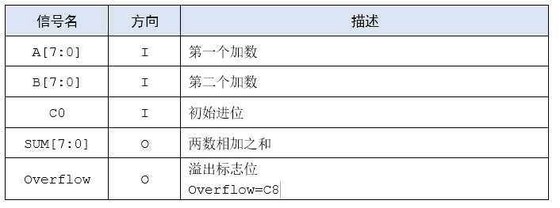
</div>

上图是一个8位加法器最为简单的定义表，定义了它有五个信号，8位信号A，B，SUM，1位信号C0和Overflow。方向中用I代表InPut输入，用O代表Output输出。描述一栏用汉语对加法器进行了简单的描述。信号的语法遵循了类似Verilog HDL中的写法，如此，通过这个简单的端口定义表，我们就能知晓我们这8位加法器应该做什么。

对于更复杂的电路，我们会用两张表。

<div align="center">
    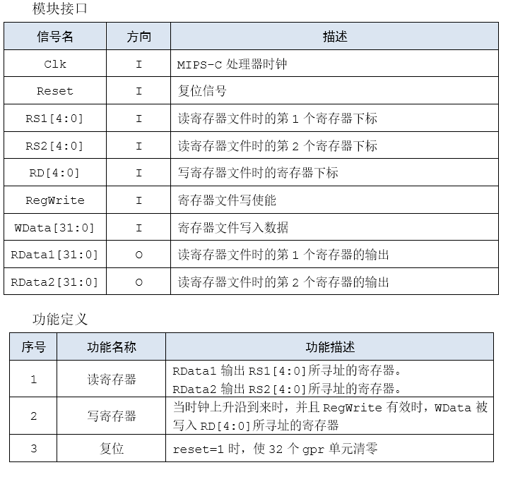
</div>

一张模块接口定义表与一张功能定义表，原因是对于这些复杂电路来说，简单的端口定义已经无法识别其功能，或者该模块在不同的情况与输入下有不同的功能，这种时候我们需要使用功能定义表来对模块的功能进行约定。

在对我们设计的电路有了如此合理，无歧义的设计目标后，我们才能去动手实现真正的电路。我们需要把设计与实现这两项工作分开来保证我们在工程中较高的完成率。**因此，建议，或者说要求，大家在之后我们的电路设计作业中，先要对模块的端口和功能进行书面化的定义，可以不拘泥于具体形式，但是一定要是可供他人阅读，立马明白模块功能的，**再去进行实际的设计，我们不希望看到最终你设计的电路出问题是从功能定义上就出了毛病。我们之后的练习题部分也将会给出定义表供大家参照。

## 分析目标并划分层次

在定义清楚设计的目标之后，我们需要对我们的实现目标进行分析————这是一个时序电路？还是一个无状态的纯组合电路？它需要同时有多个功能吗？需要分层化设计吗？需要模块化设计么？————解决这些问题的过程，其实就是完成实现的过程。而这些问题往往也是与实际的模块要求有关系，之后我们将用具体的实例来进行说明。

模块设计相信大家在理论课以及前面的指导中已经有所耳闻，在这里需要提的一点是**分层**的设计思想，在计算机科学中有一句名言，“**在计算机科学中的任何问题都可以通过增加一个间接层来解决。**”这句话即使是在电路设计这个偏硬的领域下也是有效的，以32位加法器为例，初拿上手，可能会觉得无所适从，输入是两个32位数，输出是一个32位数，关系虽然抽象上简单，但是并不能简单用门电路概括。但是如果我们添加一个“一位加法器”的间接层，使用1位加法器拼出一个32位加法器比较简单，单独拼出一个一个1位加法器也很简单。如此，问题就解决了！可见分层的威力，希望大家在设计时也要重视这种思想，当然，**分层**的思想在后续的课程中可能会和大家一次又一次的见面，记得和熟人打个招呼！

## 电路搭建与注意事项

在完成设计阶段后，具体的实现比起来可能只是一些小case，通过我们关于工具的知识，可以把我们的设计变为具体的元件组合，这一点我们将在之后的示例里看得更清楚。具体到工具上，在Logisim中，需要注意布线/器件设置等，在Verilog中，需要注意位宽一致/命名正确等。这里就是要考察大家的基本功了。

在搭建功能较为复杂，重复性比较多的电路（如通用寄存器堆）时，如果全部用手工搭建会消耗较多时间，过程中也容易产生接线错误等问题。我们可以尝试采用代码生成XML文件等自动化方法来缚住进行模块搭建。无论是手工搭建还是自动生成，建议同学们在完成Logisim电路后仔细检查模块外观/布线与接线、功能等是否正常，避免产生不必要的麻烦。

当然，我们也在此给出一些具体实现中常常遇到的一些问题，便于大家早点发现问题进行排除：

### 多驱动

这是指一个变量有两个以上的赋值源。这一般是由于对于某一输出源，存在多个路径向其提供输出值，对于这种情况，Logisim也会识别并将相关路线标红。

具体而言，这可能是**一个输入源经过不同的运算对其输出不同的值引起的：**

<div align="center">
    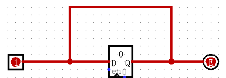
</div>

上述例子中，同一输入存在两条不同的路径达到输出，导致了多驱动。

也可能是由于**多个输入源对其输出不同值引起的**：

<div align="center">
    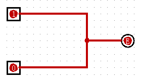
</div>

上述例子中，多个输入源同时驱动输出，导致了多驱动。

在Verilog中，也同样存在着这样的情况：

```Verilog
assign signal_1 = a ? 1'b1 : 1'b0;
assign signal_2 = b ? 1'b1 : 1'b0;
```

### 组合逻辑环路

这是指不经过任何时序逻辑（寄存器等），而直接将组合逻辑电路的输出信号反馈到其输入节点而形成的环路。这一般是由于**电路中存在输出直接作为该输出的输入而导致的：**

<div align="center">
    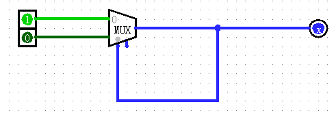
</div>

上述例子中，输出又直接作为了输入的一部分（MUX选择条件）接入到了输入中，导致电路发生震荡。Logisim识别并将相关线路标注为蓝色。

同样，在Verilog中，也同样存在着这样的情况：

```Verilog
assign BHR_Violent = (Delay_BHR_Hash_Write_PC == BHR_Hash_Read_PC);
asign BHR_Hash_Read_PC = BHR_Violent ? hash_10(Now_PC) + 1 : hash_10(Now_PC);
```

上述例子中，BHR_Violent的计算需要BHR_Hash_Read_PC的值，但是BHR_Hash_Read_PC的计算同样需要BHR_Violent的值，这样导致了一个组合逻辑上的回路。

**当然，Logisim线路颜色表达的含义不局限于以上几种，希望大家在电路搭建时不要盲目依赖Logisim或者ISE给出的线路颜色或者错误信息，而应该在参考的基础上仔细思考搭建时产生的问题。**

## 电路搭建与测试

在完成了搭建后，测试是个必不可少的环节；尽管我们搭建了自动测试平台，所有的文件可以自动测试，但是在实际环境中，测试这项工作更多也需要设计者来进行一定的自我测试，来避免一些显而易见的错误。而测试的基本原则就是根据我们的端口定义和功能定义表，对各种可能的输入情况进行排查，观察是否有与定义违背的情况，或者在输入未定义信号的时候会不会产生一些非常危险的行为。

### 测试样例设计

有限的输入可能性可以穷举，但是需要消耗大量时间；无限的输入可能性无法穷举；无论是什么情况，我们都不可能枚举所有输入以求测试的覆盖性，因此最好的方法是使用有代表性的，有“价值”的测试数据进行测试，而测试数据的价值可以体现在很多方面，不同情境下我们对“价值”的定义不同。在这里我们给出几种样例生成的参考方向，以供大家在实践中使用，但是如何设计更多潜在有价值的测试数据，还需要同学们靠不断的练习来摸索并积累经验！
- 覆盖所有测试功能正常进行的样例
- 极端情况的样例
- 异常情况的样例


### 测试方法

为了提高测试效率，我们可以使用Pre提到的**自动化测试**方法！

大家看完上面的设计和测试方法可能还一头雾水，不过不用担心，下面我们将通过CRC校验码的例子来带大家深入体会整个流程！

<div style="page-break-after: always;">
</div>

# CRC校验码计算电路的设计与测试

在这个部分中，你将从需求开始一步一步搭建我们所要求的8位CRC校验码计算电路。我们希望在这个简单的例子中，你能体会到方法性的东西，并应用到之后的设计中去。这对之后的学习和**课上测试**都是很有帮助的，请各位谨记。

## CRC校验码简介

CRC校验是数据通信领域中最常用的一种查错校验方式，它对数据进行多项式计算，并将得到的结果附在帧的后面，接收设备也执行类似的算法，以保证数据传输的正确性和完整性。（“帧”在本章指的是数据的二进制码）

在了解这种校验码怎么计算之前，我们需要先了解一种特殊的除法：“模二除法”。它与算数除法类似，但在做减法时既不向上借位，也不比较被除数和除数相同位数值的大小；它的运算法则为`1-1=0`，`0-1=1`，`1-0=1`，`0-0=0`，例如`1100-1001=0101`。对于模二除法，我们以被除数为1011，除数为10为例，运算过程如下：

<div align='center'>
    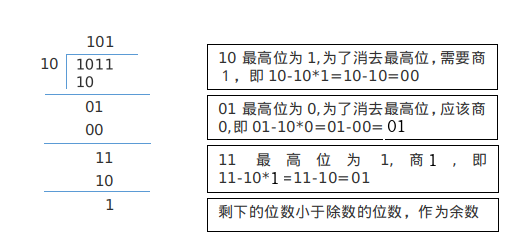
</div>

如果细心的话，你会发现，模二除法中的减法和异或的效果是相同的，所以模二除法可以用异或来完成。

知道了模二除法的计算过程，CRC校验码的计算就简单了。我们只需要将原帧补上（除数位数 - 1）个0作为被除数，然后进行模二除法即可。举个例子，我们要发送的帧A为10011，发送端和接收端共同选定的除数B为1110.因为B是4位二进制数，我们需要在A后面补上3个0，从而得到A'=10011000。我们将A'作被除数，B作除数，进行“模二除法”。如下图：

<div align="center">
    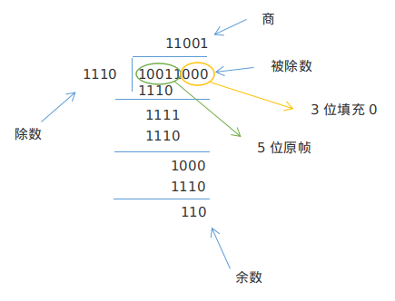
</div>

最后得到的余数是一个三位数（注意如果不是三位，也要在前面补零俩凑齐三位），这就是要求的校验码。我们将得到的校验码110拼接在原数据帧的后面，就得到了要发送的新帧A''=10011110。这样就完成了CRC校验码的生成。

## CRC校验码计算电路的设计

在普通的设计流程中，一般都是用汉语描述电路的功能，需要我们自己来进行形式化的定义，不过由于我们这个例子相对简单，因此直接给出我们8位CRC校验码计算电路的端口定义。

<div align="center">
    
</div>

## 分析目标并层次化

初拿到如上表的需求，可以发现这是一个没有状态的部件，自身内部不储存信息，单纯的输入就决定了输出，因此有一种相当暴力的思路就是直接画出真值表，我们需要动2048下手指才可以把真值表画出来————似乎繁琐了点？我们需要更加简单的方法。但是希望大家明白真值表法永不过时，在输入输出比较小时是非常实用的方法，并且可以使用相关工具自动生成电路。

我们仔细分析一下，其实类似除法的计算方法，我们可以把这个计算过程分解为多次进行被除数为4位的除法计算。因此我们引入“4位模二除法器”这个间接层，这样问题就变成了两个部分：
- 设计四位模二除法器
- 使用四位模二除法器搭箭8位CRC校验码计算电路

为了方便理解，我们的给出了一种四位模二除法器的端口定义（这只是为了讲解时参考，你在设计时不一定要遵循这个定义）

<div align="center">
    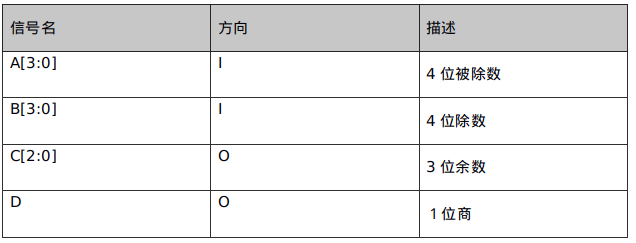
</div>

我们知道，模二除法和异或运算是等价的，所以对于一个四位除四位的模二除法器，如果被除数的最高位是1，则商1，余数使用异或门来将四位被除数和四位除数异或即可。当然，如果被除数的最高位是0，则商为0，余数直接等于被除数了。

这个电路搭建很简单，我们只需要判断下被除数的最高位，然后分情况输出即可。

搭建完四位的除法器，我们再来看看怎么使用这个简单的电路来搭建我们所需要的复杂电路。类似于普通出发的过程，我们计算模二除法时也是每次从被除数中取出一定的位数（对于该问题是4位）来和除数相除，除得的余数再补上移位被除数后继续与除数相除。如此，计算过程就相当于进行多次四位的模二除法了。我们要做的就是将上一个四位模二除法器的余数输出，拼接一位被除数作为下一个四位模二除法器的被除数输入（除数始终是同一个数），如此反复直到被除数所有的位都被使用。

## 具体搭建（Logisim）

在Logisim搭建上述电路时还需注意：
- 可以使用Tunnel来表示中间变量简化布线
- 可以改变门电路输入数简化电路
- 这个电路并不是最简的，可以使用逻辑方法优化

综上，我们可以在完成了设计工作的基础上使用Logisim进行电路搭建啦！

## 测试与验证

### 测试样例设计

正如前文所述，开发者的自我测试在开发过程中是十分重要，这里我们就以刚搭建的8位CRC校验码计算电路为例来说明如何进行测试样例的设计。对于我们这里的组合电路，测试样例要覆盖所有的输入。因此最简单直接的想法就是将所有的二进制输入依此尝试一遍。在我们的电路中，共需尝试2048组输入。这种方法的好处就是保证彻底的覆盖性，缺点也很明显，需要过多的操作。在面对更复杂电路时，我们需要更加合理的样例。一种比较合理的方法是根据功能来设计相关的样例：
- 覆盖所有测试功能正常进行的样例（如 A:11001010 B:1011, A:01001110 B:1100）
- 极端情况的样例（如：A:00000000 B:1000）
- 异常情况的样例（如：A:110X010X B:XXXX，这个 X 的输入在 Logisim 也是支持的）

在设计出相应的测试样例后，需进行相关的输入观测现象，为历史测试电路更加简洁，我们将使用已经设计好了的子电路进行测试，下面介绍子电路。

### 子电路

我们在Pre中学习了子电路的使用，不知道同学们是否有尝试过。在P0中，随着电路**逐渐复杂化**，我们需要子电路的帮助来完成整体电路。

其实子电路和**子函数**有一定的相似性。我们可以把合作完成同一功能的电路封装为一个子电路，再像main中调用子函数那样多处进行引用，减少重复且不必要的电路搭建，一定程度上减少我们的工作量。同时，由于Logisim是在画布上完成我们的任务，利用子电路也可以让我们整个画布跟家**简洁清楚**。

同时，也可以把一部分相互依赖性高且线路复杂的电路封装成一个子电路，虽然可能不会有其他地方也利用这个子电路，但是由于Logisim没有很好的debug的方式，利用这个方式可以通过测试**保证每个子电路的正确性**，进而确定我们提交电路的正确性

#### **如何使用子电路**

为了提高使用子电路的效率，我们可以通过外观编辑页面以更改电路外观的形状及端口位置；通过更改layout为子电路及其相应端口设置Label，进而区分相同子电路的不同引用，并对子电路的输入输出进行命名（在引用时鼠标悬停即可查看其自定义名称），在引用子电路的同时可以更行出其信息。

同时，在进行电路测试的时候，应该也测试每个子电路的功能，之后再对整个电路进行测试。如此可以减轻工作量，更快地完成测试工作。

在之后的题目中，虽然不用子电路也可以完成任务，但希望同学们可以尝试着使用子电路。

这里给出测试电路示例：（“CRC”为你需要搭建的电路）

我们将设计好的CRC电路进行封装，并命名为“CRC”，在测试电路中，A、B为输入观测值，C为输出观测值，“CRC”以子电路的形式出现。

<div align="center">
    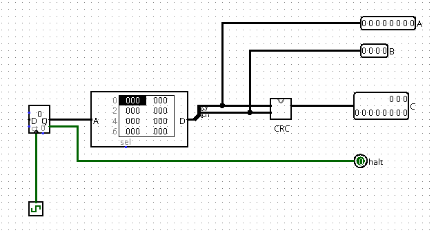
</div>

<div style="page-break-after: always;">
</div>

# 实现GRF

## p0_l0_GRF【实现GRF（P0.Q2）】【文件上传】

### 提交要求

使用logisim搭建一个GRF。

GRF中包含32个32为寄存器，分别对应0~31号寄存器，其中0号寄存器读取的结果恒为0。具体模块端口定义如下：

<div align="center">
    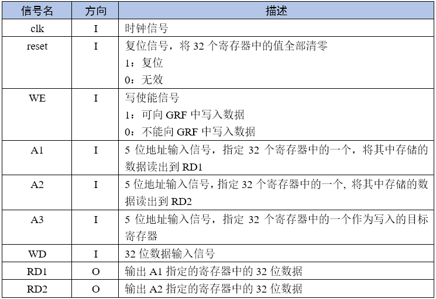
</div>

模块功能定义如下：

<div align="center">
    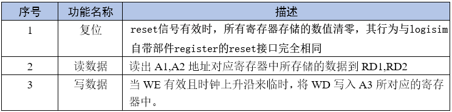
</div>

- 必须严格按照模块的端口定义
- **0号寄存器读出的数据在任何时候都为0**
- **请使用寄存器部件来实现GRF中的32个寄存器**
- 文件内模块名：grf
- 测试电路：（grf为你需要搭建的电路）

<div align="center">
    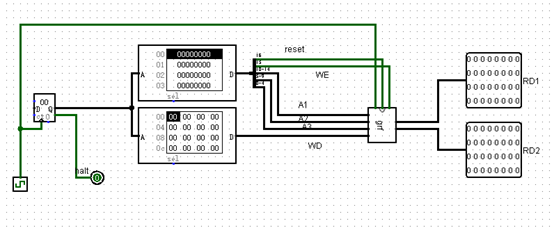
</div>

- **注意：请保证模块内的appearance与下图完全一致，否则有可能造成评测错误**（查看模块appearance方法：在Ligisim中打开相应模块后点击左上角按钮）

<div align="left">
    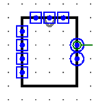
</div>

<div style="page-break-after: always;">
</div>

# ftoi

<div style="page-break-after: always;">
</div>

# Logisim中的有限状态机

## 前言

经过理论课和之前 Logisim教程部分的学习，相信大家对有限状态机的基本知识已经有了充分的了解，也已经了解了使用Logisim设计简单状态机的方法技巧。现在，我们帮助大家简单的回顾一下使用Logisim设计有限状态机的基本步骤，以帮助大家更快的适应p0。

## 使用Logisim设计有限状态机的基本步骤

使用Logisim设计有限状态机的过程基本上可以分为三个步骤：- 设计实现状态储存模块 - 设计实现状态转移模块 - 设计实现输出模块

以上三个模块是对有限状态机进行抽象后的三个主要方面。其中，状态转移模块和输出模块内是纯组合逻辑，不涉及时序逻辑。而状态储存模块则需要储存每个周期有限状态机的具体状态。它们之间的关系是，状态转移模块根据当前有限状态机的状态（即状态储存模块所储存的值）和当前的输入计算有限状态机的下一状态值，当时钟上升沿到来时，这个新的状态值被存入储存模块中。输出模块的逻辑分为两种，根据输出逻辑的不同，有限状态机又被分为Moore型状态机和Mealy型状态机。它们之间具体的差别是，Moore型状态机的输出逻辑仅与有限状态机当前状态值有关；而Mealy型状态机的输出逻辑则与有限状态机的当前状态和当前输入有关。

Moore型状态机示例图
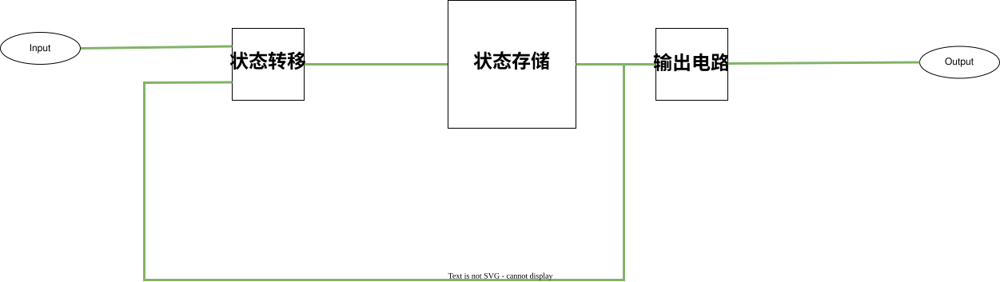

Mealy型状态机示例图
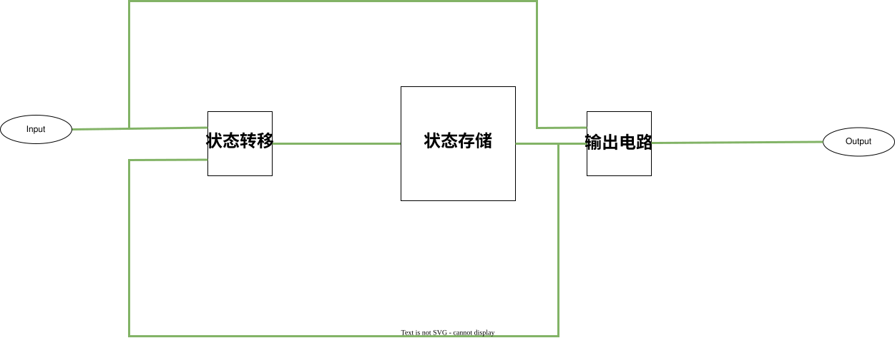

（注：上图模块从左至右分别是：状态转移，状态储存，输出）

## 设计建议
1. 分析具体问题，画出状态转移图
2. 对状态进行合适的编码
3. 画出状态转移和输出逻辑的真值表
4. 在Logisim中实现状态转移和输出逻辑，并采用合适的储存器储存具体状态值

同学们可以重新回顾一下pre部分中Logisim的部分内容，我们可以通过analye circuit的功能来完成状态转移部分的内容。（在project-analyze circuit可以选择此功能）

这个功能让我们可以通过打表的方式表示niput和output的关系。当然同学们可以选择自己搭建电路，或者通过更好地设计状态机来简化其状态转移的过程。

## 有限状态机测试

在完成了对有限状态机地设计之后，我们还需要进行有限状态机的**测试**，正如我们在教程中学到的，测试一直是电路设计中一个非常重要的环节。但是由于FSM相比之前简单的组合电路更加复杂，因此其测试也会包含更多内容，可以概括为两个主要的部分————**输出电路**测试与**状态转移**测试。

如果我们仍采用在组合电路中采用的**黑箱测试**办法，直接将输入与输出联系起来，那么我们将会需要非常大数量的样例序列来进行测试，这种做法既不经济也不实用，因此我们不予采用。我们需要做的是，将**输出电路**测试与**状态转移**电路测试分开进行，记录状态转移信息。

如果我们将这两者分开，那么对于这两者来说，他们都是普通的组合电路，只需要使用我们之前的方法就可以完成相关测试，测试上的问题也就迎刃而解了。

<div style="background-color: #e3f2fd; border-left: 4px solid #2196f3; padding: 12px 16px; margin: 16px 0;">
<strong>思考题</strong><br><br>
1. 状态存储器的复位方式包括异步复位和同步复位，二者的定义分别是什么？两种复位方式在 Verilog 中可以通过什么语句句式实现？在 Logisim 中又可以通过什么样的电路框架实现？<br><br>
2. 在 Verilog 中我们可以通过 initial 块对状态存储器的初值进行定义，在 Logisim 中我们可以通过哪些电路框架实现赋初值的功能？<br><br>
3. 一个大型的 Logisim 电路设计可能会具有非常复杂的电路结构，你有哪些可以降低这种复杂性的设计方法？
</div>

<div style="page-break-after: always;">
</div>

# Logisim导航

## P0_L1_navigation_2020【Logisim导航（P0.Q3）】【文件上传】

### 提交要求

计小组要去机房上机考试，需要去B机房，但是目前他在A机房。他现在的时间很充裕，就决定生成一串随机序列，告诉他下一步行走的方向，直到走到B机房。她希望用logisim搭建一个可以导航的Moore型有限状态机，来通过序列告诉他是否到达B机房。

<div align="left">
    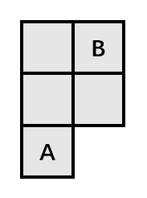
</div>

题目要求：

计小组只能往东南西北四个方向行走，且若能行走，则每次**只能行走一格**。若下一步不存在机房让计小组行走，那么计小组会撞到墙壁并且**hit置高一周期**，此时计小组仍**保持原地**不会移动，等待下一周期再进行运动。（如果下一步依旧撞墙，则hit仍然置高；若下一步不会撞墙，则计小组将会继续进行，hit在此周期置0）

计小组走到B机房后，**“到达”信号需要置位，并保持一周期**。到达B机房后计小组将会在下一周期回到原位，（下一周期的输入将被忽略掉）等待下下周期的输入，继续测试他的序列。

计小组遵循上北下南左西右东的方向完成操作。

计小组在时钟上升沿的时候就已经知道自己下一步的方向并且瞬移过去，并列立即做出判断。

端口定义：

<div slign="center">
    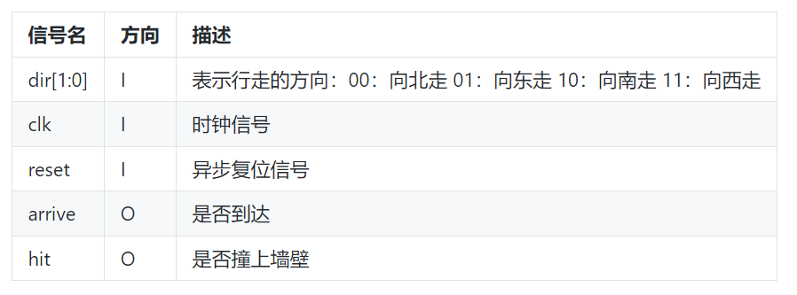
</div>

**模块名**：navigation

**必须严格按照模块的端口定义**

**测试电路：**

<div align="center">
    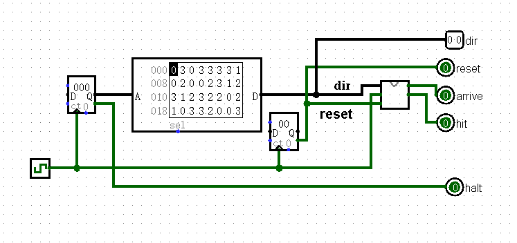
</div>

**注意：请保证模块的appearance与下图完全一致，否则有可能造成评测错误**（查看模块appearance方法：在Logisim中打开相应模块后点击左上角按钮）

<div align="left">
    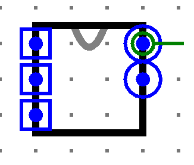
</div>

<div style="page-break-after: always;">
</div>

# Logisim中的FSM

## P0_l0_FSM【Logisim中的FSM（P0.Q4）】【文件上传】

### 正则表达式匹配

正则表达式是对字符串操作的一种逻辑公式，它通常被用来检索、替换符合某个模式的文本。它的规则比较复杂，我们现在只讲解其中比较简单的几种规则。

- [...]是指要匹配中括号中的字符（注意是字符不是字符串），比如[xyz]就是要匹配x，y，z这三个字符中的任意一个。
- {...}是指要求匹配“{”前的那个字符几次，比如a{2}是指要匹配a两次，a{2,4}是指要匹配a2至4次，a{2,}指要匹配a 2至无穷次，a{,4}指要匹配a 0至4次。所以[cd]{1,2}就是要求匹配（c或d）一次或两次，即cc、dd、cd、dc、c、d都是能匹配的。
- (...)是指将()内的字符串视为一个整体，比如(ab){1,2}对应的就是ab或abab。
- 我们也可以将多条表达式组合起来，如a{2}b{2}就是指匹配a两次后再匹配b两次，即匹配aabb。

### 提交要求

使用Logisim搭建一个Mealy型有限状态机，检测串行输入字符串中的能匹配正则表达式b{1,2}[ac]{2}的子串并输出。具体模块端口定义如下：

<div align="center">
    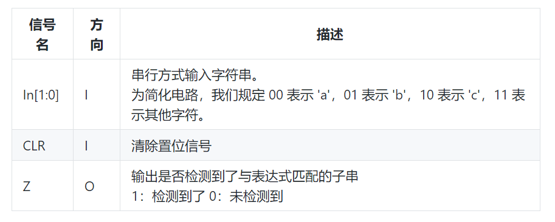
</div>

模块功能定义如下：

<div align="center">
    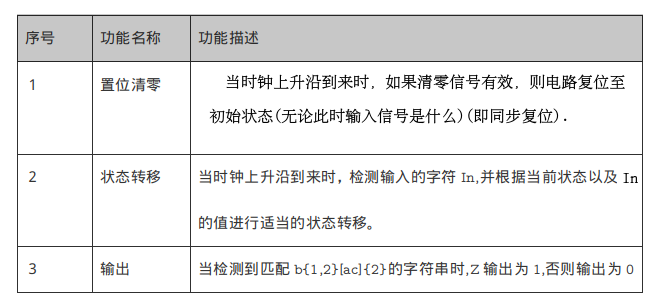
</div>

- 必须严格按照模块的端口定义
- 文件内模块名：fsm
- **注意：每当匹配到一个子串是，需要输出一次1。例如对字符串bacbacac,模块应当在第一个c输入和第二个c输入时输出1，而在其它时刻保持输出为0。**
- **注意：有限状态机的设计是Mealy型有限状态机。**
- 测试电路如下：（code部分是你需要搭建的电路）

<div align="left">
    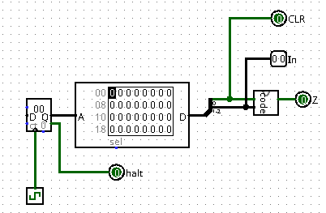
</div>

- **注意：请保证模块的appearance与下图完全一致，否则有可能造成评测错误**（查看模块appearance方法：在Logisim中打开相应模块后点击左上角按钮）

<div align="left">
    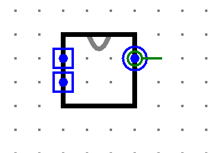
</div>

<div style="page-break-after: always;">
</div>