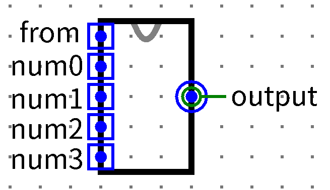
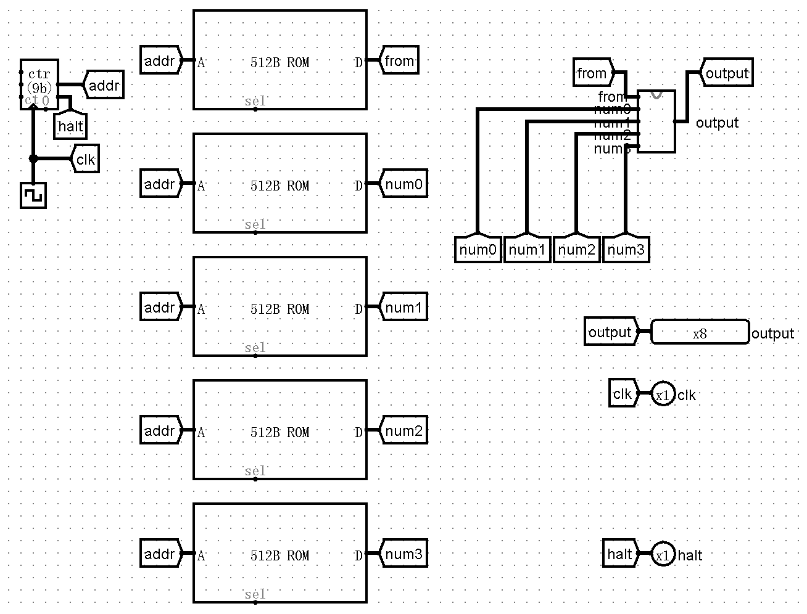

# P0_ups_and_downs 【起伏数列】【文件上传】

独小星在检测一个数列的起伏变化，聪明的他想到可以用状态机来自动检测。请你帮独小星实际一个Moore状态机，来统计一个串行输入数列的起伏规律，并在识别到特定规律时输出。

## 提交要求

### 前置知识

在本题中，串行输入是指，不断将当前输入追加到之前输入数列的末尾。假设截止到某个周期共有m个输入，从第零个周期到该周期的输入分别为: $a_0, a_1,...,a_{m-2}, a_{m-1}$。则从第零周期到该周期的串行输入的串依次为：

$$
\begin{align}
& a_0 \\
& a_0 a_1 \\
& a_0 a_1 a_2 \\
& ..... \\
& a_0a_1a_2...a_{m-2}a_{m-1} \\
\end{align}
$$

本题中的“起伏”指的是：当前周期输入$a_m$相对于上一周期最后输入$a_{m-1}$的大小关系。若$a_m$**严格大于**$ a_{m-1} $，则称为一次“起”。若$a_m$**严格小于**$a_{m-1}$，则称为一次“伏”。

数据保证**相邻两周期输入不相同**。

### 任务要求

使用Logisim搭建一个识别串行输入串中“起起伏起”规律的Moore状态机。

每个周期输入一个位宽为5的**无符号数**，当最近四个周期的输入使得数列满足“起”“起”“伏”“起”时，输出1，否则输出0。

状态机支持**循环检测**，即当前“起”“起”“伏”“起”的最后一个“起”可以作为下一次“起”“起”“伏”“起”的第一个“起”。

数列默认第零项为`5'd7`，**在初始状态和复位后**，数列的$a_0=$`5'd7`。

### 样例

假设串行输入串为：$(7)8901215$，则状态机输出为：$(0)001001$，其中输入的第一个7表示数列默认第零项为7，输出的第一个0表示在第一个输入到来之前输出默认为0。

### 输入输出

|**名称**|**功能**|**位宽**|**方向**|
|---|---|---|---|
|a|输入|5|I|
|clk|时钟信号|1|I|
|reset|异步复位信号|1|I|
|output|结果|1|O|

- **输入**：上文所述a(5 bits)，时钟信号(1 bit)，异步复位信号(1 bit)。
- **输出**：0或者1.
- **文件内模块名**：main
- **注意：请保证模块的 appearance 与下图一致，否则有可能造成评测错误。注意输入的上下顺序。**

    

### 测试电路图

    

- **注意：模块的`clk`输入与Logisim内置时钟并不一致。请保证模块内采用`clk`作为唯一时钟输入，不要在电路及子电路中使用 Logisim自带时钟，否则有可能造成评测错误。**

# P0_binary_calculator 【二进制移位计算器】【文件上传】

小企鹅在做数字电路设计时，想要设计一个支持特殊位运算的移位计算器，请你帮助设计一个Mealy状态机来实现这个功能。

## 提交要求

### 前置知识

在本题中，我们需要设计一个基于移位操作的二进制计算器，支持以下操作：

1. **移位加法**(SA): 将当前寄存器中的数值左移一位，然后加上输入的操作数
2. **移位减法**(SS): 将当前寄存器中的数值左移一位，然后减去输入的操作数
3. **移位异或**(SX): 将当前寄存器中的数值左移一位，然后与输入的操作数进行按位异或运算

### 任务要求

使用Logisim搭建一个移位计算器的Mealy状态机。

每个周期系统接收一个2位的操作码`op`和一个8位的操作数`operand`，根据操作码执行相关的运算，输出计算结果并将该结果存入寄存器。

操作码与运算的对应关系如下：

|`op`|**操作**|**功能描述**|
|---|---|---|
|00|复位|将寄存器清零|
|01|SA|将当前寄存器中的数值左移一位，然后加上输入的操作数|
|10|SS|将当前寄存器中的数值左移一位，然后与输入的操作数进行按位异或运算|

计算器的初始状态和复位后，寄存器中的数值为`8'h00`。

所有计算均使用无符号8位整数，计算结果如果超出8位表示范围，则类似取模运算保留低8位即可。

**reset说明**：本题不需要`reset`信号，具体逻辑通过`op`实现。

### 样例

假设每个时钟周期只有一次输入，那么输入序列为：

\[
\begin{aligned}
& \text{op} = 01,\quad \text{operand} = 0x03 \quad \# SA操作：(0x00 \ll 1) + 0x03 = 0x03 \\
& \text{op} = 01,\quad \text{operand} = 0x05 \quad \# SA操作: (0x03 \ll 1) + 0x05 = 0x0B \\
& \text{op} = 10,\quad \text{operand} = 0x02 \quad \# SS操作: (0x0B \ll 1) - 0x02 = 0x14 \\
& \text{op} = 11,\quad \text{operand} = 0xFF \quad \# SX操作: (0x14 \ll 1) \mathbin{\hat{}} 0xFF = 0x28 \mathbin{\hat{}} 0xFF = 0xD7 \\
& \text{op} = 00,\quad \text{operand} = 任意 \quad \# 复位操作: 0x00
\end{aligned}
\]

对应的输出序列为：`0x03,0x0B,0xD7,0x00`

需要注意的是，本题要求使用Mealy型有限状态机，在一个时钟周期内可能输入会不停变化，但是只要时钟上升沿没有到达，其状态就不会被写入寄存器。

### 输入输出

|**名称**|**功能**|**位宽**|**方向**|
|---|---|---|---|
|op|操作码|2|I|
|operand|操作数|8|I|
|clk|时钟信号|1|I|
|result|计算结果|8|O|

- **输入**：操作码op，操作数operand，时钟信号。
- **输出**：计算结果result
- **文件内模块名**：main
- **测试要求**：请以Mealy状态机的方式实现。
- **注意：请保证模块的appearance与下图一致，否则有可能造成评测错误。注意输入的上下顺序。**

    

### 测试电路图

    

- **注意：模块的`clk`输入与Logisim内置的时钟并不一致。请保证模块内采用`clk`作为唯一时钟输入，不要在电路及子电路中使用Logisim自带时钟，否则有可能造成评测错误。**

# P0_intelligent_elevator 【智能电梯】【文件上传】

独小星设计了一种智能电梯，能够根据每层乘客人数来动态调节目标楼层，请你设计一个组合电路，计算电梯移动的总楼层数。

## 提交要求

### 前置知识

在本题中，一共只有**四个楼层**,分别命名为：第0层，第1层，第2层，第3层。

从第n层移动到第m层，电梯移动了$\lvert m-n\rvert$层楼。

### 任务要求

使用Logisim搭建一个电路，根据输入的信息计算电梯移动的总楼层数，并输出。

电梯初始停留楼层不固定，由输入信号from指定。from是一个位宽为4的独热编码，其与初始停留楼层的对应关系如下：

| from | **初始停留楼层** |
| ---- | ---------------------- |
| 0001 | 第0层                  |
| 0010 | 第1层                  |
| 0100 | 第2层                  |
| 1000 | 第3层                  |

该电梯为理想电梯，乘客只上不下，电梯容量无限。

电梯停留在某一层时，可以认为该层乘客全部进入电梯了，后续该层乘客数即为0。由于电梯一开始停留在初始楼层，因此无论输入的乘客数是多少，初始层乘客数可直接视为0.

电梯的运行逻辑为：寻找目前所有楼层中**乘客数最多且不为0**的楼层，并将其视为目标楼层，然后从当前停留楼层直达目标楼层并停留(中间路过的楼层不算做停留)。之后继续已该逻辑运行，知道所有楼层乘客数都为0.

数据保证**所有楼层乘客数不相同，且均不为0**.

### 输入输出

| **名称** | **功能**   | **位宽** | **方向** |
| -------------- | ---------------- | -------------- | -------------- |
| from           | 初始楼层独热编码 | 4              | I              |
| num0           | 第0层乘客数      | 8              | I              |
| num1           | 第1层乘客数      | 8              | I              |
| num2           | 第2层乘客数      | 8              | I              |
| num3           | 第3层乘客数      | 8              | I              |
| output         | 电梯移动总楼层数 | 8              | O              |

- **输入**：保证num0,num1,num2,num3互不相等，且均不为0。
- **输出**：电梯移动总楼层数(8 bits)。
- **文件内模块名：main**
- **注意：请保证模块的appearance与下图一致，否则有可能造成评测错误。注意输入的上下顺序。**

    

### 测试电路图

    

