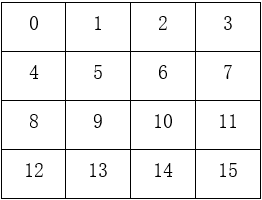
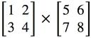
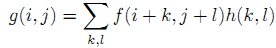

# 课下作业说明

## 作业说明

- 学习基于MIPS指令集的汇编语言，并在Mars环境下独立编写和调试以下程序：矩阵乘法，回文串判断，卷积运算，全排列。
- 高精度阶乘，01迷宫两道题为挑战题，不作为参与P2课上测试的条件。
- 所有程序的初始地址设置都是**Compact,Data at Address 0**
- 测试平台是使用命令行运行汇编程序，命令行中有CompactDataAtZero这个参数，如果**初始地址的设置不按照要求或者.data指令后面带有参数，程序会编译错误**。
- p2中所有的题目，如果没有特殊声明，都**不考虑延迟槽**的存在。
- p2中所有的题目，在程序运行完成后，需要**使用syscall结束程序**，否则评测机可能会误认为程序运行时间超出限制从而报错。
- p2中所有的题目，请大家本地充分测试后提交，请勿滥用评测机，每道题将设置5分钟提交间隔。

<div style="page-break-after: always;">
</div>

# 内存操作

## 简介

在高级语言中，我们可以使用多维数组对内存进行多维操作，但实际上，一般这些多维数组在内存中也只是按照一维的形式连续储存的。比如二维数组 `arr[2][2]`，他在内存中会占用4个单位的连续空间，分别保存 `arr[0][0],arr[0][1],arr[1][0],arr[1][1]`。

作为低级语言，汇编语言对内存只能进行一维操作。而为了实现多维操作，我们就需要使用一些技巧了，下面会进行举例分析。

## 样例分析

比如我们要将0~255依次赋给一个 `16*16`的矩阵，填充方式如下图 `4*4`矩阵的例子。

<span style="left">
    
</span>

使用高级语言的话只需要两个 `for`循环嵌套，如下：

```C
int value = 0;
int arr[16][16];
for (int i = 0; i <16; i++) {
    for (int j = 0; j < 16; j++) {
        arr[i][j] = value++;
    }
}
```

使用汇编语言的话，就需要分为三步：

- 初始化数据

```mips
.data
    data: .word 0 : 256 # storage for 16*16 matrix of words

.text
    li $t0, 16 # $t0 = number of rows
    li $t1, 16 # $t1 = number of columns
    move $s0, $zero # $s0 = row counter
    move $s1, $zero # $s1 = column ocunter
    move $t2, $zero # $t2 = the value to be stored
```

`$t0`和 `$t1`是总的行数，`$s0`和 `$s1`是当前复制的行列数，`$t2`就是要赋的值。

- 为一行矩阵赋值

```mips
# ____________tag1___________
loop : 
    mult $s0, $t1 # $s2 = row * #cols(two - instruction sequence)
    mflo $s2 # move mulitply result from lo register to $s2
    add $s2, $s2, $s1 # $s2 += column counter
    sll $s2, $s2, 2 # $s2 *= 4(shift left 2 bits) for byte offset
    sw $t2, data($s2) # store the value in matrix element
# ---------------------------

# ____________tag2___________
    addi $t2, $t2, 1 # increment value to be stored
# ---------------------------

# Loop control : If we increment past last column, reset column counter and increment row counter. 
#                If we increment past last row, we're finished.

# ____________tag3___________
    addi $s1, $s1, 1 # increment column counter
# ---------------------------

    bne $s1, $t1, loop # not at end of row so loop back
```

tag1段代码为当前矩阵元素对应的内存赋值，tag2和tag3代码段更新数据，最后一行判断这一行矩阵是否已完全赋值。

- 准备为下一行矩阵赋值

```mips
    move $s1, $zero
    addi $s0, $s0, 1
    bne $s0, $t0, loop
    li $v0, 10
    syscall
```

当一行矩阵已赋完值后，更新数据，然后重新回到loop处为下一行矩阵赋值，直到整个矩阵都赋完值。

## 补充：利用Macros简化二维数组的计算

在MIPS教程部分，我们学习了如何使用macro宏定义一些操作来简化我们的MIPS程序，对于二维数组的相关计算，我们可以发现，计算数组中元素的地址是一个重复且固定的算法，因此，我们计划创建一个macro来代替这些语句，从而减少代码行数，增加可读性，以便出错后更好的调试代码。

```mips
.macro calc_addr($dst, %row, %column, %rank)
    # dst : the register to save the calculated address
    # row : the row that element is in
    # column : the column that element is in
    # rank : the number of columns in the matrix

    multu %row, %rank
    mflo %dst
    addu %dst, %dst, %column
    sll %dst, %dst, 2
.end_macro
```

上面就是我们关于计算地址的macro了，我们精心的设计保证了运算中只改变%dst所代表的寄存器，避免了macro内部不可见的修改其他寄存器的情况的发生。这种复用代码的思想类似于函数，但是一定要注意macro的运用中易出现的如上所述的问题，希望同学们能够熟练运用，写出易懂的汇编代码来。

<div style="page-break-after: always;">
</div>

# 矩阵乘法(P2.Q1)

## P2_L0_matrix【文件上传】

### 任务

使用MIPS汇编语言编写一个具有矩阵相乘功能的汇编程序(不考虑延迟槽)。

### 具体任务

- 首先读取方形矩阵的阶数n，然后再依次读取第一个矩阵(n行n列)的第二个矩阵(n行n列)中的元素。
- 两个矩阵的阶数相同，我们提供的测试数据中`0 < n <= 8`，每个矩阵元素是小于10的整数。
- 最终将计算出的结果输出，每行n个数据，每个数据间用空格分开。评测机会自动过滤掉行尾空格以及最后的回车。
- 请使用syscall结束程序：

```
    li $v0, 10
    syscall
```

### 样例

<span style="left">
    
</span>

比如我们想要计算上面这两个矩阵相乘的结果，我们会给出以下输入：

```text
2
1
2
3
4
5
6
7
8
```

正确的输出应该是：

```text
19 22
43 50
```

### 提交要求
- 请勿使用`.globl main`。
- 不考虑延迟槽。
- 只需要提交`.asm`文件。
- 程序的初始地址设置(Mars->Settings->Memory Configuration)为**Compact,Data at Address 0**。

<div style="page-break-after: always;">
</div>

# 回文串判断(P2.Q2)

## P2_L0_judge【文件上传】

### 回文串判断

实现满足下面功能的汇编程序：
1. 判断输入的字符串是不是回文串。
2. 输出一个字符，是回文串输出1，否则输出0
3. 每组数据最多执行100000条指令
4. 请使用syscall结束程序：

```text
    li $v0, 10
    syscall
```

### 输入格式

第一行为一个整数n，代表字符串的长度。第二行开始的n行：每行一个字符(小写字母)，连起来为输入的字符串。(`0<n<=20`)

### 输出格式

输出为一行，输出一个字符，是回文串输出1，否则输出0。

### 输入样例

```text
5
a
b
b
d
l
```

### 输入样例

```text
0
```

### 提交要求

1. **请勿使用**`.globl main`
2. 不考虑延迟槽
3. 只需要提交`.asm`文件
4. 程序的初始地址设置为**Compact, Data at Address 0**

### 注意事项

1. 注意！因为评测机的行为和MARS有一些区别，你需要注意以下事项。
2. 如果你采取每次读入一个字符的系统调用(`$v0 = 12`)来读入数据，那么我们保证你不会读入到任何换行符。如果你采取这种方式输入，那么对于样例，你可以在MARS中首先手动输入5，打回车，然后手动在一行之中输入abbdl。
3. 如果你采取一次读一行的系统调用(`$v0 = 8`)，那么你读入的每行有一个小写字母以及行尾的一个换行符。
4. 如果你的程序长时间等不到应有的输入，则有可能提示超时或运行错误。
5. 在你处理字符的时候，你需要考虑到上述情况。

<div style="page-break-after: always;">
</div>

# 卷积运算(P2.Q3)

## P2_L0_conv【文件上传】

### 矩阵卷积

使用MIPS汇编语言编写一个进行卷积运算的汇编程序(不考虑延迟槽)。

### 具体要求

- 首先读取待卷积矩阵的行数m1和列数n1，然后读取卷积核的行数m2和列数n2。
- 然后再依次读取待卷积矩阵(m1行n1列)和卷积核(m2行n2列)中的元素。
- 卷积核的行列数分别严格小于待卷积矩阵的行列数。
- 测试数据中`0 < m1, n1, m2, n2 < 11`
- 输入的每个数的绝对值不会超过`2^10`。
- 最后输出进行卷积后的结果。
- 输出中，有`m1 - m2 + 1`行，每行有`n1 - n2 + 1`个数据，每个数据用空格分开。
- 卷积运算的定义：

<span style="left">
    
</span>

其中`f`为待卷积矩阵，`h`为卷积核，`g`即为输出矩阵，`k`与`l`的终值分别为卷积核`h`的行大小、列大小。计算中不考虑边缘效应。

- 请使用`syscall`结束程序：

```text
    li $v0, 10
    syscall
```

### 特别的

- 卷积窗口的移动步长为1，且不采用填充。

### 样例

给出以下输入：

```text
4
3
2
2
1
2
3
4
5
6
7
8
9
10
11
12
0
1
2
3
```

正确的输出应该是：

```text
25 31
43 49
61 67
```

### 提交要求

- 请勿使用`.globl main`
- 不考虑延迟槽。
- 只需要提交`.asm`文件
- 程序的初始地址设置(Mars->Settings->Memory Configuration)为**Compact, Date at Address 0**。

<div style="page-break-after: always;">
</div>

# 全排列(P2.Q4)

## P2_L0_full_1【文件上传】

### 全排列生成

实现满足下面功能的汇编程序：
1. 使用mips实现全排列生成算法。
2. 以0x00000000为数据段起始地址。
3. 输入一个小于等于6的正整数，求出n的全排列，并按照字典序输出。
4. 每组数据最多执行500000条指令。
5. 请使用`syscall`结束程序：

```mips
    li $v0, 10
    syscall
```

### 输入格式

只输入一行，输入一个整数n(0 < n <= 6)

### 输出格式

按照字典序输出n!行数组，每行输出n个数字，数字之间以空格隔开，每行最后一个数字后可以有空格。

### C代码提示

```C
#include<stdio.h>
#include<stdio.h>

int symbol[7], array[7];
int n;
void FullArray(int index) {
    int i;
    if (index >= n) {
        for (i = 0; i < n; i++) {
            printf("%d ", array[i]);
        }
        pirntf("\n");
        return;
    }
    for (i = 0; i < n; i++) {
        if (symbol[i] == 0) {
            array[index] = i + 1;
            symbol[i] = 1;
            FullArray(index + 1);
            symbol[i] = 0;
        }
    }
}
int main() {
    int i;
    scanf("%d", &n);
    FullArray(0);
    return 0;
}
```

### 输入样例

```text
1 2 3 4
1 2 4 3
1 3 2 4
1 3 4 2
1 4 2 3
1 4 3 2
2 1 3 4
2 1 4 3
2 3 1 4
2 3 4 1
2 4 1 3
2 4 3 1
3 1 2 4
3 1 4 2
3 2 1 4
3 2 4 1
3 4 1 2
3 4 2 1
4 1 2 3
4 1 3 2
4 2 1 3
4 2 3 1
4 3 1 2
4 3 2 1
```

### 提交要求

1. 请勿使用`.globl main`
2. 不考虑延迟槽
3. 只需要提交`.asm`文件
4. 程序的初始地址设置为**Compact, Date at Address 0**。

<div style="page-break-after: always;">
</div>