# P3_CPU设计文档——Logisim实现单周期处理器

> 既然设计文档也没有什么内容和格式上的要求，我就借此机会梳理总结一下搭建的完整过程和在搭建CPU时我的一些感想和体会。

本次实验内容为使用Logisim搭建一个能处理一些指令的CPU电路模型。要求支持的指令共有8条: `add, sub, ori, lw, sw, beq, lui, nop`。在之前几次实验课和理论课的学习过程中，虽然我对CPU的大致运行原理有了一定的认识，但是亲手完成一个CPU的设计和搭建还是很有挑战性的。

我把整个工程分为若干个阶段：
- 第一，先将完整的CPU分为若干个模块，结合实验的要求分别完成每个模块的设计。
- 第二，将搭建好的每个模块整合到一起，也就是完成数据通路的设计。这样就完成了从局部到整体的设计过程。
- 第三，根据不同的指令产生相应的控制信号，使用控制信号来决定数据通路中指令和数据的流通过程，从而实现用一套完整的线路就行实现多个指令。

经过了问题的分解，一个庞大的目标就转化为了若干个具体的小目标，实现起来也更加具象化，出现问题也更加容易找到有问题的部分。

## 搭建CPU第一部分：CPU局部模块的设计

通过理论课的学习，一个完整的CPU应当包含以下模块：

    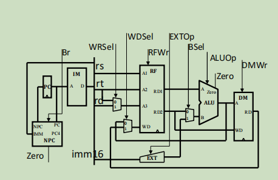

- **IFU模块(Instruction Fetch Unit)**：这个模块的工作是根据程序计数器PC生成的地址从指令存储器IM中读取指令，给到下一模块。在我们的设计中这是一个时序逻辑模块，因此要关注时钟信号和复位信号（异步复位信号）。
- **Splitter模块**：这个模块的工作是接接收IFU给的32位指令，把32位指令的机器码按照不同指令的格式分成不同的机器码段并分别输出，对于R型指令包括: 6位操作码opcode，5位rs寄存器编号，5位rt寄存器编号，5位rd寄存器编号，5位shamt码段，6位funct码段；对于I型指令包括：6位操作码opcode，5位rs寄存器编号，5位rt寄存器编号，16位立即数；对于J型指令包括：6位操作码opcode，26位跳转地址address。
- **GRF模块(General Register File)**：32个32位寄存器堆，这个模块的工作是临时存储数据，有两个读数据的端口和一个写数据的端口，这也是一个时序逻辑模块，需要异步复位。
- **ALU模块(Arithmetic Logic Unit)模块**：算术逻辑单元需要完成的工作是执行算数和逻辑运算，目前只有加减法和或逻辑运算。考虑到`liu`指令需要用到逻辑左移，因此我在设计时把逻辑移位运算也放到了这个模块中。
- **DM模块(Data Memory)**：这一部分实际上就是CPU中的内存部分，用来长期存储数据。这一部分也是时序逻辑。
- **EXT模块(Extent)**：这一部分的工作是进行位扩展，包括零扩展和符号扩展两种模式。对于目前这些指令需要进行的工作是将16位立即数扩展至32位，考虑到J型指令的需求，在设计时我给这一模块留出了26位立即数扩展至32位的接口。
- **Controller模块**：这一部分是整个CPU的控制电路，它的工作是接受不同的指令的操作码，识别出不同的指令从而产生相应的控制信号给出到其他模块，从而实现不同的数据通路的控制。

按照实验的要求，设计的顶层还应该有相应的输出信号，包括：**当前周期的32位指令，指令的地址，GRF写入控制信号，写入地址，写入数据，DM写入控制信号，控制地址，写入数据**。顶层的输入只有**异步复位信号**，时钟需要使用logisim内置的时钟信号。

### IFU模块

这个模块的处理指令的核心模块，顶层输入只有时钟信号和异步复位信号。考虑到跳转类指令，我们需要识别当前指令的类型，从而计算下一条指令的地址。考虑到`beq`跳转指令有触发条件，我们还应该加入是否跳转的判断信号和跳转的目标，也就是`beq`指令的立即数。顶层输出及32位指令的机器码和该条指令的地址。输入输出端口如下：

|信号名|方向|描述|
|---|---|---|
|clk|I|时钟信号|
|reset|I|**异步复位**信号|
|NPCop[1:0]|I|来自控制模块的信号，表示下一条指令地址的计算方式|
|beq_zero|I|来自ALU模块的信号，表示`beq`指令的两个目标寄存器的值是否相等|
|beq_imm[15:0]|I|来自Splitter模块，`beq`指令的立即数，表示跳转的地址偏移量|
|currentPC[31:0]|O|输出当前指令的地址(这是本次实验的要求，其实在CPU的工作中不需要将这个信号输出到模块外部)|
|instruction[31:0]|O|输出当前的指令(这是这个模块最关关键的输出信号！)|

考虑到IFU模块仍然是一个较大型的模块，工作也很复杂，因此我考虑将他进一步封装，分成三个小的模块，分别是：
- **PC模块**：指令寄存器，用于保存当前指令的地址；
- **NPC模块**：即nextPC模块，用于计算下一条指令的地址，也是IFU中最关键的模块；
- **IM模块**：指令存储器，用于保存全部的指令的机器码，接受指令的地址，取出相应地址的指令机器码。

#### 子模块一：**PC模块**

这一部分的搭建就很简单了，这个部分需要接受并储存下一条指令的地址，并给出当前指令的地址。输入输出端口如下：

|信号名|方向|描述|
|---|---|---|
|clk|I|时钟信号|
|reset|I|**异步复位**信号|
|nextPC[31:0]|I|下一条指令的地址，来自NPC模块|
|currentPC[31:0]|O|当前指令的地址，发送给IM用于取出机器码，发送给NPC用于计算下一条指令的地址|

这一部分实际上类似于一个有限状态机的状态储存部分。由于要求的指令初始地址是$0x00003000$并且要求异步复位，因此我再寄存器中存储的数字是每条地址减去$0x00003000$的结果，在输出时在给寄存器中的数字加上$0x00003000$就得到了真正的地址，以此来实现复位和初始化。如果是同步复位信号就不用这么麻烦了。

以下是具体的实现：

    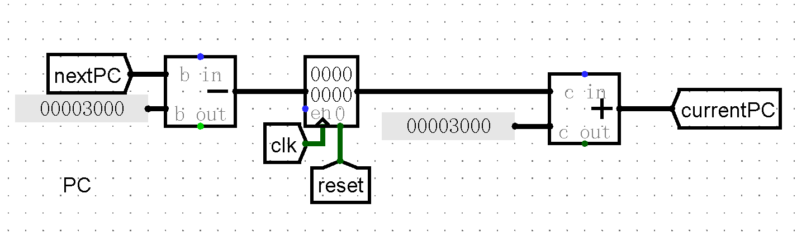

#### 子模块二：**NPC模块**

这一部分是整个IFU的关键，按顺序执行的指令只需要给当前指令地址(currentPC信号)加4就可得到下一条指令的地址(nextPC信号)。而`beq`指令如果跳转的话需要给currentPC在加4的基础上再加上16位立即数(beq_imm[15:0]信号)。目前只需要考虑这两种计算，而大于等于跳转小于等于跳转等比较跳转类指令的计算方式与`beq`相似，可以在`beq`的计算方式上进行扩展。J型指令中需要用到26位立即数，因此我在选择输出时预留了相应的接口。具体的输入输出端口如下：

|信号名|方向|描述|
|---|---|---|
|currentPC[31:0]|I|当前指令的地址|
|NPCop[1:0]|I|指令计算操作码，$00$表示顺序执行，$01$表示`beq`跳转，$10$和$11$是暂时给`jar`和`j`指令留出的接口|
|beq_zero|I|来自ALU模块，高电平表示`beq`指令的跳转条件成立；低电平表示跳转指令不成立|
|beq_imm16[15:0]|I|来自Splitter模块，`beq`指令的16位立即数|
|jar_imm26[25:0]|I|来自Splitter模块，`jar`指令的26位立即数|
|jr_A32[31:0]|I|暂时还不知道来自那个模块，`j`指令的32位操作数|
|nextPC[31:0]|O|计算好的下一条指令的地址|

这一部分类似有限状态机的次态逻辑，考虑到数据通路的复杂程度，NPC中的所有计算均使用模块内部的算术元件，而不是由ALU模块完成，这样可以保证模块的独立性，在实际生产中也能保证即使ALU部件有故障也不影响其他指令的正常运行。

以下是具体的计算过程：

    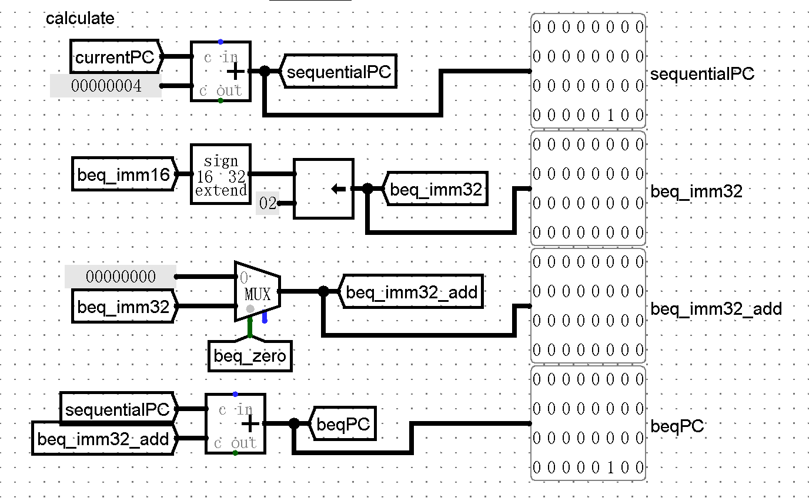

#### 子模块三：**IM模块**

这一部分相对简单，根据输入的地址取出数据，根据实验的要求使用ROM模拟指令寄存器即可实现。需要注意的是指令的地址是从$0x00003000$开始的，而我们的指令保存地址是从$0x00000000$开始的，因此取指令时需要给输入的地址减去$0x00003000$。输入输出端口如下：

|信号名|方向|描述|
|---|---|---|
|currentPC[31:0]|I|当前指令的地址|
|instruction[31:0]|O|取出的32位机器码|

需要注意的是指令的地址范围是从$0x00003000$~$0x00006FFF$，而且每条指令占四字节，所以实际上ROM的地址只需要12位就满足要求，因此我们需要取每个地址的第2位到第13位作为ROM取数据的参考。具体实现如下：

    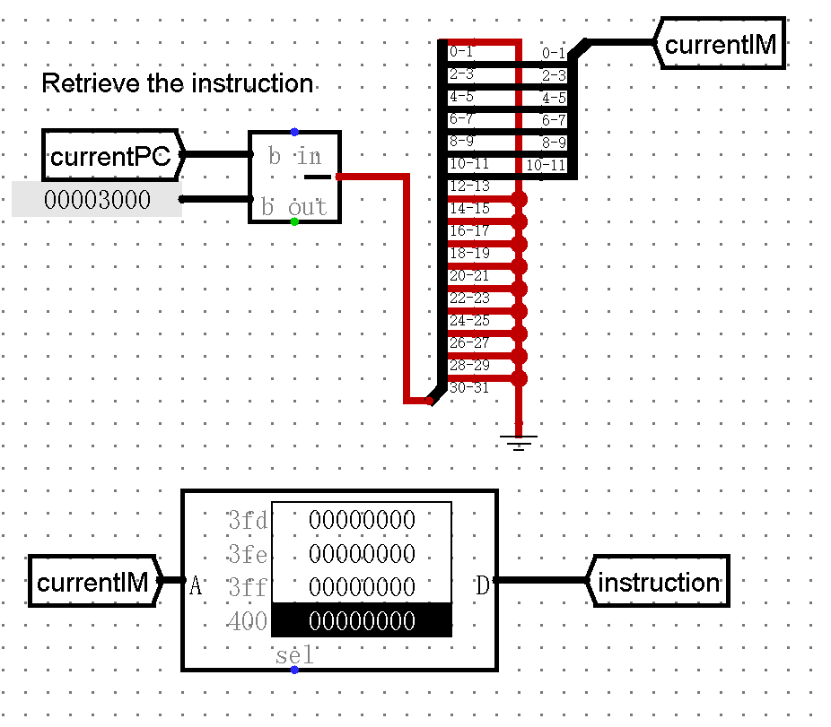

#### 将三个子模块连接成IFU

有了三个小模块，IFU的链接就很容易了。从PC中得到当前指令的地址，一边给到IM取出对应的指令作为输出，另一边给到NPC计算出下一条指令的地址。下一条指令的地址再作为PC的输入，保存到指令寄存器中，以此循环往复，不断地给出一条条指令。

具体的实现如下：

    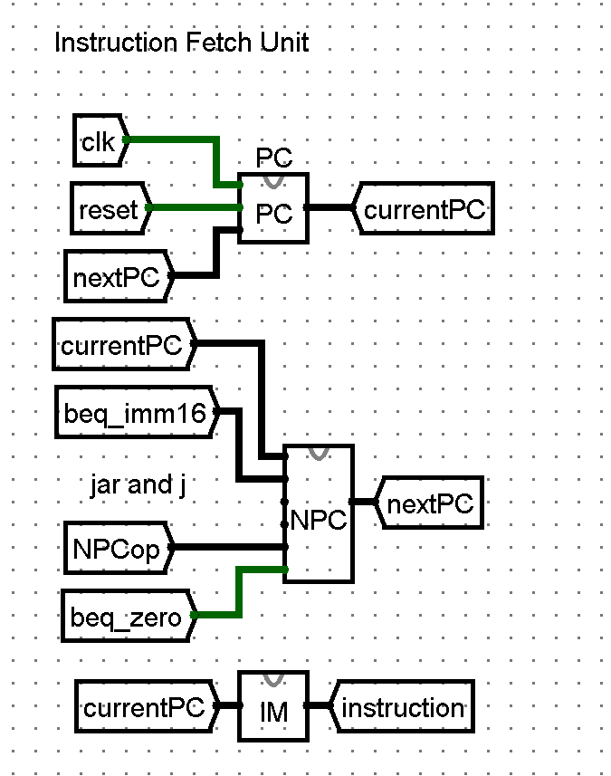

### Splitter模块

这一部分是一个组合逻辑，完成的任务就是取出32位机器码的不同位，搭建的时候注意splitter元件哪一端是高位，哪一端是低位就可以。输入输出端口如下：

|信号名|方向|描述|
|---|---|---|
|instruction[31:0]|I|当前指令的32位机器码|
|opcode[5:0]|O|一个指令的操作码，发送给控制模块用于识别不同的指令|
|rs[4:0]|O|rs寄存器的编号(针对I型指令和R型指令)|
|rt[4:0]|O|rt寄存器的编号(针对I型指令和R型指令)|
|rd[4:0]|O|rd寄存器的编号(针对R型指令)|
|shamt[4:0]|O|移位量，对于非移位指令这一段为0，不需要关注(针对R型指令)|
|funct[5:0]|O|功能码，用于明确一条R型指令的具体功能，也就是说和opcode共同区分一条R型指令(针对R型指令)|
|imm16[15:0]|O|16位立即数(针对I型指令)|
|imm26[25:0]|O|26位地址(针对J型指令)|

R型指令的机器码结构为:
&emsp;&emsp;**opcode[5:0] + rs[4:0] + rt[4:0] + rd[4:0] + shamt[4:0] + funct[5:0]**;

I型指令的机器码结构为：
&emsp;&emsp;**opcode[5:0] + rs[5:0] + rt[5:0] + immediate[15:0]**;

J型指令的机器码结构为：
&emsp;&emsp;**opcode[5:0] + address[25:0]**;

本次实验的指令并未涉及到J型指令，因此暂时还不需要分离出26位的地址。所以我在这个模块留出了分离指令后26位的接口。具体实现如下：

    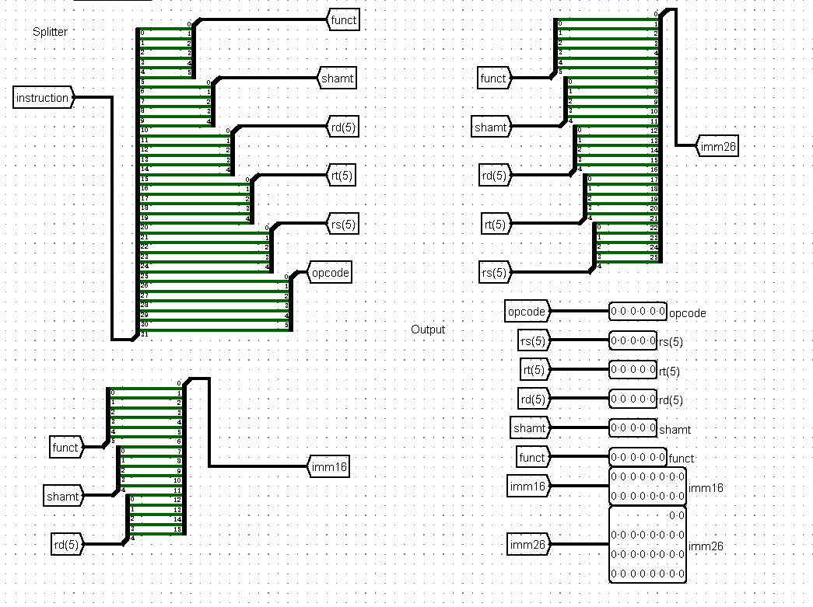

### GRF模块

这一部分在之前的课下提交中就作为一个独立的题目进行了设计，有两个读数据的端口，分别读取rs寄存器和rt寄存器的数据；有个写数据的端口，用来给rd寄存器写入数据。同时注意这个模块是时序逻辑，**异步复位**。

32个寄存器的初始值和复位值都是0，因此不需要额外处理。需要注意当有写入数据的需求时需要控制模块发送来写使能信号。输入输出端口如下：

|信号名|方向|描述|
|---|---|---|
|clk|I|时钟信号|
|reset|I|**异步复位**信号|
|GRFop|I|写使能信号，高电平时可以写入数据|
|rs[4:0]|I|rs寄存器编号(第一个读数据的端口)|
|rt[4:0]|I|rt寄存器编号(第二个读数据的端口)|
|rd[5:0]|I|rd寄存器编号(写数据的端口)|
|WD[31:0]|I|将要写入rd寄存器的数据|
|RD1[31:0]|O|rs寄存器中保存的数据|
|RD2[31:0]|O|rt寄存器中保存的数据|

这一部分没有什么需要特别注意地点，只是在搭建这个模块时我注意到了一个问题: 
> Logisim中DMX元件，会把输入的数据从选择信号指定的那一路输出出去，其他路并非没有输入，而是输入了0！第一次搭建GRF的时候我给目标寄存器写入数据的同时其他寄存器被清零就是这个问题。

具体的实现如下：

    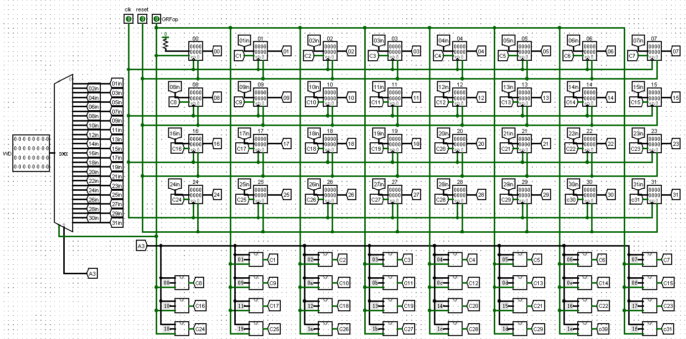

### ALU模块

这一部分需要完成相关的计算，目前的8条指令需要用到的有加减法，逻辑或运算，向左逻辑位移16位4种运算。特别需要注意的是针对`beq`指令ALU需要给出两个数是否相等的判断信号。一般来说出于代码复用的角度，ALU判断两数相等的做法是先作差然后和零比较。在这里由于已经有了封装好的32位运算元件，我就直接进行比较了。输入输出端口如下：

|信号名|方向|描述|
|---|---|---|
|memory[rs][31:0]|I|rs寄存器中存储的数据|
|memory[rt][31:0]|I|rt寄存器中存储的数据|
|ALUop[1:0]|I|算路逻辑单元的操作码，$00$表示加法，$01$表示减法，$10$表示或逻辑运算，$11$表示向左逻辑位移16位|
|Ans[31:0]|O|32位计算结果，发送到GRF就保存在寄存器中，发送到IM就保存到内存中|
|zero|O|判断两数是否相等，发送到NPC作为`beq`是否跳转的信号|

这里可以使用logisim中现有的32位运算元件，因此给我们的搭建工程节省了极大的工作量，如果需要我们从门电路搭建出1位运算器再从1位运算器搭建出32位运算器，那就需要考虑怎样提高一下效率了。

具体的实现如下：

    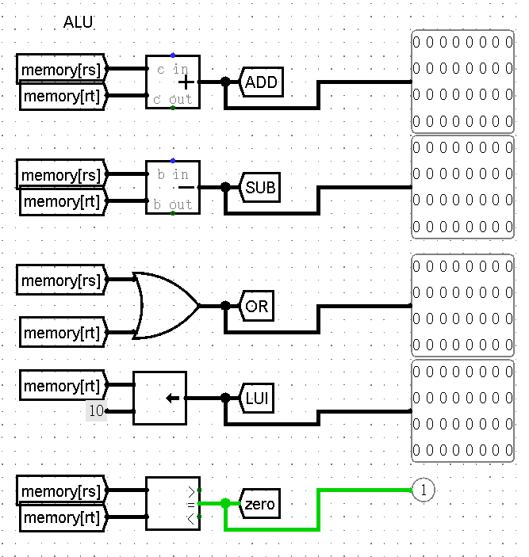

### DM模块

这一部分模拟CPU中的内存，实验要求用RAM实现。这个模块的整体难度并不大，注意这是一个时序逻辑的模块，异步复位。同时需要注意logisim中RAM元件的模式设置为“Separate load and stores ports”。输入输出端口如下：

|信号名|方向|描述|
|---|---|---|
|clk|I|时钟信号|
|reset|I|异步复位信号|
|DMop|I|写使能信号，高电平时写入数据，低电平时读出目标地址的数据|
|address[31:0]|I|写数据的地址|
|Datainput[31:0]|I|写入的数据|
|Dataoutput[31:0]|O|读出的数据|

这里的RAM也是用12位地址访问数据的，因此也需要对32位地址进行处理，处理的方式与IM模块中的ROM元件相似，这里就不再多说了。具体的实现如下：

    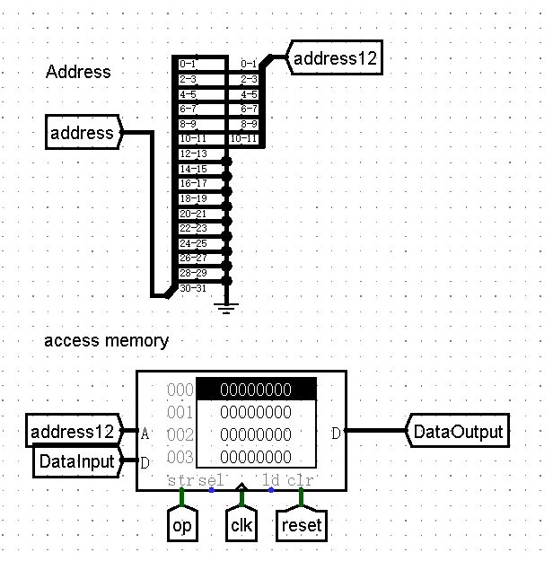

### EXT模块

这个模块较为简单，实现的功能就是把I型指令或J型指令的立即数进行扩展。扩展的方式有零扩展和符号扩展，因此需要接收来自控制模块的信号。输入输出端口如下：

|信号名|方向|描述|
|---|---|---|
|imm16[15:0]|I|16位立即数|
|imm26[25:0]|I|26位立即数|
|EXTop[1:0]|I|来自控制单元的控制信号，$00$表示16位立即数进行零扩展，$01$表示16位立即数进行符号扩展，$10$表示26位立即数进行零扩展，$11$表示26位立即数进行符号扩展|
|Ans[31:0]|O|32位扩展结果，发送到ALU进行下一步的计算|

在搭建时使用logisim内置的位扩展元件即可。具体的实现如下：

    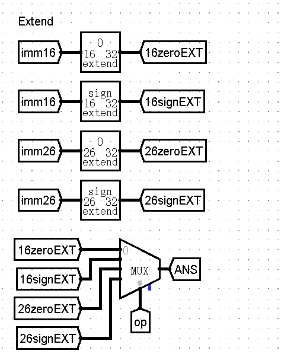

### Controller模块

这一部分是组合逻辑，是整个CPU的核心控制单元，以后添加指令也一定需要在这一部分添加产生相应控制信号的逻辑电路。这8个控制信号就是控制模块需要输出的信号，每一条指令对应自己的控制信号。我认为这一部分是最易错，也最重要的一个部分。那每一个指令应该生成怎样的控制信号呢？这就需要我们先构建完整的数据通路以后分析每一条指令应该走什么样的线路来决定了。

我们先来看每一条指令的数据路线。

#### `add`指令

- 机器码：$000000$ _ $xxxxx$ _ $xxxxx$ _ $xxxxx$ _ $00000$ _ $100000$

在执行`add`指令时，Splitter模块将指令的不同段分离出来，rs寄存器编号和rt寄存器编号发送到GRF模块，GRF取出对应的数据RD1和RD2发送到ALU模块进行计算，ALU将计算结果发送到GRF中储存在rt寄存器中。

#### `sub`指令

- 机器码: $000000$ _ $xxxxx$ _ $xxxxx$ _ $xxxxx$ _ $00000$ _ $100010$

在执行`sub`指令时，Splitter模块将指令的不同段分离出来，rs寄存器编号和rt寄存器编号发送到GRF模块，GRF取出对应的数据RD1和RD2发送到ALU模块进行计算，ALU将计算结果发送到GRF中储存在rt寄存器中。过程与`add`完全相同，只是ALU的计算控制信号不同。一个是加法，一个是减法。

#### `ori`指令

在执行`ori`指令时，Splitter模块将指令的不同段分离出来，rs寄存器编号发送到GRF模块，GRF取出对应的数据发送到ALU模块的第一个操作数；16位立即数发送到EXT模块先进行零扩展，然后发送到ALU的第二个操作数。ALU进行计算，将计算结果发送到GRF保存在rt寄存器中。在这个过程中，ALU模块的第二个操作数走的是与加减法不同的线路，因此需要一个控制信号来确定应该是哪个线路的数据进入ALU。GRF模块的写数据的寄存器也和加减法不同，因此也需要一个控制信号来确定写入GRF的数据应该保存在哪个寄存器中。

#### `sw`指令

- 机器码: $101011$ _ $xxxxx$ _ $xxxxx$ _ $xxxxxxxxxxxxxxxx$

在执行`sw`指令时，Splitter模块将指令的不同段分离出来，rs寄存器编号和rt寄存器编号发送到GRF模块，GRF取出rs对应的数据发送到ALU，分离出来的立即数经过符号扩展也送到ALU，相加之后作为地址发送到IM，然后GRF取出的rt寄存器的数据存入到IM中相应的地址中。在这条指令中，ALU计算的结果作为IM的地址输入，GRF取出的数据作为IM的数据输入。同时`sw`指令需要对立即数进行符号扩展，IM需要收到有效的写使能信号。

#### `lw`指令

- 机器码：$100011$ _ $xxxxx$ _ $xxxxx$ _ $xxxxxxxxxxxxxxxx$

`lw`指令和`sw`指令相似，Splitter模块将指令的不同段分离出来，rs寄存器编号发送到GRF模块，rt寄存器编号作为写入数据的地址发送到GRF模块。GRF取出rs寄存器中的数据发送到ALU作为第一操作数，16位立即数经过符号扩展发送到ALU作为第二操作数，相加之后作为地址发送到IM，读出相应地址的数据后作为GRF的数据输入写入rt寄存器中。在这条指令中，GRF需要收到相应的写使能信号。

#### `lui`指令

- 机器码：$001111$ _ $00000$ _ $xxxxx$ _ $xxxxxxxxxxxxxxxx$

在执行`lui`指令时，Splitter模块将指令的不同段分离出来，rt寄存器编号作为写入数据的地址发送到GRF模块。然后16位立即数经过零扩展后发送到ALU，ALU根据操作码进行向左移位，得到的计算结果再发送到GRF作为写入的数据，GRF在接收到写使能信号后将数据写入rt寄存器。其实16位立即数并不需要经过零扩展，但为了同一接口，简化和服用电路，我仍然零扩展后使用ALU进行逻辑移位。

#### `beq`指令

- 机器码: $000100$ _ $xxxxx$ _ $xxxxx$ _ $xxxxxxxxxxxxxxxx$

在执行`beq`指令时，Splitter模块将指令的不同段分离出来，rs寄存器编号和rt寄存器编号发送到GRF模块，GRF取出对应的数据RD1和RD2发送到ALU模块进行比较，返回zero信号到IFU中的NPC模块，高电平则表示符合跳转要求，低电平则不跳转。这时NPC在接收到识别`beq`指令的控制信号后进行计算，得到下一指令的地址。在这个指令的执行过程中，控制电路需要给IFU中的NPC模块发送识别到`beq`的信号。

#### `nop`指令

- 机器码：$00000000, 00000000, 00000000, 00000000$

本指令什么都不用做，所以输出的控制信号全部为零即可。

整理上面的所有模块并连接输入输出线路，发现我们一共用到了8个控制信号如图所示。

    

因此Contrtller的输入输出端口如下：

|信号名|方向|描述|
|---|---|---|
|opcode[5:0]|I|不同指令的操作码|
|funct[5:0]|I|R型指令辅助操作码对指令进行区分的字段|
|NPCop[1:0]|O|发送给IFU的NPC模块，$00$表示正常顺序执行，$01$表示识别到`beq`指令，$10$表示识别到`jar`指令，$11$表示识别到`j`指令(本次实验只用到了前两个信号)|
|GRFop|O|GRF的写使能信号，高电平有效|
|AddSub|O|发送到GRF写数据地址端口的**选择信号**，高电平时写入数据的地址为rd寄存器，低电平时写入数据的地址为rt寄存器(本质上是I型指令和R型指令的不同)|
|write|O|发送到GRF写数据数据端口的**选择信号**，高电平时写入从内从内存中取出的数据，低电平时写入ALU的计算结果|
|ALUop[1:0]|O|发送到ALU的操作码。$00$表示加法，$01$表示减法，$10$表示逻辑或立即数，$11$表示逻辑左移16位|
|IMMop|O|发送到ALU第二个操作数的**选择信号**，高电平时将立即数扩展后的结果输入到ALU的第二操作数，低电平时将GRF取出的RD2写入ALU的第二操作数|
|DMop|O|DM的写使能信号，高电平有效|
|EXTop|O|发送到EXT的操作码，高电平时进行符号扩展，低电平时进行零扩展|

具体的实现分两个部分，如下：

第一个部分：从opcode码段和funct码段识别出指令

    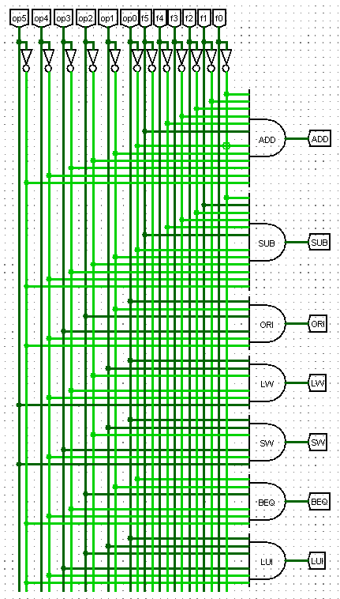

第二个部分：每条指令生成对应的控制信号

    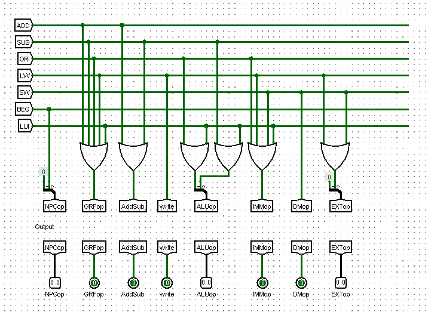

## 搭建CPU第二部分：将不同的模块整合为完整的CPU

具体的实现如下：

    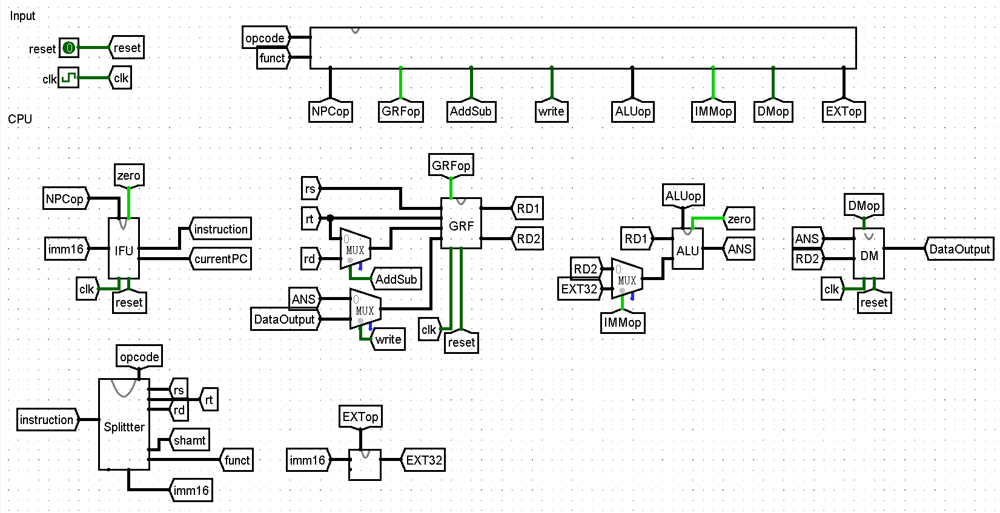

## 思考题

1. 上面我们介绍了通过 FSM 理解单周期 CPU 的基本方法。请大家指出单周期 CPU 所用到的模块中，哪些发挥状态存储功能，哪些发挥状态转移功能。
2. 现在我们的模块中 IM 使用 ROM， DM 使用 RAM， GRF 使用 Register，这种做法合理吗？ 请给出分析，若有改进意见也请一并给出。
3. 在上述提示的模块之外，你是否在实际实现时设计了其他的模块？如果是的话，请给出介绍和设计的思路。
4. 事实上，实现 nop 空指令，我们并不需要将它加入控制信号真值表，为什么？
5. 阅读 Pre 的 “MIPS 指令集及汇编语言” 一节中给出的测试样例，评价其强度（可从各个指令的覆盖情况，单一指令各种行为的覆盖情况等方面分析），并指出具体的不足之处。

&emsp;&emsp;对于第一个问题，其实在搭建的过程中就可以按照有限状态机的思路来理解每个模块的关系。在IFU单元中，PC寄存器发挥状态储存功能，NPC模块类似次态逻辑，发挥的是状态转移功能。而IM存储着所有的状态，接收PC给出的信号取出一个状态。在其他模块中，GRF和DM发挥储存功能，其他模块则通过各自的运算发挥状态转移功能。

&emsp;&emsp;读于第二个问题，由于我暂时还没有更好的方案来解决这个问题，所以暂时认为ROM和RAM是合理的吧。

&emsp;&emsp;对于第三个问题，实验中给出了6个模块。在搭建过程中我也是按照这个思路去搭建的，除了增加了一个Splitter模块暂时没用到更多的模块。

&emsp;&emsp;对于第四个问题，`nop`指令什么都不做就好了。

&emsp;&emsp;

## 搭建完成后的一些感想和思考

