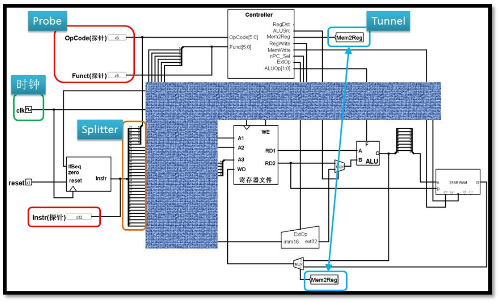
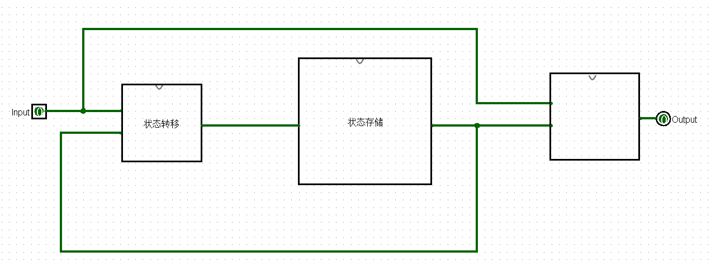
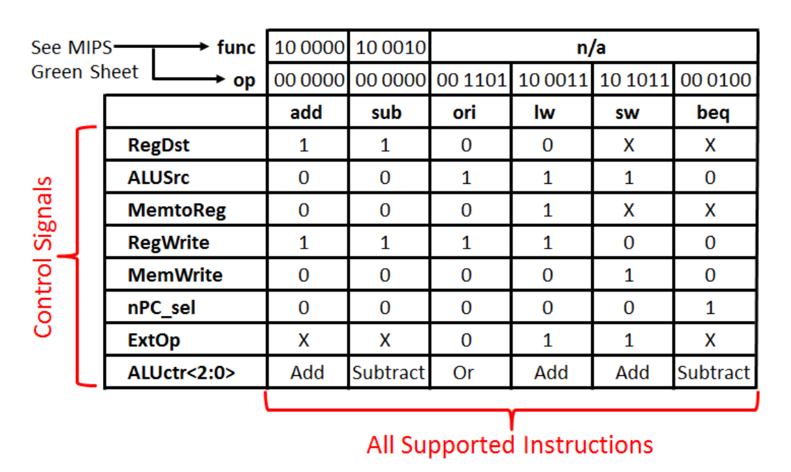
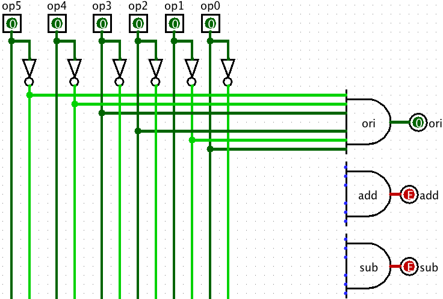
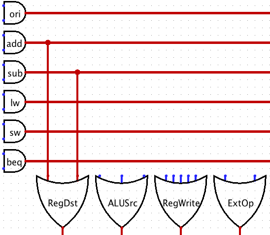
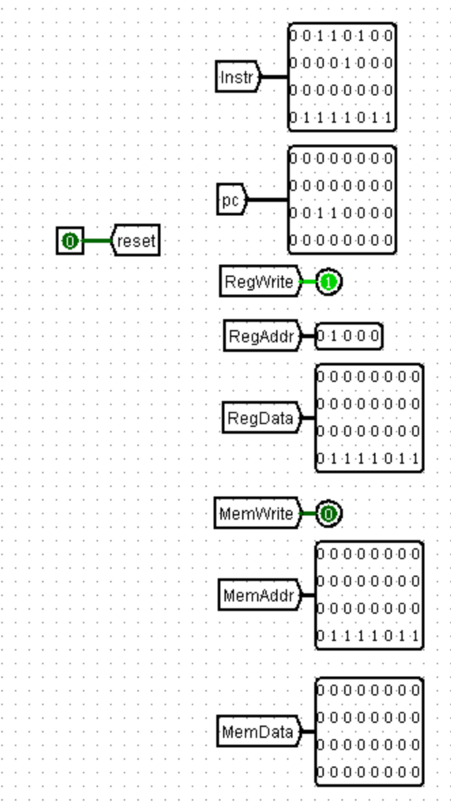
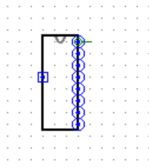
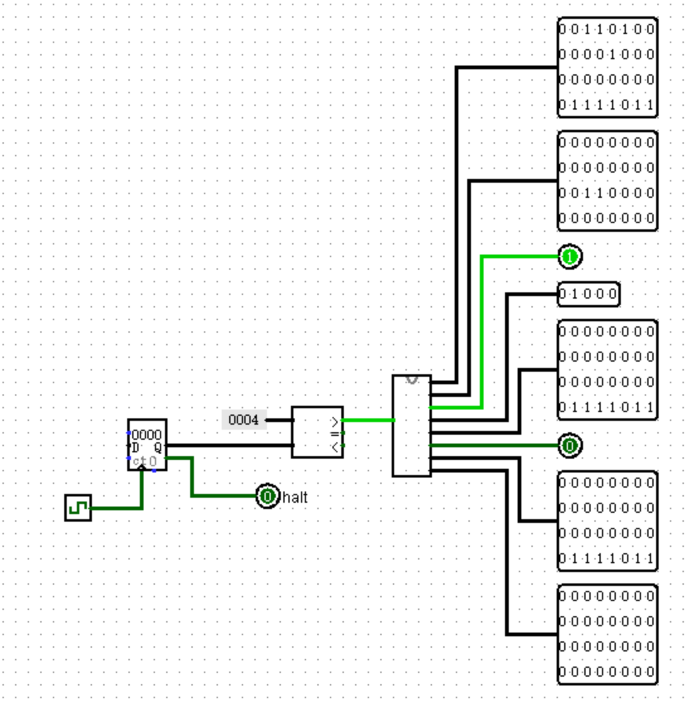

# 整体结构

## 概述

通过Pre预习教程、p0、p1和p2的学习，想必你已经基本掌握了本课程工具集的使用，是时候小试牛刀了。在本节中，你将使用Logisim开发一个简单的MIPS单周期处理器，并使用Mars自行编写测试程序，验证CPU设计的正确性。

本节的实验将带你走进CPU的世界，一窥CPU内部的构造，为今后更为复杂的实验打下基础。在这个过程中，我们希望同学们能够自行阅读理论课本的有关章节以及其他有关资料作为参考，也希望同学们能够认真设计自己的CPU，并保存自己的设计(即便只是草稿)。

**值得一提的是，我们将会在课上问答环节对设计原稿、测试方案与思考题等内容加以检查，请做好准备！**

## 基本思路

本节中，我们设计的CPU将包含IFU(取指令单元，从存储指令的ROM模块中取出下一条指令的32位二进制码)、Splitter(将每条指令的32位二进制码分成分别表示寄存器号、funct码等的二进制码段)、Controller(控制器，根据splitter得到的6位funct码和6位instr_index码确定指令的类型并输出对应的控制信号)、GRF(通用寄存器组，也成为寄存器文件、寄存器堆)、ALU(算术逻辑单元，实现指令需要的数学运算)、DM(数据存储器)、EXT(位扩展器，根据需要进行相应的位扩展)等基本部件，通过MUX(多路选择器)、splitter等内置器件组合连接成数据通路。一个可能的顶层设计参考图示为：

<span>
    
</span>

在阅读课本的相关章节后，大家应该对单周期的CPU的运行原理和过程有了一个大概的了解。为了方便大家更加深刻地理解CPU地工作过程，我们先来回忆一下在logisim的学习中提到的FSM。

<span>
    
</span>

Mealy型FSM由三部分组成：状态存储模块、状态转移电路和输出电路；它的功能，是根据当前状态和输入共同决定下一个状态和输出，实现状态的转换和输出的生成。对比一下我们要设计的单周期CPU，你会发现两者的相似之处：以splitter为界，将整个数据通路分成“上游”和“下游”两部分。数据通路的“上游”(输入下一个PC值并储存在PC寄存器中，下一个周期PC寄存器将其中的pc值传给ROM，ROM取得指令并输出给splitter)和“下游”(从splitter输入指令的各段二进制码，由Controller生成控制信号，寄存器堆根据指令进行读写、改变其中存储的数据，输出下一个pc值)分别是一个Moore型FSM和一个Mealy型FSM，只不过要比我们之前见过的复杂亿点点。

以“上游”为例，PC寄存器对应FSM中的状态储存模块，判断下一个存入PC寄存器的值的电路(通常封装为NPC模块)对应FSM中的状态转移电路，而从POM中取出指令并传给splitter的电路对应FSM中的输出电路。同理，我们也可以为“下游”各个部分找到它在FSM中对应的模块。

从上面的分析中我们发现，我们要完成单周期CPU，只需要实现“上游”的Moore型FSM和“下游”的Mealy型FSM，并将之用splitter拼在一起。希望大家在理解和设计的过程中结合之前学过的FSM知识，让脑海中形成单周期CPU的运作机理和模型、而不仅仅是照猫画虎，为后续更加抽象的Verilog单周期CPU甚至流水线CPU的设计打下坚实的基础。

## 设计要求

- 处理器为32位单周期处理器，应支持的指令集为: `add, sub, ori, lw, sw, beq, lui, nop`，其中：
  - `nop`为空指令，机器码 `0x0000_0000`，不进行任何有效行为(修改寄存器等)。
  - `add, sub`按无符号加减法处理(不考虑溢出)。
- 需要采用**模块化**和**层次化**设计。顶层有效的驱动信号要求包括且仅包括**异步复位信号reset**(clk请使用内置时钟模块)。

## 设计建议

- 推荐同学们在设计CPU前请**通读本章所有内容**，以避免无谓的修改；在设计CPU时参考之后各节给出的要求与建议，形成CPU设计草稿，并回答思考题。请注意：
  - 设计草稿与思考题为必做内容，请合并为CPU设计文档提交。
  - 设计草稿形式与篇幅不限，电子版可采用文本、截屏等形式，纸质版可直接拍照。
  - 最后需要提交的内容为：**CPU设计文档**、**Logisim电路源文件**。

<div style="background-color: #e6f7ff; border-left: 4px solid #1890ff; padding: 12px; border-radius: 4px; margin: 16px 0;">
<strong>思考题</strong><br>
上面我们介绍了通过FSM理解单周期CPU的基本方法。请大家指出单周期CPU所用到的模块中，哪些发挥状态存储功能，哪些发挥状态转移功能。
</div>

<div style="page-break-after: always;">
</div>

# 模块规格

## 模块规格

模块规格设计包含了CPU各个端口的**端口说明**与**功能定义**。一个好的模块规格可以让其他人快速理解该模块的功能并加以实现。这就相当于一份CPU重要部件的“说明书”，需着重设计。

本部分我们不直接给出详细的端口说明与功能规定，仅给出简略的要求，希望同学们在使用Logisim搭建CPU过程中，**自行完成相应的设计**。下面我们就各个模块给出几点要求：

- IFU(取指令单元)

  - 内部包括PC(程序计数器)、IM(指令存储器)及相关逻辑。
  - PC用寄存器实现，应具有**异步复位功能**，复位值为起始地址。
  - **起始地址: `0x0000_3000`**。
  - 地址范围: `0x0000_3000`~`0x00006FFF`。
  - IM用ROM实现，容量为 `4096 x 32bit`。
  - ROM内部的起始地址是从0开始的，即ROM的0位置存储的是PC为 `0x0000_3000`的指令，每条指令是一个32bit的常数。
  - 经过以上分析，不难发现ROM实际地址宽度仅需12位，请使用恰当的方法将PC中储存的地址同IM联系起来。
- GRF(通用寄存器组，也称为寄存器文件、寄存器堆)

  - 用具有写使能的寄存器实现，寄存器总数为32个，应具有**异步复位**功能。
  - **0号寄存器**的值始终保持为0.其他寄存器**初始值(复位后)均为0**，无需专门设置。
- ALU(算术逻辑单元)

  - 提供32位加、减、或运算及大小比较功能。
  - 加减法按无符号处理(不考虑溢出).
- DM(数据存储器)

  - 使用RAM实现，容量为 `3072 x 32bit`，应具有**异步复位**功能，复位值为 `0x0000_0000`。
  - **起始地址: `0x0000_0000`**
  - 地址范围: `0x0000_0000`~`0x0000_2FFF`。
  - RAM应使用双端口模式，即设置RAM的**Data Interface**属性为**Separate load and store ports**。
- EXT(扩展单元)

  - 可以使用Logisim内置的Bit Extender。
- Controller(控制器)

  - 使用与或门阵列控制信号的具体方法见后文叙述。
  - 也可以使用其他方式构造控制信号，同学们可以自行探索。

<div style="background-color: #e6f7ff; border-left: 4px solid #1890ff; padding: 12px; border-radius: 4px; margin: 16px 0;">
<strong>思考题</strong><br>
现在我们的模块中IM使用ROM，DM使用RAM，GRF使用Register，这种做法合理吗？请给出分析，若有改进意见也请一并给出。
</div>

<div style="background-color: #e6f7ff; border-left: 4px solid #1890ff; padding: 12px; border-radius: 4px; margin: 16px 0;">
<strong>思考题</strong><br>
在上述提示的模块之外，你是否在实际实现时设计了其他的模块？如果是的话，请给出介绍和设计的思路。
</div>

<div style="page-break-after: always;">
</div>

# 控制器设计

## 控制器设计

控制器的设计，从最基本的层面来说，是一个**译码**的过程，将每一条机器指令中包含的信息，转化为给CPU各部分的控制信号(RegDst, ALUSrc等等)，相信同学们在理论课上也了解了该部分的内容。而到了实践层面，如何让解码过程变得工程上可实现，是一个重要的问题。最为直接的办法就是生成真值表，但是这样在实际操作中不具有可扩展性与易调试性，指令数增加时非常容易导致Bug产生。所以，我们在下面提出一种可行的建议，空同学们参考。

我们把解码逻辑分为**和逻辑**与**或逻辑**两部分：和逻辑的功能是**识别**，将输入的机器码识别为相应的指令；或逻辑的功能是**生成**，根据输入的指令的不同，产生不同的控制信号。这种拆分使得两部分逻辑目的明确，这是一种朴素的**抽象**与**模块化**，希望同学们能够在其他的领域也加以借鉴。

<div>
    
</div>

而在设计这两套逻辑的过程中，和逻辑是非常自然的。而或逻辑则需要我们建立从指令到控制信号的的映射，为了避免错误的产生，我们希望使用真值表来完成相应的设计任务，并希望通过真值表可以简化相应的逻辑。一个典型的真值表如下图：

<div>
    
</div>

上图中，我们把 `beq`指令对应的ExtOp标记为x，而不是0或1，这代表在处理 `beq`指令时，我们采用的方法不需要用到ExtOp这个信号，也就是说不需要用到EXT模块。这是因为我们采用的是在NPC模块对 `beq`的16位立即数进行符号扩展的处理方式。

下图是上述逻辑在Logisim中的电路具体实现样例——**与或门阵列**(并不完整)，当然你也可以用自己的电路设计，比如使用Tunnel来简化布线、对指令进行合理的分类建模等方案。

<div>
    
</div>

在“和逻辑”的这一部分电路中，我们根据op1到op6这6个信号，通过恰当的将原信号和通过非门后的信号连接到同一个**与门**中，来使得“输入指令所对应的与门”能够产生“真”，而其他的与门产生“假”值。例如，上图中 `(op5, op4, op3, op2, op1, op0) == (0, 0, 1, 1, 0, 1)`的时候，ori指令所对应的与门产生“真”作为输出信号。同时，还需要保证其他的任何指令所对应的与门都输出“假”——因为我们通过是哪个与门输出真来判断输入的是哪种指令，而同一时刻我们只可能输入同一种指令。

<div>
    
</div>

在“或逻辑”的这一部分电路中，我们已经拥有了与门的输出结果，现在只需要考虑: 当输入了某种指令，需要使哪些控制信号输出“真”？由于同一时刻有且只可能有一个与门输出“真”，只需要将每个“指令对应的与门输出”连接到“该指令所产生的控制信号的或门输入”即可。例如输入是add指令或者是sub指令时，RegDst控制信号需要为真，上图中便将add与门和sub与门的输出连接到了RegDst或门的输入。

<div style="background-color: #e6f7ff; border-left: 4px solid #1890ff; padding: 12px; border-radius: 4px; margin: 16px 0;">
<strong>思考题</strong><br>
事实上，实现<code>nop</code>空指令，我们并不需要将他加入控制信号真值表，为什么？
</div>

<div style="page-break-after: always;">
</div>

# 测试CPU

> 通过课下测试并不意味着你的设计完全不存在问题，建议自行构造测试用例以验证设计的正确性(如果进行了相关工作，请写入设计文档，课上问答时将酌情加分)。

在完成CPU搭建后，进行CPU的测试是一个重要的环节，它可以检查出我们CPU设计和实现的错误。在Pre的“”一节中，我们初步介绍了测试程序设计的一些要点并给出了一个参考的测试样例。相比于课上强侧，Pre中给出的测试样例在量和强度上都存在一定不足，下面讲就课下指令功能测试进行一些建议和补充。

## 计算机类指令功能测试

- 寄存器数据方面，可以考虑一下情况：
  - 0及附近的数：-2, -1, 0, 1, 2
  - 32位数边界附近的数: −2147483648, −2147483647, 2147483646, 2147483647
  - 32位数范围内的一些随机数: −1000786109, 1919156834, ...
- 无符号立即数方面，可以考虑以下情况：
  - 0及附近的数: 0, 1, 2, 3
  - 16位无符号数边界附近的数: 6533, 65534, 65535
  - 16位无符号数范围内的一些随机数: 25779, 42528, ...
- 符号立即数(P3不涉及)方面，可以考虑以下情况：
  - 0及附近的数: -2, -1, 0, 1, 2
  - 16位符号数边界附近的数: -32768, -32767, 32766, 32767
  - 16位符号数范围内的一些随机数: -5329, 25299, ...

## 存取类指令功能测试

- offset方面，可以考虑以下情况:
  - offset是正数
  - offset是0
  - offset是负数
- `$base`寄存器方面，可以考虑以下情况:
  - `$base`寄存器中的值是正数
  - `$base`寄存器中的值是零
  - `$base`寄存器中的值是负数
- 特别的，对于 `sw`指令，建议存入的word中，每个byte都不是零。
- 特别的，对于 `lw`指令，可注意测试目标寄存器是 `$s0`的情况。

## 跳转类指令功能测试

- 对于非比较相关的部分，可以考虑一下情况：
  - 跳转，且目标在此跳转指令之前
  - 跳转，且目标是此跳转指令
  - 跳转，且目标在此跳转指令之后
  - 不跳转，且目标在此跳转指令之前
  - 不跳转，且目标是此跳转指令
  - 不跳转，且目标在此跳转指令之后
- 对于比较相关的部分，本质上依旧是构造寄存器数据，处理类似"计算类指令功能测试"。

## 其他测试上的建议

- 为更正确地进行测试，如果利用Mars进行对拍，应该将Mars和自己的CPU内存保持一致，因此需要在Mars中将Memory Configuration设置为Compact, Data at Address 0。才能让Mars的PC起始于0x3000，DM起始于0x0000。
- 为了更合理地进行测试，如果利用Mars对拍，单个测试点最多指令数不可以超过1024条，这个限制来源于Mars的.text段长度限制，有兴趣的同学可以思考其原因，并考虑能否通过修改Mars使其支持更大的指令容量以符合题目要求(例如IM容量)并进行测试。
- 为了更有效的进行测试，同学们可以在测试程序开始时将31个寄存器初始化乘非0值，这往往有助于发现bug，同样的，有兴趣的同学可以思考其原因。
- DM的地址范围为0x0000~0x2fff。生成Load/Store类指令时注意不要地址越界，这个范围同样来源于Mars的.data。
- 为了验证自己设计的正确性，一种简易且可行的方式是：

  - 对直接产生结果的的指令，将结果存入内存，同时增加维护内存位置的“指针”，其逻辑类似以下代码：

  ```C
  save[index++] = result;
  ```

  其对应的汇编语言可以为以下代码：
  ```mips
  # 假设此时的$t0维护存入内存位置的“指针”，$t1保存的是结果
  sw $t1, 0($t0) # 将result保存到内存位置
  addi $t0, $t0, 4 # 维护index指针
  ```

  - 对于不产生结果的指令，可以通过构造指令序列，是指令执行结果不同时(如跳转或不跳转)，存入内存的值不同或值的数量不同，其逻辑类似以下代码：`<br>`其对应的汇编语言可以为以下代码：

  ```C
  if (branch) save[index++] = result1;
  else save[index++] = result2;
  ```

  其对应的汇编语言可以为以下代码：
  ```mips
  # 假设此时的$t0维护存入内存位置的“指针”，$t1和$t2分别保存两种不同的数值
  # branch表示一种分支指令，如: beq $s0, $s1
  branch, save_result1
  nop 
  sw $t2, 0($t0) # 将result2保存到内存位置
  addi $t0, $t0, 4 # 维护index指针
  j end_branch
  nop

  save_result1:
  sw $t1, 0($t0) # 将result1保存到内存位置
  addi $t0, $t0, 4 # 维护index指针

  end_branch:
  # ......
  ```

  保存不同数量的值：
  ```C
  if (branch) save[index++] = result;
  save[index++] = result;
  ```

  其对应的汇编语言可以为以下代码：
  ```mips
  # 假设此时的$t0维护存入内存位置的“指针”，$t1用于保存一个数值
  # branch表示一种分支指令，如: beq $s0, $s1
  branch, save_result
  nop
  j end_branch
  nop

  save_result:
  sw $t1, 0($t0) # 存入result
  addi $t0, $t0, 4 # 维护index指针

  end_branch:
  sw $t1, 0($t0) # 存入result
  addi $t0, $t0, 4 # 维护index指针
  # ......
  ```

  - 测试程序运行结束以后，将logisim中的DM中的内容和Mars中内存的内容导出并对比，由于两者格式不同，同学们可以实现一个用于比对的程序，对于经过程序设计和数据结构训练的同学们而言，这并不难。
  - 此外也可以通过其他方式进行正确性验证，同学们可以自行探索。在这里建议学有余力的同学尝试在Pre部分涉及的Logisim自动化测试方法。在后面的Project中，同学们也可以采用类似的思想辅助进行自动化测试。
  - 为了避免课上产生不必要的bug，如果在测试时修改了IM和DM的规格，**请一定保证在进入课上时进行恢复！**

<div style="background-color: #e6f7ff; border-left: 4px solid #1890ff; padding: 12px; border-radius: 4px; margin: 16px 0;">
<strong>思考题</strong><br>
阅读Pre的“MIPS指令集及汇编语言”一节中给出的测试样例，评价其强度(可从各个指令的覆盖情况，单一指令各种行为的覆盖情况等方面分析)，并指出具体的不足之处。
</div>

<div style="page-break-after: always;">
</div>

# 提交窗口

## P3_L0_document【文件上传】

### CPU设计文档及思考题提交入口

#### 注意事项

- 设计文档应包含设计草稿、测试方案与思考题等内容。
- 推荐使用Markdown撰写设计文档，Markdown教程可参考[菜鸟教程](https://www.runoob.com/markdown/md-tutorial.html)

#### 思考题汇总
1. 上面我们介绍了通过 FSM 理解单周期 CPU 的基本方法。请大家指出单周期 CPU 所用到的模块中，哪些发挥状态存储功能，哪些发挥状态转移功能。
2. 现在我们的模块中 IM 使用 ROM， DM 使用 RAM， GRF 使用 Register，这种做法合理吗？ 请给出分析，若有改进意见也请一并给出。
3. 在上述提示的模块之外，你是否在实际实现时设计了其他的模块？如果是的话，请给出介绍和设计的思路。
4. 事实上，实现`nop`空指令，我们并不需要将它加入控制信号真值表，为什么？
5. 阅读 Pre 的“MIPS 指令集及汇编语言”一节中给出的测试样例，评价其强度（可从各个指令的覆盖情况，单一指令各种行为的覆盖情况等方面分析），并指出具体的不足之处。

## P3_student_judge【文件上传】

### CPU自动测试或辅助工具提交窗口

如果同学们在课下完成了辅助工程化设计或自动测试的工具，如自动测试环境的某个组件或全部，或根据文档自动生成代码以辅助开发的工具，请在这个窗口提交自己工具的工程源码。

建议附加简单的说明，注明运行环境和启动方法，我们会逐一查看同学们的最后一次提交。

#### 注意事项

- 提交**格式不限**(请控制文件大小，多文件可压缩后提交)，但请不要在此窗口提交其他的文件，如CPU、设计文档等，并尽可能保持文件树整洁。
- 如果在这个窗口进行过提交，在课上问答结束，将组合考虑工具的完成情况及个人意愿安排额外的问答，视实际效果和完成度酌情加分，并将作为助教选拔的标准之一。
- 这个窗口提交的提交在考试期间**无法**下载查看，这个窗口提交与否不作为能否参与课上的条件。
- 请**不要**提交他人的自动测试或辅助工具，如果你与他人合作完成了工具的开发，或使用了他人的工具作为你的工具的组成部分，请明确注明**自己完成的部分**。

## P3_L0_weak_2023【文件上传】

### CPU电路源文件提交入口

#### 评测说明

为了鼓励同学们编写自己的测试程序，对于评测机使用的评测程序，我们仅给出第一个测试数据的机器码来进行本地测试，测试代码机器码见附件。

评测机将通过如下读取一下信号来对正确性进行判断，因此请保证在顶层视图中有如下输出信号

- Instr: 32位指令信号
- pc: 32位程序计数器信号
- RegWrite: GRF写入控制信号
- RegAddr: GRF5位写入地址
- RegData: GRF32位写入数据
- MemWrite: DM写入控制信号
- MemAddr: DM32位写入地址
- MemData: DM32位写入数据

我们建议你使用Tunnel将相关信号引出，如下图所示。但无论你是用什么方法，请确保输入输出的相对位置、位宽与下图相同。

<div>
    
</div>

#### **注意事项**

- 顶层模块名称: main
- 子电路外观：

<div style="left">
    
</div>

- 测试电路如下图所示：

<div>
    
</div>

- 本实验允许使用Logisim所有的内置元器件。
- 请提交单一一个 `.circ`文件，评测机会自动在你的ROM中加载机器码进行测试。
- 提交自动评测的时间间隔为5分钟，请自行做好测试在提交评测机评测。
- 本次实验课下测试部分仅提供弱侧，其返回的错误信息有一定的参考价值，但请不要完全依赖！
- **参加课上测试条件：**
  - **通过本窗口的所有测试点。**
  - **提交CPU设计文档。**

[P3_textcode.txt](./P3_testcode.txt)
