# P4_CPU设计文档——Verilog实现单周期处理器

> 既然设计文档也没有什么内容和格式上的要求，我就借此机会梳理总结一下在本周搭建的完整过程和在搭建CPU时我的一些感想和体会。

本次实验的任务是使用Verilog语言写一个32位单周期处理器，需要支持的指令集为：`add, sub, ori, lw, sw, beq, lui, jal, jr, nop`，这在P3实验的基础上新增了一些指令，但是总体来说搭建CPU的思路是一致的。仍然先搭建不同的模块，最后把所有模块整合到顶层模块mips.v中。有了P3的基础上，CPU每个模块以及整体数据通路的具体架构就不再是P4需要重点关注的事情了，这一部分直接参考P3即可。P4需要考虑的事情是怎样**用代码来实现**这些功能。

<div style="page-break-after: always;">
</div>

## 搭建CPU第一部分：CPU局部模块的设计

我沿用P3的设计，整个CPU分为7个一级模块以及IFU调用的3个二级模块，它们分别是：

- IFU
  - PC
  - NPC
  - IM
- Splitter
- GRF
- ALU
- DM
- EXT
- Controller

需要注意的是P4要求使用同步复位信号reset，因此在所有时序逻辑中需要小心。下面具体来看每一个模块的搭建过程。

### IFU

IFU分为三个小模块，这里需要同时考虑 `beq``jal``jr`三种跳转方式和正常顺序执行。因此NPC模块的计算方式在P3的基础上有增加。

#### PC子模块

PC寄存器就是一个寄存器，里面存着当前指令的地址。唯一需要注意的就是初始地址不是$0x0000_0000$而是$0x00003000$，输入输出端口如下：

| 信号名          | 方向 | 描述                                                                      |
| --------------- | ---- | ------------------------------------------------------------------------- |
| clk             | I    | 时钟信号                                                                  |
| reset           | I    | **同步复位**信号                                                    |
| nextPC[31:0]    | I    | 下一条指令的地址，来自NPC模块                                             |
| currentPC[31:0] | O    | 当前指令的地址，发送给IM用于取出机器码，发送给NPC用于计算下一条指令的地址 |

代码实现如下：

<div>
    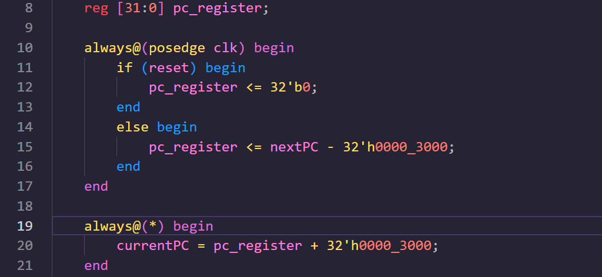
</div>

#### NPC子模块

在考虑到J型指令和 `jr`跳转指令后，NPC共有4中计算方式。同时要注意的是 `jal`指令需要将$PC + 8$写入到 `$ra`寄存器。因此输入输出端口定义如下：

| 信号名                   | 方向 | 描述                                                                                                      |
| ------------------------ | ---- | --------------------------------------------------------------------------------------------------------- |
| currentPC[31:0]          | I    | 当前指令的地址                                                                                            |
| NPC_op[1:0]              | I    | 指令计算操作码，$00$表示顺序执行，$01$表示 `beq`跳转，$10$表示 `jal`跳转，$11$表示 `jr`跳转 |
| beq_zero                 | I    | 来自ALU模块，高电平表示 `beq`指令的跳转条件成立；低电平表示跳转指令不成立                               |
| imm16[15:0]              | I    | 来自Splitter模块，`beq`指令的16位立即数                                                                 |
| imm26[25:0]              | I    | 来自Splitter模块，`jal`指令的26位立即数                                                                 |
| add32[31:0]              | I    | 来自GRF模块 `$ra`寄存器，`j`指令的32位操作数                                                          |
| nextPC[31:0]             | O    | 计算好的下一条指令的地址                                                                                  |
| jal_return_address[31:0] | O    | $PC+4$的值，需要保存到 `$ra`寄存器中，作为调用函数结束以后返回的地址                                  |

> 这里有一个需要格外注意的点！根据mips指令集，实际上 `jal`指令保存到 `$ra`寄存器的数值应该是$PC+8$！这是因为我们现在搭建的是**不考虑延迟槽的单周期处理器！** 所以在这里保存$PC+4$，也就是下一条指令作为函数调用结束返回后执行的指令。

四种计算方式的宏定义为：

<div>
    
</div>

具体的计算过程代码实现为：

<div>
    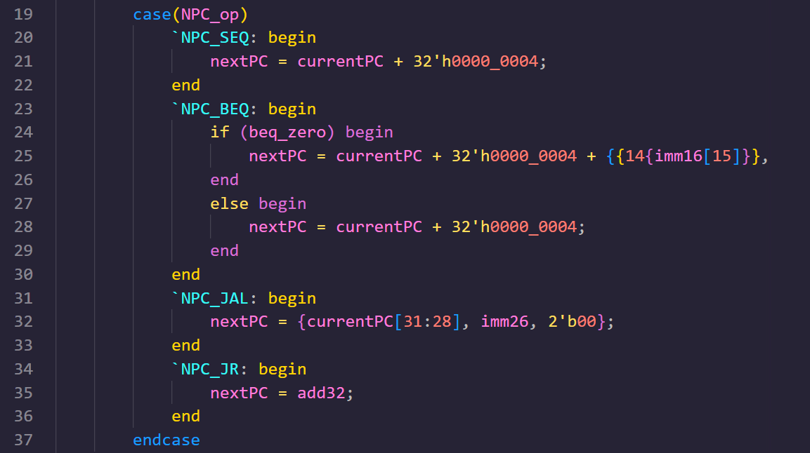
</div>

#### IM子模块

在Logisim中，可以直接使用内置的RAM和ROM模块进行仿真。而在Verilog代码中则没有这样的功能，需要我们用庞大的寄存器阵列来模拟内存。而Verilog提供了读写寄存器的内置函数，因此将程序的若干条机器码导入ROM的工作可以直接使用内置函数 `$readmemh`来完成。输入输出端口定义如下：

| 信号名            | 方向 | 描述             |
| ----------------- | ---- | ---------------- |
| currentPC[31:0]   | I    | 当前指令的地址   |
| instruction[31:0] | O    | 取出的32位机器码 |

这里IM的容量为$4096*32bit$，即4096个32位寄存器。指令的地址是从$0x00003000$开始的，而我们的指令保存地址是从$0x00000000$开始的，因此取指令时需要给输入的地址减去$0x00003000$。

指令的地址范围是从$0x00003000$~$0x00006FFF$，而且每条指令占四字节，所以实际上ROM的地址只需要12位就满足要求，因此我们需要取每个地址的第2位到第13位作为ROM取数据的参考。详细的解释参考下面的DM模块(我先写的DM，后写的IM)。

具体的代码实现如下：

<div>
    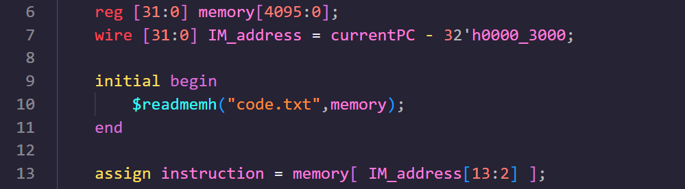
</div>

#### 把三个小模块整合到一起

我们需要在IFU.v模块里实例化这三个子模块，然后按照逻辑搭建出大的IFU模块。首先IFU的输入输出端口定义如下：

| 信号名                   | 方向 | 描述                                                                                    |
| ------------------------ | ---- | --------------------------------------------------------------------------------------- |
| clk                      | I    | 时钟信号                                                                                |
| reset                    | I    | **同步复位**信号                                                                  |
| NPC_op[1:0]              | I    | 来自控制模块的信号，表示下一条指令地址的计算方式                                        |
| beq_zero                 | I    | 来自ALU模块的信号，表示 `beq`指令的两个目标寄存器的值是否相等                         |
| imm16[15:0]              | I    | 来自Splitter模块，`beq`指令的立即数，表示跳转的地址偏移量                             |
| imm26[25:0]              | I    | 来自Splitter模块，`jal`指令的立即数，表示跳转的地址偏移量                             |
| add32[31:0]              | I    | 来自GRF模块 `$ra`寄存器，`j`指令的32位操作数                                        |
| currentPC[31:0]          | O    | 输出当前指令的地址(这是本次实验的要求，其实在CPU的工作中不需要将这个信号输出到模块外部) |
| instruction[31:0]        | O    | 输出当前的指令(这是这个模块最关关键的输出信号！)                                        |
| jal_return_address[31:0] | O    | $PC+8$的值，需要保存到 `$ra`寄存器中，作为调用函数结束以后返回的地址                |

首先明确IFU这个大模块的输入输出端口定义：

<div>
    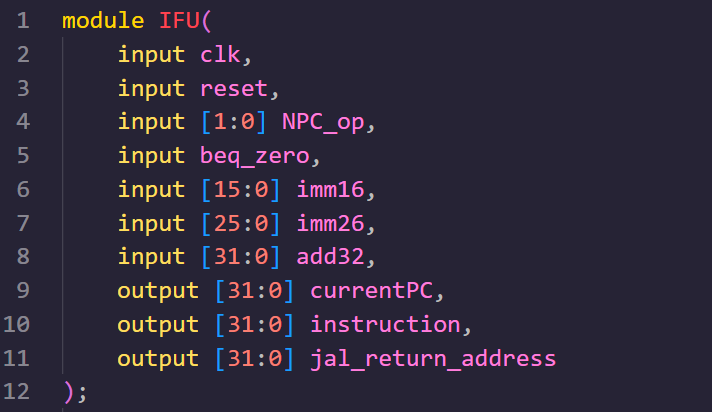
</div>

然后声明了需要的中间变量后将三个子模块实例化：

<div>
    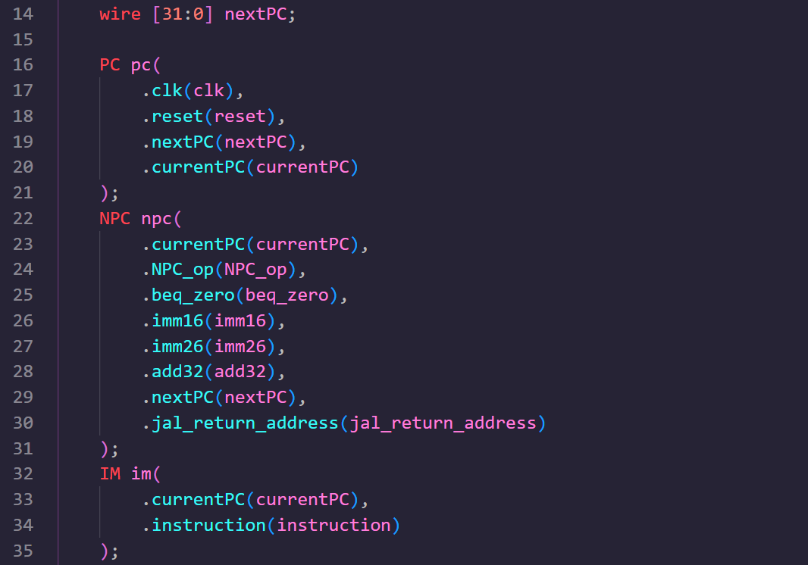
</div>

<div style="page-break-after: always;">
</div>

### Splitter模块

综合考虑所有需要支持的指令以及它们不同的类型，我们需要把一个32位机器码划分成：

- R型指令：opcode[5:0], rs[4:0], rt[4:0], rd[4:0], shamt[4:0], funct[5:0]，共6段；
- J型指令：
- I型指令：opcode[5:0], rs[4:0], rt[4:0], imm16[15:0]，共4段。

因此Splitter模块就是要根据32位机器码给出这些字段，故它的输入输出端口定义如下：

| 信号名            | 方向 | 描述                                                                                    |
| ----------------- | ---- | --------------------------------------------------------------------------------------- |
| instruction[31:0] | I    | 当前指令的32位机器码                                                                    |
| opcode[5:0]       | O    | 一个指令的操作码，发送给控制模块用于识别不同的指令                                      |
| rs[4:0]           | O    | rs寄存器的编号(针对I型指令和R型指令)                                                    |
| rt[4:0]           | O    | rt寄存器的编号(针对I型指令和R型指令)                                                    |
| rd[4:0]           | O    | rd寄存器的编号(针对R型指令)                                                             |
| shamt[4:0]        | O    | 移位量，对于非移位指令这一段为0，不需要关注(针对R型指令)                                |
| funct[5:0]        | O    | 功能码，用于明确一条R型指令的具体功能，也就是说和opcode共同区分一条R型指令(针对R型指令) |
| imm16[15:0]       | O    | 16位立即数(针对I型指令)                                                                 |
| imm26[25:0]       | O    | 26位地址(针对J型指令)                                                                   |

在代码的编写过程中难度不大，熟练掌握数据的位拼接的语法即可。具体的代码实现如下：

<div>
    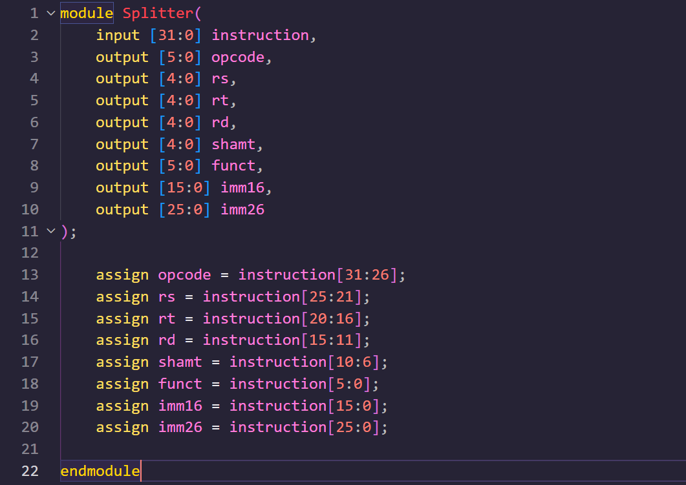
</div>

<div style="page-break-after: always;">
</div>

### GRF

这个模块是32个32位寄存器组成的寄存器堆，使用数组即可。注意这里需要使用同步复位信号，并且要保持0号寄存器的值始终为零。它的写使能信号来自控制器。它的输入输出端口定义如下：

| 信号名    | 方向 | 描述                             |
| --------- | ---- | -------------------------------- |
| clk       | I    | 时钟信号                         |
| reset     | I    | **同步复位**信号           |
| GRF_WE    | I    | 写使能信号，高电平时可以写入数据 |
| A1[4:0]   | I    | rs寄存器编号(第一个读数据的端口) |
| A2[4:0]   | I    | rt寄存器编号(第二个读数据的端口) |
| A3[4:0]   | I    | rd寄存器编号(写数据的端口)       |
| WD[31:0]  | I    | 将要写入rd寄存器的数据           |
| RD1[31:0] | O    | rs寄存器中保存的数据             |
| RD2[31:0] | O    | rt寄存器中保存的数据             |

> &emsp;&emsp;在写代码的时候，这里有一个需要注意的点是写数据是只有在时钟上升沿，也就是说写入数据是时序逻辑。而读数据需要按照组合逻辑来赋值。
>
> &emsp;&emsp;注意组合逻辑用阻塞赋值，时序逻辑用非阻塞赋值.

代码分成模块声明，同步复位和写数据(时序逻辑)，读数据(组合逻辑)三块，具体的实现如下：

- 模块声明：

<div>
    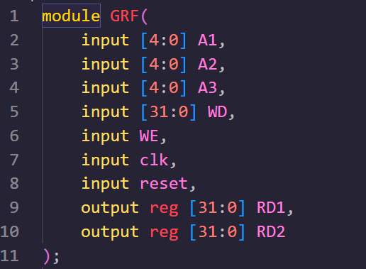
</div>

- 时序逻辑

<div>
    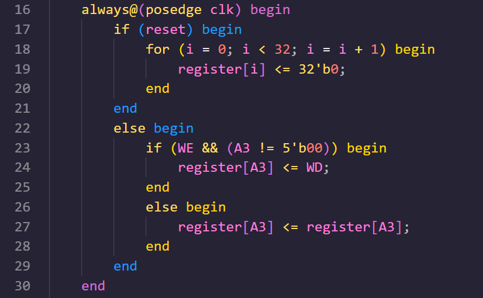
</div>

- 组合逻辑

<div>
    
</div>

<div style="page-break-after: always;">
</div>

### ALU

就目前的指令集来看，32位运算器需要支持的运算有加减法，逻辑位或，逻辑左移16位四种。另外，ALU还需要能够进行两个数是否相等的比较，供 `beq`指令进行判断。它的计算方式信号来自控制器。这个模块是组合逻辑，因此不涉及时钟和复位信号。它具体的输入输出端口定义如下：

| 信号名      | 方向 | 描述                                                                                                   |
| ----------- | ---- | ------------------------------------------------------------------------------------------------------ |
| A[31:0]     | I    | rs寄存器中存储的数据                                                                                   |
| B[31:0]     | I    | rt寄存器中存储的数据                                                                                   |
| ALU_op[1:0] | I    | 算路逻辑单元的操作码，$00$表示加法，$01$表示减法，$10$表示或逻辑运算，$11$表示向左逻辑位移16位 |
| ans[31:0]   | O    | 32位计算结果，发送到GRF就保存在寄存器中，发送到IM就保存到内存中                                        |
| zero        | O    | 判断两数是否相等，发送到NPC作为 `beq`是否跳转的信号                                                  |

> 不同的计算模式使用宏定义即可。
>
> 使用case语句块注意写default分支。

以下是具体的代码实现：这个模块现在支持的四种计算方式为：

<div>
    
</div>

每种计算的具体实现和为 `beq`指令实现做的比较为：

<div>
    
</div>

如需扩展这个模块，只需要增加 `ALU_op`信号的位宽以增加更多的计算模式即可。这一点要比在Logisim中修改多路选择器要方便的多。

<div style="page-break-after: always;">
</div>

### DM

Logisim中DM模块使用RAM来进行模拟，此处我们只能用寄存器阵列来模拟，用Verilog的内置函数 `$display`来输出其中的数据。这里DM的容量为 $3072*32bit$ 即3072个32位寄存器。同时DM需要接收控制器给它的写使能信号才能进行写操作。具体的输入输出端口定义如下：

| 信号名            | 方向 | 描述                                                     |
| ----------------- | ---- | -------------------------------------------------------- |
| clk               | I    | 时钟信号                                                 |
| reset             | I    | **同步复位**信号                                   |
| DM_WE             | I    | 写使能信号，高电平时写入数据，低电平时读出目标地址的数据 |
| address[31:0]     | I    | 写数据的地址                                             |
| data_input[31:0]  | I    | 写入的数据                                               |
| data_output[31:0] | O    | 读出的数据                                               |

> &emsp;&emsp;这里最重要的问题就是怎样把32位读写数据的地址和IM内部存储的地址对应起来。根据IM的容量可知其内部存了不超过 $2^12$ 个字，每个字对应一个寄存器。也就是说32位地址是有上限的。同时由于这里我们都是按字取值，因此32位地址一定是经过对齐的，否则就是无效的指令。因此32位地址的低2位一定是0，于是有效的地址就是原地址的第13到第2位。
>
> &emsp;&emsp;综上，DM的真实地址只截取 `address[13:2]`即可。
>
> &emsp;&emsp;如果出现按字节寻址的指令，我们在进行扩展即可。

由于这里读写数据共用一个地址，因此在时钟上升沿且写使能信号有效时进行写操作。写使能信号无效时进行读操作。具体的代码实现如下：

<div>
    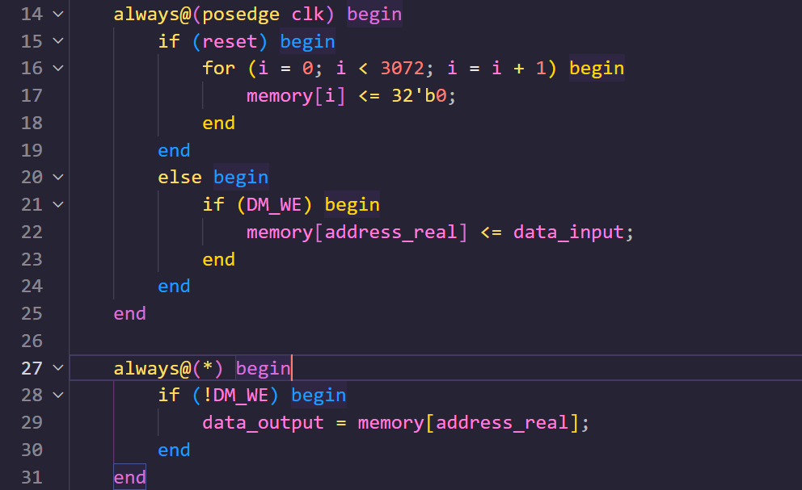
</div>

<div style="page-break-after: always;">
</div>

### EXT

由于EXT模块是为ALU的计算来处理立即数，考虑到ALU的计算模式，EXT只需要能够进行16位立即数的零扩展和符号扩展即可。关于J型指令的26位立即数的扩展则内置到NPC模块里独立计算即可。这样可以降低控制信号的复杂度。因此我在P3的基础上把关于26位立即数的处理在这个模块删除了。具体输入输出端口定义如下：

| 信号名        | 方向 | 描述                                                                                     |
| ------------- | ---- | ---------------------------------------------------------------------------------------- |
| imm16[15:0]   | I    | 16位立即数                                                                               |
| EXT_op        | I    | 来自控制单元的控制信号，低电平表示16位立即数进行零扩展，高电平表示16位立即数进行符号扩展 |
| imm_ext[31:0] | O    | 32位扩展结果，发送到ALU进行下一步的计算                                                  |

一共两种扩展模式，具体的代码实现如下：

<div>
    
</div>

<div style="page-break-after: always;">
</div>

### Controller

到搭建控制器之前，其他所有模块就应该都搭建好了。六个大模块的输入输出示意图如下：

<div>
    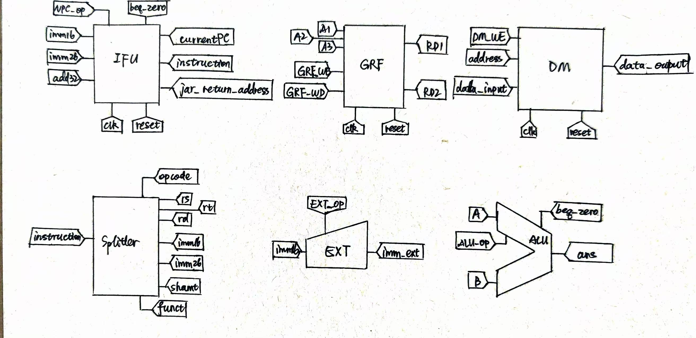
</div>

目前各个模块的写使能信号有两个：`GRF_WE`和 `DM_WE`；各个模块的操作模式有三个：`NPC_op[1:0]`和 `EXT_op`和 `ALU_op`；再加上构建数据通路用到的选择信号(即多路选择器的选择信号)，如下图示意，共有：

<div>
    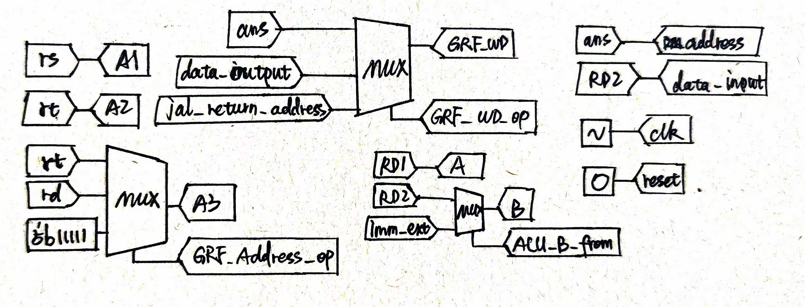
</div>

(1). `GRF_Address_from[1:0]`: 写入GRF的地址是 `$rt`寄存器还是 `$rd`寄存器抑或是 `jal`指令独用的常数地址$5'b11111$寄存器；

> 经过分析，R型指令写入 `$rd`寄存器，需要回写的I型指令以及 `jal`指令写入 `$rt`寄存器。

(2). `GRF_WD_from[1:0]`: 写入GRF的数据来自于ALU的计算结果 `ans`还是DM取出的数据 `data_output`抑或是 `jal`指令独有的 `jal_return_address`。

> 只有 `lw`指令写入的数据是来自 `data_output`；只有 `jal`指令的数据来自于 `jal_return_address`

(3). `ALU_B_from`: ALU的第二个操作数来自于 `$rt`寄存器还是EXT输出的32位立即数 `imm_ext`。

> 显然只有R型的计算指令来自于 `$rt`寄存器读取的数据 `RD1`

因此我们共有8个控制信号需要由控制器给出，控制器的输入输出端口定义如下：

| 信号名                | 方向 | 描述                                                                                                                                                       |
| --------------------- | ---- | ---------------------------------------------------------------------------------------------------------------------------------------------------------- |
| opcode[5:0]           | I    | 不同指令的操作码                                                                                                                                           |
| funct[5:0]            | I    | R型指令辅助操作码对指令进行区分的字段                                                                                                                      |
| NPC_op[1:0]           | O    | 发送给IFU的NPC模块，$00$表示正常顺序执行，$01$表示识别到 `beq`指令，$10$表示识别到 `jal`指令，$11$表示识别到 `jr`指令                        |
| GRF_WE                | O    | GRF的写使能信号，高电平有效                                                                                                                                |
| GRF_Address_from[1:0] | O    | 发送到GRF写数据地址端口的**选择信号**，$00$时写入数据的地址为rt寄存器,$01$时写入数据的地址为rd寄存器，$10$时写入数据的地址是$5'b11111$寄存器 |
| GRF_WD_from[1:0]      | O    | 发送到GRF写数据数据端口的**选择信号**，$00$时写入ALU的计算结果,$01$时写入从内存中取出的数据，$10$时写入 `jal_return_address`                 |
| ALU_op[1:0]           | O    | 发送到ALU的操作码。$00$表示加法，$01$表示减法，$10$表示逻辑或立即数，$11$表示逻辑左移16位                                                          |
| ALU_B_from            | O    | 发送到ALU第二个操作数的**选择信号**，高电平时将立即数扩展后的结果输入到ALU的第二操作数，低电平时将GRF取出的RD2写入ALU的第二操作数                    |
| DM_WE                 | O    | DM的写使能信号，高电平有效                                                                                                                                 |
| EXT_op                | O    | 发送到EXT的操作码，高电平时进行符号扩展，低电平时进行零扩展                                                                                                |

我们根据识别出不同的指令，给出每条指令对应的每个指令。这样在添加指令的时候可以有很好的扩展性。因此我根据不同的 `opcode`和 `funct`字段先识别出不同的指令，每条指令对应一个宏定义，如下：

<div>
    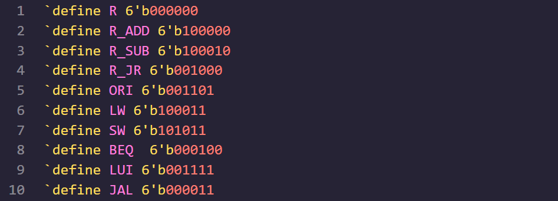
</div>

然后根据不同指令的数据通路给出每条指令的控制信号，具体代码如下：

<div>
    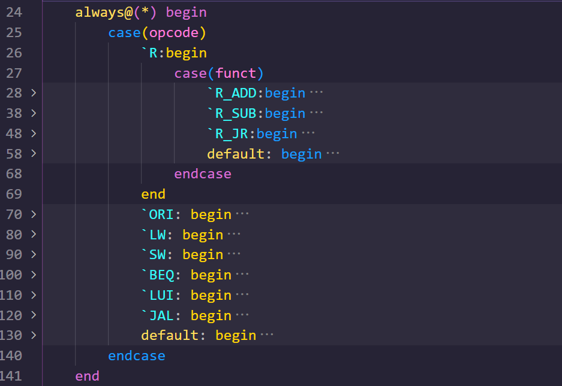
</div>

到这里我们就给出了每一条指令的数据通路和控制信号。

<div style="page-break-after: always;">
</div>

## 搭建CPU第二部分：CPU顶层模块的设计

有了每一个小的模块，我们就可以在顶层模块中实例化这些小模块，组成一个完整的CPU电路。在顶层模块中，我们只有两个输入端口，没有输出端口，定义如下：

| 信号名 | 方向 | 描述                   |
| ------ | ---- | ---------------------- |
| clk    | I    | 时钟信号               |
| reset  | I    | **异步复位**信号 |

根据实验的要求，我们需要随时监控GRF和DM的状态，并在这两个模块有变化的时候给出相应的输出。

- 监控GRF模块：我们需要输出的信息是：当时钟上升沿到来时，若写使能信号有效，则输出

```verilog
$display("@%h: $%d <= %h", currentPC, A3, GRF_WD);
```

- 监控DM模块：我们需要输出的信息是：当时钟上升沿到来时，若写使能信号有效，则输出

```verilog
$display("@%h: *%h <= %h", currentPC, address, data_input);
```

因此，我们需要将 `currentPC`信号输入到GRF和DM模块中，要注意在实际的处理器运行过程中不需要这么做。这里对这两个模块有一点小改动，因此特别说明一下。

在搭建顶层模块时，一个需要格外注意的工作是声明中间变量，以连接不同的子模块。在实际搭建过程中，我采取了逐个模块声明的方式，在每实例化一个模块之前声明这个模块需要但是未生明的信号。

> 要注意变量的位宽和类型。

具体的代码实现如下：

<div>
    
</div>

<div>
    
</div>

<div>
    
</div>

**声明中间变量的过程，实际上就是连接不同模块构建数据通路的过程。** 然后依次实例化每个模块即可，具体代码这里就不展示了。实例化的语法可以参考IFU模块实例化PC和NPC和IM三个模块的代码。到这里整个CPU就构建完成了。VScode的TerosHDL插件给出了顶层模块的一个Module Documentation，我将其源文件和pdf格式的文件插入到下面，作为完整mips.v模块的一个展示。

`<a href="./image/设计文档/mips.html">`Module Documentation of mips.v `</a>`

`<a href="./image/mips.pdf">`Module Documentation in pdf of mips.v `</a>`

<div style="page-break-after: always;">
</div>

## 搭建CPU第三部分：verilog源文件的编译和输出调试

以下是我的项目结构：

<div>
    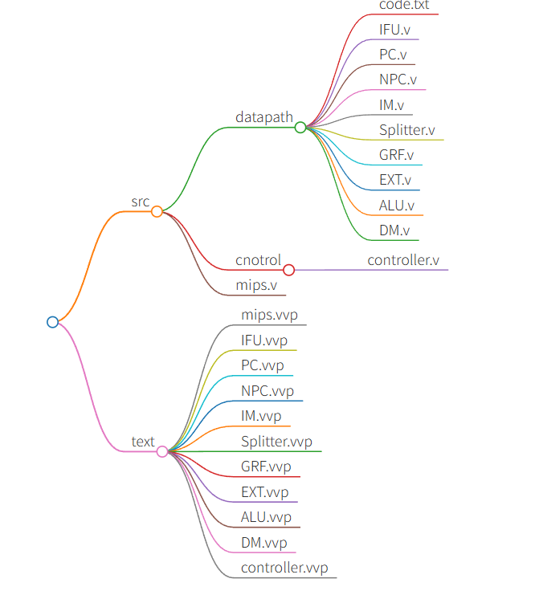
</div>

在完成实验的过程中，我是用命令行来进行verilog源文件的编译工作的。

(1) 编译独立的模块时直接编译即可，以PC为例：

```bash
iverilog -o test/PC.vvp src/PC.v
```

(2) 编译实例化其他模块的大模块时，需要同时将引用到的小模块编译进来，否则编译器找不到这个大模块中实例化的小模块，以IFU和mips为例：

```bash
iverilog -o test/IFU.vvp src/IFU.v src/PC.v src/NPC.v src/IM.v

iverilog -o test/mips.vvp src/mips.v src/datapath/*.v src/control/*.v
```

在编译完成后，我们可以试着运行这个vvd文件。当我调用顶层模块时：

```bash
vvd test/mips.vvd
```

可以可到我添加的调试代码相应的输出。这就表明搭建的这个模块可以正常运行。

<div style="page-break-after: always;">
</div>

# P4_CPU设计文档-思考题

> 1. 阅读下面给出的DM的输入示例中(示例DM容量为4KB，即32bit x 1024字)，根据你的理解回答，这个 `addr`信号又是从哪里来的？地址信号 `addr`位数为什么是[11:2]而不是[9:0]？
>
> <div>
>    
> </div>

问题一：在目前需要实现的指令集中，涉及到DM模块的只有 `sw`和 `lw`两条指令。它们的数据通路很相似，一个是向DM中写数据，一个是从DM中取数据。根据这两条指令的数据通路，输入DM的地址信号显然只能来自于ALU计算的结果(基地址加上偏移量)，这个计算结果是32位的。根据**DM的数据容量**，只需要 $10*2$ 位二进制数据就能覆盖整个DM(示例的DM容量和实验的DM模块的容量不一样)的每一个字节，而且这两条指令都是**以字为单位**进行读写操作，因此根据**对齐**的原则有效地址的低两位一定都是零，否则无法取到一个完整的字。因此实际上有效的地址信号是不需要低两位的数据的。

> 2. 思考上述两种控制器设计的译码方式，给出代码示例，并尝试对比各方式的优劣。

问题二：两种方式分别是：(1)给出每条指令对应的8个控制信号；(2)给出每个控制信号在每条指令下的值。我认为就目前的工作量来看这两种方式还没有明显的优劣之分。但是个人认为使用方式一能够更加清晰地看出每条指令的数据走向，在添加指令的过程中也更为整顿。从代码的角度来看方式二的代码更加简洁明了，没有方式一那么繁琐。出于对添加指令的便捷程度的考虑，我采取了方式一进行开发。以下是两种方式的对比代码：

> 3. 在相应的部件中，复位信号的设计都是**同步复位**，这与 P3 中的设计要求不同。请对比**同步复位**与**异步复位**这两种方式的 reset 信号与 clk 信号优先级的关系。

问题三：P3中使用的是异步复位，这样的方式显然 `reset`信号的优先级要高于 `clk`。无论现在是在哪一个时钟周期的哪一个阶段，只要复位信号有效就立刻复位。P4中使用的是同步复位信号，这时 `clk`的优先级要高于 `reset`信号。同步复位的实现方式其实是**当复位信号有效时，在时钟上升沿将初始值或复位值赋值给寄存器**。

> 4. C 语言是一种弱类型程序设计语言。C 语言中不对计算结果溢出进行处理，这意味着 C 语言要求程序员必须很清楚计算结果是否会导致溢出。因此，如果仅仅支持 C 语言，MIPS 指令的所有计算指令均可以忽略溢出。 请说明为什么在忽略溢出的前提下，addi 与 addiu 是等价的，add 与 addu 是等价的。提示：阅读《MIPS32® Architecture For Programmers Volume II: The MIPS32® Instruction Set》中相关指令的 Operation 部分。

问题四：不考虑溢出的情况下，`add`和 `addu`两条指令执行同样的工作。只是 `addu`会在溢出的情况下给出一个异常。

<div style="page-break-after: always;">
</div>

# 写在最后
