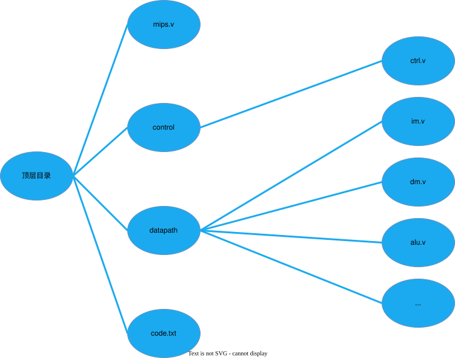
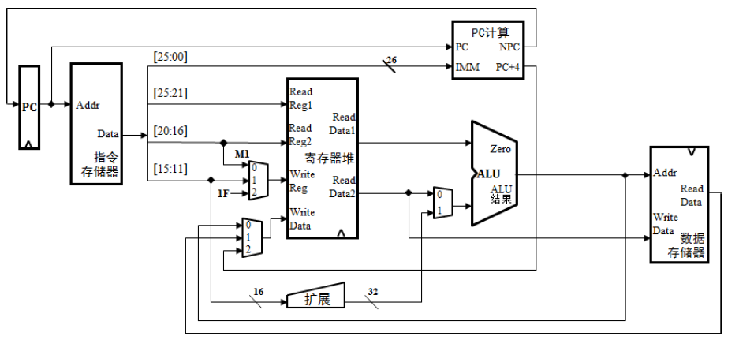
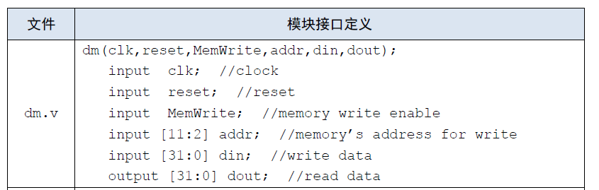
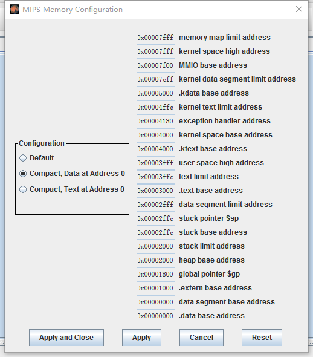
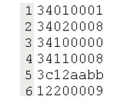

# 模块化与层次化设计

## 概述

在本实验，同学们需要将P3中使用Logisim搭建的MIPS单周期CPU电路转用Verilog HDL进行描述，并在其基础上支持更多指令。同时，本实验也是首个跨文件、多模块的Verilog的工程化项目，我们会给予一定的设计指导，并且设置一些思考题，来帮助大家更快的学会较为复杂工程的开发方法。

复杂数字逻辑电路和系统的**层次化、结构化**设计隐含着对系统硬件设计方案的逐次分解。虽然现在设计的电路并不复杂，但是我们希望大家通过这种设计方法的实践学到更多东西，同时，这种思想方法对于整个实验的完成也是非常有帮助的。

在这个过程中，我们也希望同学们可以不断完善自己的CPU设计草稿，它是我们进行电路搭建的指南。<span style="color: red">值得一提的是，我们将会在课下以及课上测试环节对文档中的内容(设计文档、思考题)加以检查，请做好准备！</span>

## 基本思路

在P3，你已经使用Logisim工具设计出了MIPS单周期处理的电路图，这对于P4的完成是非常有帮助的，你要做的只是完成从Logisim电路到Verilog代码的映射。

首先，参考在P3设计的MIPS单周期处理器的电路图，Verilog设计的MIPS单周期处理器可基本归结为下图所示：(图中的目录结构和文件命名仅供参考)

<div>
    
</div>

整体设计已经完成，接下来就是具体的模块化与层次化设计：

- 单周期处理器包括顶层模块、控制器和数据通路，将其放入顶层下。code.txt中存储相应的机器码。
- 控制器模块占一个独立的Verilog HDL文件，实现控制器这个单一的职责，降低模块间的耦合度。
- 顶层目录中的每个module都由一个独立的Verilog HDL文件组成。在增加相应功能或者修改代码时，减小了对其它模块的影响和修改，条例更加清晰，且对后续的设计也是非常有用和方便的。

这样设计的好处是整个工程具有极好的**局部性**(包括你所理解的**模块化**设计等等)。记住模块化的要领不是从模块的大小出发，而是从**模块功能的独立性**出发。

## 设计说明
- 处理器为32位单周期处理器，不考虑延迟槽，应支持的指令集为：`add, sub, ori, lw, sw, beq, lui, jal, jr, nop`，其中：
  - `nop`为空指令，机器码`0x00000000`，不进行任何有效行为(修改寄存器等)。
  - `add, sub`按无符号加减法处理(不考虑溢出)。
- 需要采用**模块化**和**层次化**设计。顶层文件为mips.v，有效的驱动信号要求包括且仅包括**同步复位信号resert和时钟信号clk**，接口定义如下：
```verilog
module mips(
    input clk,
    input reset
);
```
- 推荐同学们在设计CPU前请**通读本章所有内容**，以避免无谓的修改；在设计CPU时参考之后各节给出的要求与建议，形成CPU设计草稿，并回答思考题。请注意：
  - 设计草稿与思考题为必做内容，请合并为CPU设计文档提交。
  - 设计草稿形式与篇幅不限，电子版可采用文本、截屏等形式，纸质版可直接拍照。
  - 最后需要提交的内容为：**CPU设计文档、包含全部Verilog文件的zip格式压缩包**。
- 通过课下测试并**不意味着你的设计完全不存在问题**，建议自行构造测试用例已验证设计的正确性(如果进行了相关工作，请写入设计文档，课上问答时将酌情加分)。

<div style="page-break-after: always;">
</div>


# 数据通路设计

## 概述

前面说明了整体设计和模块化设计的思想，下面介绍数据通路的具体设计。

关于Verilog工程的开发流程，可以回顾预习教程Verilog工程的设计开发调试章节，并重点复习**<span style="color: blue">Verilog模块实例化、ISE仿真调试方法、编译预处理</span>**等内容。

## 设计流程

由于在P3中，大家已经使用Logisim完成了MIPS单周期处理器的搭建，所以在本实验，大家很容易就可以画出数据通路架构图，下图是供参考的数据通路架构图：

<div>
    
</div>

- 此图仅供参考，可能存在某些错误，所以鼓励你从数据通路的**功能合理划分**的角度自行设计更好的数据通路架构。
- 如果你做了比较大的调整，也请不要和模块化与层次化的设计思想相矛盾。

有了数据通路架构图，大致完成设计草稿后，我们便可以开始编写Verilog代码。有了前面使用Verilog设计单模块的经验，我们希望同学们能过自行完成各个代码模块的编写。各个部件都已完成后，接下来可以将这些部件统一交给一个顶层的Verilog文件管理，也就是自底向上的过程。

根据你设计的数据通路架构图以及各个部件的输入输出端口，在顶层文件中定义一些内部的wire型变量，利用模块间的逻辑关系，对各个模块进行**实例化**，串接在一起，使之成为一个整体，最后预留出控制器信号的输入和输出端口即可。

<div style="background-color: #e6f7ff; border-left: 4px solid #1890ff; padding: 12px; border-radius: 4px; margin: 16px 0;">
<strong>思考题</strong><br>
阅读下面给出的DM的输入示例中(示例DM容量为4KB，即32bit*1024字)，根据你的理解回答，这个addr信号又是从哪里来的？地址信号addr位数为什么是[11:2]而不是[9:0]？

<div>
    
</div>

</div>

<div style="page-break-after: always;">
</div>


# PC及IM设计

## 概述

本节将更具体地介绍PC及IM部件的搭建。

## PC设计流程

PC主要功能是完成输出当前指令地址并保存下一条指令地址。复位后，PC指向$0x00003000$，此处为第一条指令的地址。目的是与MARS的**Memory Configuration**相匹配。评测用的测试程序将通过Mars产生，其配置模式如下图所示：

<div>
    
</div>

## IM设计流程

在P3中，我们利用Logisim中的ROM模块储存相应的指令作为我们的IM，而在ISE中，是没有这样已经搭建完成的储存器模块供大家使用的，需要大家自行设计。

用Verilog实现IM模块并不复杂，只需生成匹配需求数量的32为寄存器的阵列，以储存32-bit长度的指令。

在设计好寄存器阵列之后，需要大家将指令的十六进制码从code.txt文本文件读入到IM中去。在计组实验的P8之前，为了便于评测，我们采用`$readmemh`指令来完成相应的功能。
具体的使用方法，大家可以查看预习教程的Verilog或ISE高级特性与自动化测试章节中的**系统任务**部分。

code.txt的格式如下图所示。其中每条指令占用1行，指令十六进制码以文本方式存储。

<div>
    
</div>

<div style="page-break-after: always;">
</div>


# 控制器设计

## 概述

相对于数据通路来说，控制器的设计就比较简单些，用Verilog代码进行实现也比在Logisim中搭建电路更加便捷。只要理清思路，找到部件的功能与指令的逻辑关系，大家很快就能够完成控制器的设计及编码。

## 设计流程

首先分析各个部件从控制器中所需的信号，并全部列举出来，比如ALU需要控制器输出一个ALUop来控制其执行何种运算。在P3时，同学们已经完成了控制器电路的布局布线，所以在此只需要加上新增指令所产生的控制信号即可。这个步骤对于已经设计并成功实现P3的你来说，难度并不高。大家可以在设计草稿中列表记录控制器的映射逻辑。

这项工作对于后续的仿真调试和课上测试都非常有帮助。因为仿真调试时你可以首先查看表格是否正确，再去确认是否和代码对应，Bug一目了然。对于添加指令，只需在表格后面加入新的操作码和对应的控制信号的值，再将其映射到Verilog HDL代码中，非常方便。

至于表格的具体设计，则因人而异，可以记录下**指令对应的控制信号如何取值**，也可以记录下**控制信号每种取值所对应的指令**，在后面的Project中，这两种不同的译码方式将展现出各自的优劣，届时我们会再次对其进行详细分析。

或许你还有更好的方式完成控制器的设计，这就需要同学们自行去探索和对比发现了。

<div style="background-color: #e6f7ff; border-left: 4px solid #1890ff; padding: 12px; border-radius: 4px; margin: 16px 0;">
<strong>思考题</strong><br>
思考上述两种控制器设计的译码方式，给出代码示例，并尝试对比各方式的优劣。
</div>

<div style="page-break-after: always;">
</div>


# 过程实现

---
### **指令地址计算**

当我们通过PC值取出相应的指令后，我们还需要根据这条指令判断下条指令的地址，即NPC的值。

假设我们现在支持一下指令{`add, sub, ori, lw, sw, beq, lui, j, jal, jr`}

那么在设计NPC的计算方式时，我们至少需要设计几种不同的算法？(不同的算法种数即NPC控制信号的所有可能取值数；答案请输入阿拉伯数字)

<div style="page-break-after: always;">
</div>


# 控制器实现

---
### **控制器实现**

控制器最重要的作用是生成控制信号进行数据选择，即控制我们所熟知的MUX元件。

假设我们现在支持以下指令{`add, sub, ori, lw, sw, beq, lui, j, jal, jr`}

那么寄存器堆的写入端地址和写入数据分别至少需要多少种控制信号进行选择(假设已有专门的信号控制是否需要写寄存器堆)？

(1)控制写入地址的信号数
(2)控制写入数据的信号数

<div style="page-break-after: always;">
</div>

# 在线测试相关信息

## 提交要求

### 顶层模块

必须在Verilog HDL设计中建立这个**顶层模块**，不允许修改模块名称、端口各信号以及变量的名称和类型。

```verilog
module mips(
    input clk,
    input reset
);
```

### GRF模块

在**GRF模块**中，每个**时钟上升沿**到来时若要**写入数据**(及写使能信号为1且非reset时)则输出写入的位置及写入的值，格式(请注意空格)为：

```verilog
$display("@%h: $%d <= %h", WPC, Waddr, WDate);
```

其中`WPC`表示相应指令的存储地址，从$0x00003000$开始；`Waddr`表示输入的5位写寄存器的地址；`WData`表示输入的32位写入寄存器的值。

例如，地址在$0x00003000$的指令向3号寄存器写入数据0，则应该输出`@00003000: $3 <= 00000000`，其中$00003000$应该是对应操作的指令的16位进制地址，不足8位需要补零。

添加输出语句的示例如下：

```verilog
always@(posedge clk)
    begin
        // ......
        if (RegWrite == 1)
        begin
            // ......
            $display("@%h: $%d <= %h", WPC, Waddr, WData);
        end
    end
```

### DM模块

在**DM**模块中，每个**时钟上升沿**到来时若要**写入数据**(即写使能信号为1且非reset时)则输出写入的位置及写入的值，格式(请注意空格)为：

```verilog
$display("@%h: *%h <= %h", pc, addr, din);
```

其中`pc`是该操作对应的指令的地址，和GRF模块要求一致，`addr`表示将要存入数据的32为位地址，`din`表示输入的32位写入DM的值。

例如，若地址在$0x00003004$的指令要在$0x00001004$地址写入数据0，则应该输出`@00003004: *00001004 <= 00000000`。

加输出语句的示例如下：

```verilog
always@(posedge clk)
    begin
        // ......
        if (MemWrite == 1)
        begin
            // ......
            $display("@%h: *%h <= %h", pc, addr, din);
        end
    end
```

### 其他

IM容量为$16KiB(4096 x 32bit)$，DM容量为$12KiB(3072 x 32bit)$。

复位后，PC指向$0x00003000$，此处为第一条指令的地址，GRF和DM中的所有数据清零。注意与**MARS中设置**的保持一致。在复位期间对存储单元进行操作请不要输出任何信息，以免影响评测结果。

除加减法外的指令均以指令集规定的行为为准，可参看[MIPS-C指令集](../pre/MIPS汇编/MIPS-C指令集_校对完成版_-指令排序.pdf)，加减法按无符号处理(不考虑溢出)。若本次实验有任何疑问请及时在讨论区提出。

<div style="background-color: #e6f7ff; border-left: 4px solid #1890ff; padding: 12px; border-radius: 4px; margin: 16px 0;">
<strong>思考题</strong><br>
在相应的部件中，复位信号的设计都是**同步复位**，这与P3中的设计要求不同。请对比**同步复位**与**异步复位**这两种方式的reset信号与clk信号优先级的关系。
</div>

<div style="background-color: #e6f7ff; border-left: 4px solid #1890ff; padding: 12px; border-radius: 4px; margin: 16px 0;">
<strong>思考题</strong><br>
C语言是一种弱类型程序设计语言。C语言中不对计算结果溢出进行处理，这意味着C语言要求程序员必须很清楚结果是否会导致溢出。因此，如果仅仅支持C语言，MIPS指令的所有计算指令均可以忽略溢出。请说明为什么在忽略溢出的前提下，<code>addi</code>与<code>addiu</code>是等价的，<code>add</code>和<code>addu</code>是等价的。提示：阅读《MIPS32® Architecture For Programmers Volume II: The MIPS32® Instruction Set》中相关指令的Operation部分(文档入口见下方，详见文档page34、page35)。
</div>

文档入口：[《MIPS32® Architecture For Programmers Volume II: The MIPS32® Instruction Set》](../pre/MIPS汇编/MIPS_Vol2_指令集_.pdf)

<div style="page-break-after: always;">
</div>

# 提交窗口

## p4_L0_document【文件上传】

### CPU设计文档及思考题提交入口

#### 注意事项

- 设计文档应包含**设计草稿、测试方案与思考题**等内容。
- 推荐使用Markdown撰写设计文档，Markdown教程可参考[菜鸟教程](https://www.runoob.com/markdown/md-tutorial.html)

#### 思考题汇总

1. 阅读下面给出的DM的输入示例中(示例DM容量为4KB，即32bit x 1024字)，根据你的理解回答，这个`addr`信号又是从哪里来的？地址信号`addr`位数为什么是[11:2]而不是[9:0]？

<div>
    
</div>

2. 思考上述两种控制器设计的译码方式，给出代码示例，并尝试对比各方式的优劣。
3. 在相应的部件中，复位信号的设计都是**同步复位**，这与 P3 中的设计要求不同。请对比**同步复位**与**异步复位**这两种方式的 reset 信号与 clk 信号优先级的关系。
4. C 语言是一种弱类型程序设计语言。C 语言中不对计算结果溢出进行处理，这意味着 C 语言要求程序员必须很清楚计算结果是否会导致溢出。因此，如果仅仅支持 C 语言，MIPS 指令的所有计算指令均可以忽略溢出。 请说明为什么在忽略溢出的前提下，addi 与 addiu 是等价的，add 与 addu 是等价的。提示：阅读《MIPS32® Architecture For Programmers Volume II: The MIPS32® Instruction Set》中相关指令的 Operation 部分。

## P4_L0_weak_2023【文件上传】

### CPU Verilog源文件提交入口

#### 评测说明

为了鼓励同学们编写自己的测试程序，对于评测机使用的评测程序，我们仅给出机器码来进行本地测试，测试代码机器码见附件。

- 必须严格按照模块的端口定义，顶层文件模块名为mips，不需要考虑延迟槽。
- 在部件中，reset信号的优先级高于其他控制信号，且设计为**同步复位**，保证自动评测在CPU运行前进行复位。
- 在GRF模块中，每个时钟上升沿到来时若写使能信号为1，则输出写入位置及写入的值；在DM模块中，每个时钟上升沿到来时若写使能信号为1，则输出写入的位置及写入的值。
- 用Verilog HDL建立IM时，必须以读取文件的方式将code.txt中的指令加载至IM中。不要在Verilog HDL代码中直接对IM的内容进行赋值。
- Verilog HDL文件打包要求：在**不超过**最大压缩包提交限制的情况下，全部.v文件放在同一文件夹下压缩成.zip格式后提交。
- 自动评测提交的时间间隔为5分钟，其返回的错误信息有一定的参考价值，但仅供参考。
- 其余注意事项请认真参看在线测试相关信息。
- **<span style="color: red;">参加课上测试条件：</span>**
  - <span style="color: red;">通过本窗口的所有测试点。</span>
  - <span style="color: red;">提交 CPU 设计文档。</span>

<div style="background-color: #f5f5f5; border: 1px solid #ddd; padding: 12px 16px; border-radius: 6px; margin: 16px 0;">
    <a href="./p4_testcode.txt" download style="text-decoration: none; color: #0366d6; font-weight: bold; font-family: Arial, sans-serif;">
        📥 P4_TESTCODE.TXT
    </a>
</div>