# 工程化方法

## 设计方案

从P5开始的CPU将是具有一定代码规模(500-2000行、因人而异)的工程，并将在P6-P8中进行增量开发。实现起来需要对各环节、各模块始终保持全局掌握，在调试或增量开发时能够迅速定位具体细节。

撰写设计方案的过程，实际就是思考试验任务，整理明确自己的设计思路，并把自己的设计结构完全定型的过程。如果在思路没有完全定型的情况下就贸然开始写代码，非常容易遇到的问题是：在编码过程中发现某些新的问题需要解决，或者遗忘或记错了某个设计细节。尤其容易出现混淆的就是各个控制信号和数据端口的设计，这样细小的问题极难查出。预先把模块功能、结构设计、端口定义、控制信号命名都整理清楚，则可以大大减少此类无谓bug发生的可能性。

## 代码风格

### 命名规范

在流水线CPU设计中，不可避免的会出现大量的端口和用来在端口中传输数据的wire变量，以及由各级流水线部件产生的大量数据端口，如何给他们命名是一个重要的问题。

请精心设计自己的命名规范，一款好的命名规范应当具有“望文生义”的效果，请不要使用随意的变量名。

### 常量、字面量与宏

我们无论是在控制器解码指令的op或者rs字段，还是在使用某个模块的操作信号对功能进行选择时，都不可避免地需要使用到常量或字面量。如果直接使用 `instr[31:26]`、`4'b2`等数字来表示，会给阅读和调试带来不小的阻碍。尤其是当这个需要被频繁引用或者在增量开发要发生变动时，编写者很容易因为一个地方的疏忽而写出bug。为了解决这个问题，推荐下面的做法。

对于指令不同的字段，直接定义wire型变量如op、rs映射到instr的对应位上，直观且简短。

对于控制器译出的信号，如果仅在一个模块内使用，可以使用localparam定义。但有很多信号需要被多个跨模块文件使用到(如alu的控制信号需要同时在控制器与alu出现)，并且，我们需要为工程的扩展做好准备，因此更推荐编写单独的**宏定义文件**供其他的模块用 `include`使用。

```verilog
// constants.v
`define aluOr 4'b2
`define aluAnd 4'b3
`define aluNor 4'b6
`define aluXor 4'b7

// alu.v
`include "constants.v"

always @(*) begin
    case(alu_op)
        `aluOr:
            alu_out = alu_A | alu_B;
        `aluAnd:
            alu_out = alu_A & alu_B;
        `aluNor:
            alu_out = ~(alu_A | alu_B);
        `aluXor:
            alu_out = alu_A ^ alu_B;
    endcase
end
```

### 模块逻辑排布

对模块内部逻辑编写时，将组合逻辑、时序逻辑明确分隔开，一些中间变量可以在模块端口定义下方统一声明，也可以在对应逻辑的上方紧邻声明，尽量避免声明位置与赋值语句位置交叉混乱。此外，我们还可以利用**注释**作为一种代码段落的分割符，用注释提醒我们所在的位置，如下面的代码：

```verilog
/********* Declarations ********/
// F
wire [31:0] F_Instr, F_npc, /*...*/;

// D
wire [31:0] D_Instr, D_pc, D_pc4, /*...*/;
wire [3:0] npc_sel, /*...*/;
// wire ...

// ...

/**********  Stage_F  **********/
pc PC(
    .clk(clk),
    .reset(reset),
    // ...
    );

npc NPC(
    .npc(F_npc),
    .npc_sel(npc_sel),
    // ...
    );

// ...

/**********  Stage_D  **********/
grf GRF(
    // ...
    );

// ...
```

流水线CPU相比单周期CPU，顶层增加了流水寄存器以及相关的所有端口连线信号，复杂度与代码量有了明显的提高。ISE的Design栏能够按照顺序显示调用的子模块示例，在设计时，可以利用这一点，按照流水级的顺序对每一级的流水寄存器进行实例化，然后再其间插入相应的模块，并用注释清晰地注明各级起始位置。另外，也可以考虑**增加模块层次**，将每一流水级的各个模块放入一个父级模块中调用，可以将复杂度分散到各个层级。

但同时也应当指出，过度的模块化，尤其是包装式的模块化，有可能会增加代码的复杂度。就好像在C语言编程中用 `c=a+b`就可以解决的问题，没有必要使用 `c=sum(a,b)`进行解决。这个问题在Verilog中更加严重，因为Verilog的端口链接更加麻烦。可以说过渡的模块化不利于上机时的快速修改。

## 调试建议

在前面的教程中，我们讲解了如何用工程化方法来帮助我们设计流水线CPU。但是设计仅仅是我们工作的一部分，更重要的是在我们的设计出现问题的时候如何去调试它。而调试绝不是等着ISE的输出窗口发呆，也不是碰运气的瞎找，调试也是可以有系统化的策略的。

### 问题复现

如果发现了CPU的一次错误行为，首先要做的是利用相同的代码进行测试，让CPU再产生相同的错误。对于能够复现的bug，便可进行后续步骤；对于不可复现的bug，则需要进行大量测试(可能要自动化测试)，找到能让bug稳定出现的具体测试样例。

### 错误溯源与定位

通常来说，找到bug比改正bug要困难得多。从状态机的角度分析，P5阶段的CPU出现功能错误只有这些可能：指令执行流错误(PC错误)；写入GRF错误；写入DM错误。在找到一份使CPU出错的测试程序后，首先要将所有指令的执行情况以及写入GRF和DM的信息打出，同时与MARS的行为进行比对。如果PC本身错误，则可能是跳转执行行为错误；其它类型的错误以此类推。找到出错的指令后，再去查看那一时刻附近相关信号的波形图，便可找到错误。

# 流水线架构

## 数据通路

### 流水线阶段

流水线技术是提高CPU吞吐量的有效手段。通过将单周期处理器分解成5个流水线阶段来构成流水线处理器。5级流水的CPU在每个流水阶段都可以执行一条指令，那么同时就有5条指令并行，这大大提高了CPU的吞吐量。

我们CPU的5级流水线阶段为：

| 阶段                | 简称 | 功能概述                                               |
| ------------------- | ---- | ------------------------------------------------------ |
| 取值阶段(Fetch)     | F    | 从指令存储器中读取指令                                 |
| 译码阶段(Decode)    | D    | 从寄存器文件中读取源操作数并对指令译码以便得到控制信号 |
| 执行阶段(Execute)   | E    | 使用ALU执行计算                                        |
| 存储阶段(Memory)    | M    | 读或写数据存取器                                       |
| 写回阶段(Writeback) | W    | 将结果写回到寄存器文件                                 |

<div>
    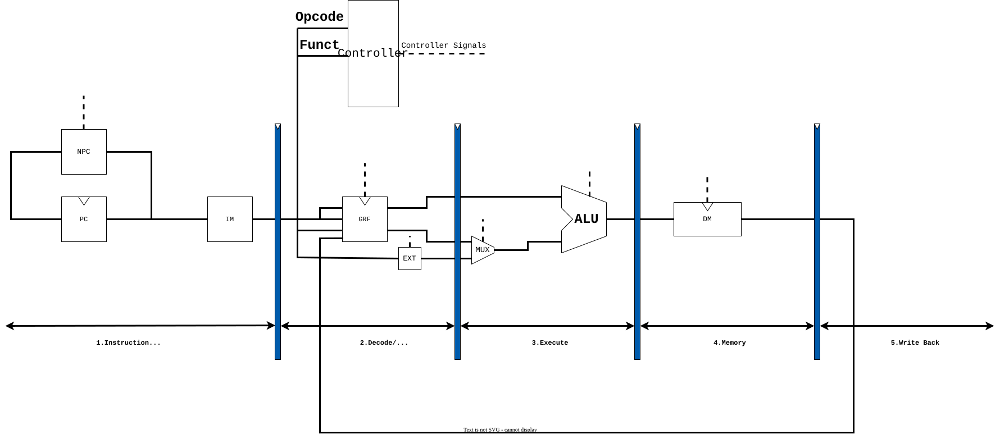
</div>

### 流水线寄存器

我们通过**流水线寄存器**将单周期处理器的数据通路划分为5个阶段。我们通过在两个阶段之间加入寄存器，来保存前一周期中的上一阶段所传来的数据，同时在后一周期中为下一阶段提供数据。无论是数据还是信号，都需要在寄存器中进行保存，直至不再需要。

<div>
    
</div>

我们流水线寄存器以其提供数据的流水级的简称命名，如D级流水线寄存器的前一级为F级，而后一级为E级。

下面我们对P5中涉及的指令进行分析，以此讲解流水线寄存器的工作原理和需要保存那些数据：

**R型算术运算指令：`add`、`sub`**

Fetch阶段：从PC寄存器取地址，根据指令从IM获得指令编码，在下一周期存入D级寄存器。

<div>
    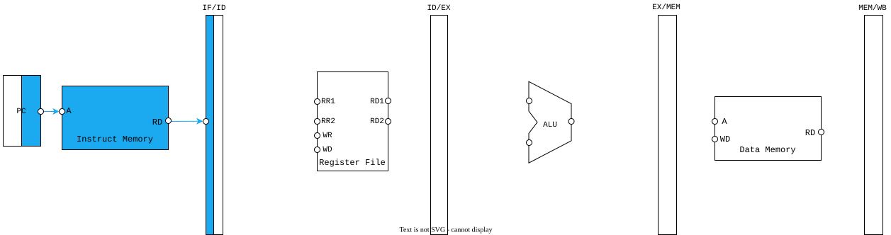
</div>

Decode阶段：从D级寄存器取出指令，根据相应寄存器rs、rt地址获取其中数据，与rd地址一起在下一周期存入E级寄存器中。

<div>
    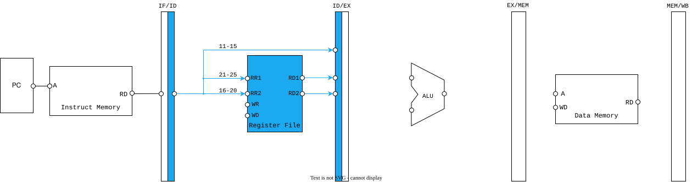
</div>

Execute阶段：从E级寄存器获得上一阶段从RF中取得的值，经过ALU计算，下一周期将存入M级寄存器，rd地址继续流水。

<div>
    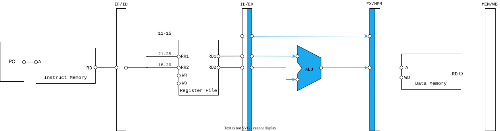
</div>

Memory阶段：rd地址与ALU结果继续流水。

<div>
    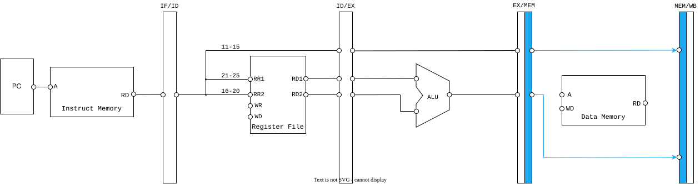
</div>

Writeback阶段：W级寄存器为RF提供rd地址与WD，将相应数据写入rd中。

<div>
    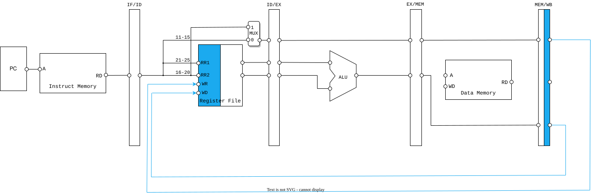
</div>

**带有立即数的I型算数、逻辑运算指令：`ori`、`lui`**

这类指令与之前的R型算术，逻辑运算指令大致相似，不同之处在于D和E阶段的处理。

Decode阶段：将指令低16位取出经过EXT存入E级寄存器。

<div>
    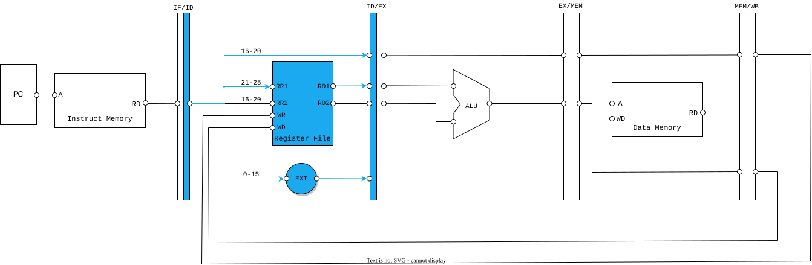
</div>

Execute阶段：E级寄存器提供EXT的结果，经过多路选择器提供给ALU的B段。

<div>
    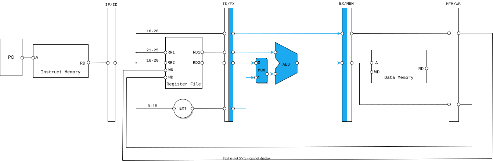
</div>

**内存访问指令：`lw`**

访存时写入寄存器变为rt，需要在ID级增加一个MUX，同时，在M级需要ALU的输出来指定DM的地址获得数据，这个数据随着流水线传到W阶段写入RF，因此在W阶段需要增设一个MUX。

Decode阶段：将rt作为目的寄存器存入ID/EX寄存器。

<div>
    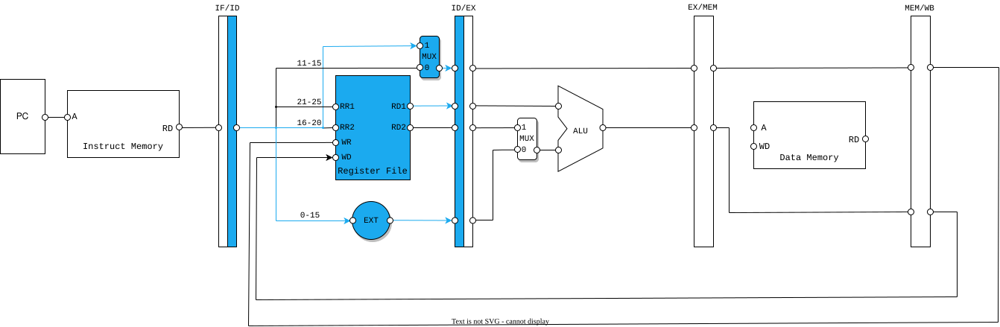
</div>

Memery阶段：根据ALU计算出的地址访存，并将数据存入MEM/WB寄存器。

<div>
    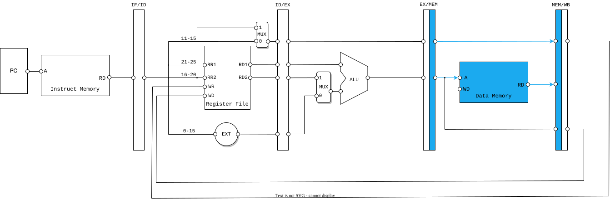
</div>

Writeback阶段：通过多路选择器写入rt寄存器。

<div>
    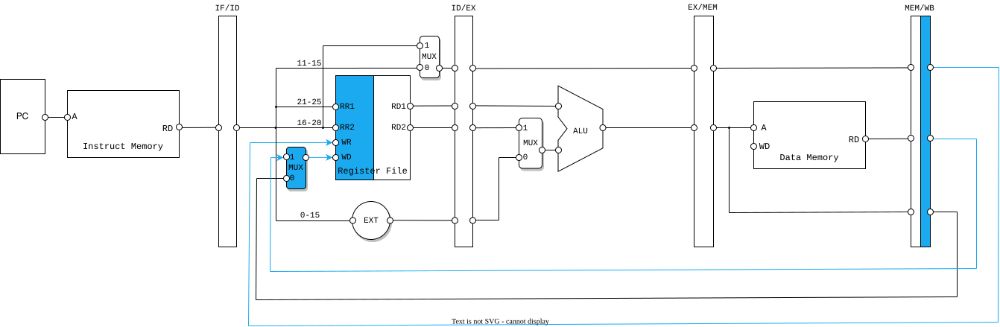
</div>

**内存写入指令：`sw`**

内存的写入在M级需要增加为DM提供的写入数据，并且在W阶段没有实质性的数据通路，即无需写回到RF。

Execute阶段：通过rs寄存器的数据与立即数计算地址。

<div>
    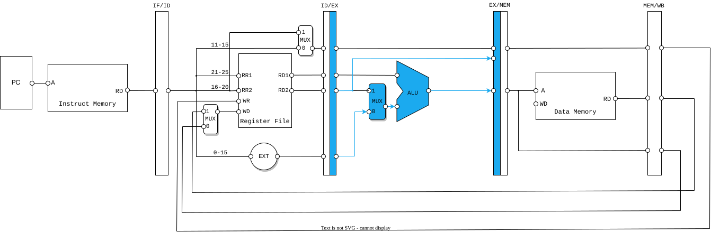
</div>

Memory阶段：将rt寄存器的数据写入ALU计算出的地址。

<div>
    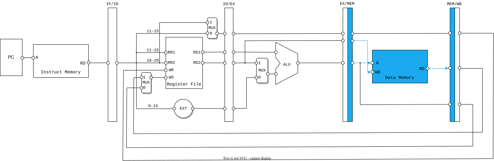
</div>

**跳转B型指令：`beq`**

在分析跳转指令开始之前，我们首先需要考虑PC寄存器，由于指令是顺序执行的，因此我们需要不断为PC寄存器加4。

<div>
    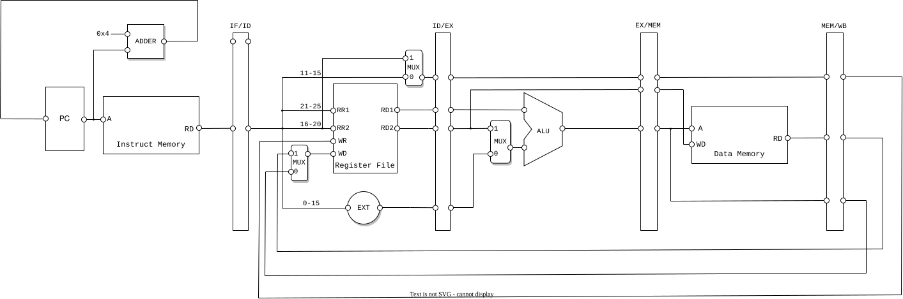
</div>

完善PC寄存器的实现后，我们开始正式分析`beq`这个指令，`beq`需要在取出rs、rt寄存器的值后进行比较，然后决定是否跳转到新的PC值，新的PC的值可以通过ID级有符号扩展后，左移两位，再与$PC+4$相加得到。

Decode阶段：比较读取出的rs和rt寄存器的数据，若相等，则通过多选器将拓展后的立即数作为下一周期的PC写入PC寄存器。

<div>
    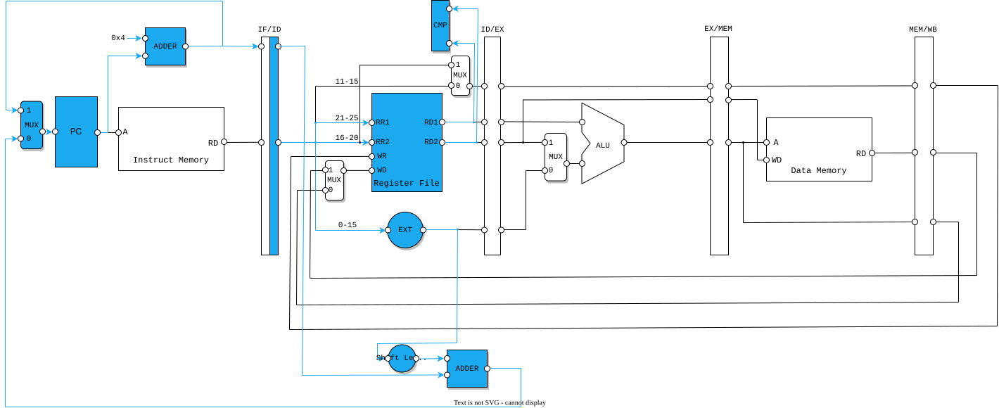
</div>

**跳转J型指令：`jal`**

J型指令同样无条件的可以在D级就修改PC寄存器的值，但需要在ID级增加一个扩展26位立即数的部件，同时，`jal`需要写入ra寄存器，$PC+8$的值需要流水至W级写入RF。

Decode阶段：通过多路选择器将扩展后的立即数作为下一周期的PC写入。

<div>
    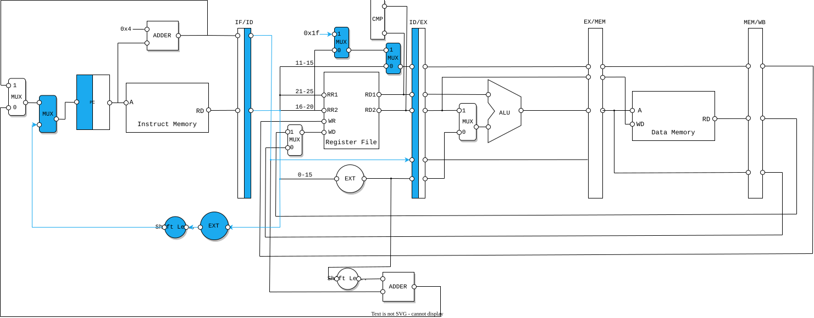
</div>

Execute阶段：将跳转前的PC存入EX/MEM寄存器。

<div>
    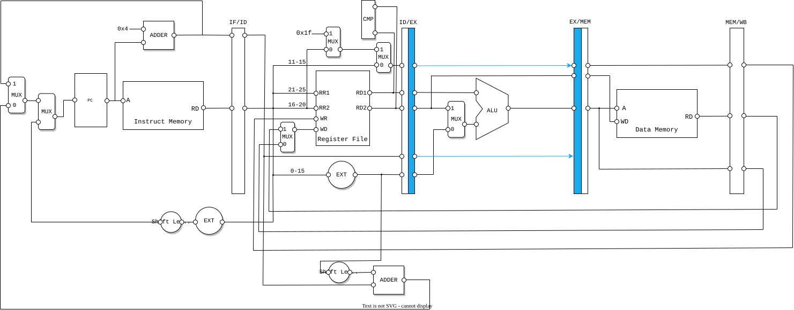
</div>

Memory阶段：将跳转前的PC存入MEM/WB寄存器。

<div>
    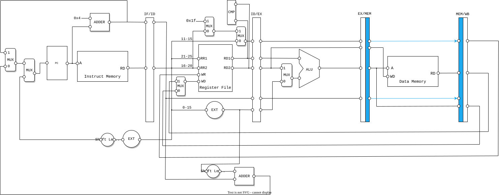
</div>

Writeback阶段：将跳转前的$PC+8$写入31号ra寄存器。

<div>
    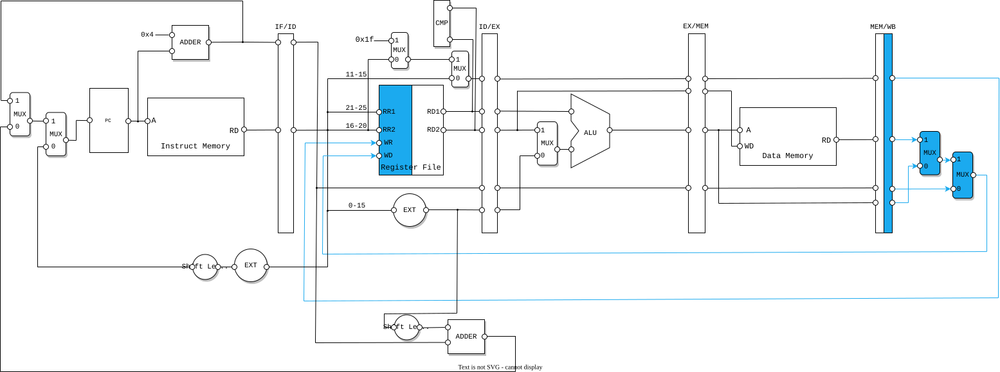
</div>

**跳转R型指令：`jr`**

R型跳转指令将rs写入PC寄存器，可以在D级就修改PC寄存器，因此只需要在D级增加一个MUX。

Decode阶段：通过多选器将rs寄存器的数据作为下一周期的PC写入。

<div>
    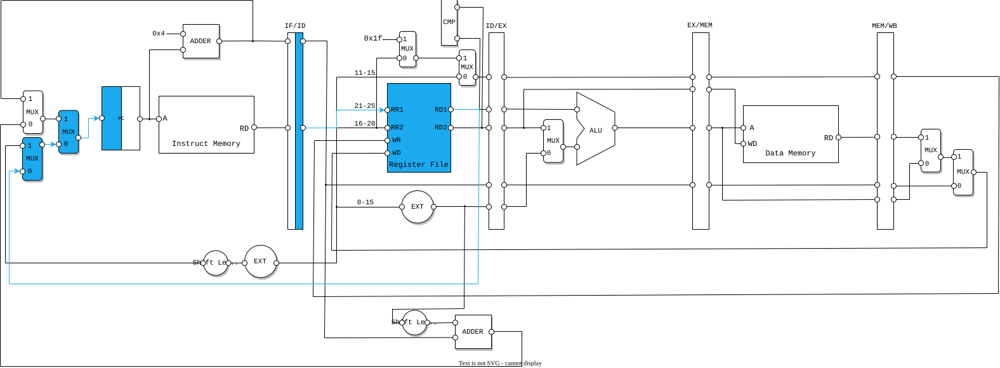
</div>

### 流水数据的选择

一般而言，我们需要流水的数据只有一个衡量标准，就是我们在其后的流水阶段中需不需要这个数据，比如说ALU的计算结果，有的会被写回寄存器文件中，所以我们需要流水这个数据，而rs对应的寄存器，在M级和W级并没有用到，所以就可以不再流水(仅一般情况)。我们可以这样说，**每个流水线寄存器都保存着一条指令完成后续操作所需要的全部信息**。

当一个数据被选择成为了流水数据，那么在CPU中就可能存在多个值。比如E、M、W级均会有ALU计算结果(三者并不相同)，在编程的时候应当使用流水阶段名前缀将其区分开。

<div style="background-color: #e6f7ff; border-left: 4px solid #1890ff; padding: 12px; border-radius: 4px; margin: 16px 0;">
<strong>思考题</strong><br>
在课上测试时，我们需要你现场实现新的指令，对于这些新的指令，你可能需要在原有的数据通路上做那些扩展或修改？提示：你可以对指令进行分类，思考每一类指令可能修改或扩展哪些位置。
</div>

## 译码器

面对复杂的工程，我们会有多种方式对指令进行译码，下面将介绍主流的两种译码方式与两种译码风格，引导大家对其进行思考并作出适合自己的设计。当然，下面所介绍的方法与风格都各有千秋，本文仅抛砖引玉，希望同学们能够斟酌后在进行设计编码。如果对控制器的设计就有很好的想法或观点，欢迎在评论区与大家进行分享。

### 译码方式

**集中式译码**：在取指令(F级)时或者读取寄存器阵列信息(D级)前，将所有的控制信号全部解析出，然后让其随着流水往后逐级传递。使用这种方法，只需要在初始对指令进行一次译码，减少了后续流水级的逻辑复杂度，但流水级之间需要传递的信号数量很大。

<div>
    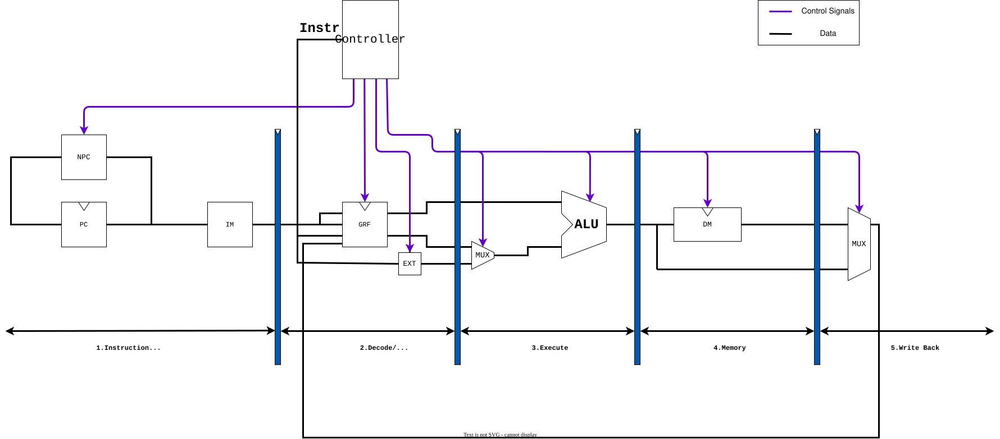
</div>

**分布式译码**：每一级都部署一个控制器，负责译出当前级所需的控制信号。这种方法较为灵活，“现译现用”有效降低了流水级间传递的信号量，但是需要实例化多个控制器，增加了后续流水级的逻辑复杂度。

<div>
    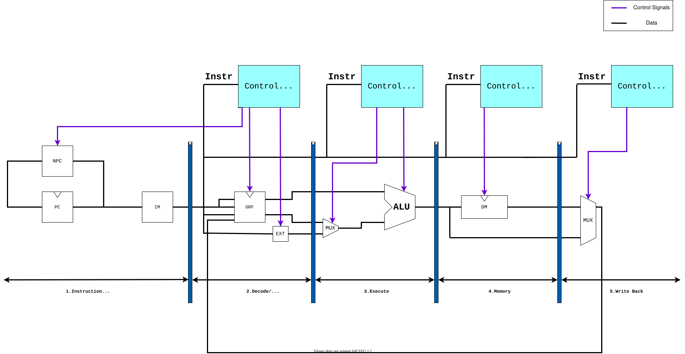
</div>

### 译码风格

**指令驱动型**：整体在一个case语句之下，通过判断指令的类型，对所有的控制信号一一赋值。这种方法便于指令的添加，不易遗漏控制信号，但是整体代码量会随指令数量增多而显著增大。

```verilog
case (Instr[31:26])
    R : begin
        case (Instr[5:0])
            add: begin
                grf_en = 1;
                dm_en = 0;
                alu_op = 0;
                npc_sel = 0;
                // ...
            end
            // ...
        endcase
    // ...
endcase
```

如果重复部分太多，非常不推荐复制粘贴的做法，可以尝试用宏将其抽象出来。

**控制信号驱动型**：为每个指令定义一个wire变量，使用或运算描述组合逻辑，对每个控制信号进行单独处理。这种方法在指令数量较多的时候适用，且代码量易于压缩，缺陷是如错添或漏填了某条指令，很难锁定出现错误的位置。

```verilog
wire R  = (op == 6'b000000);
wire add    = R & (func == 6'b100001);
wire sub    = R & (func == 6'b100011);
// wire ...

assign grf_en = (add | sub | /*...*/) ? 1'b1 : 1'b0;
// assign ...
```

<div style="background-color: #e6f7ff; border-left: 4px solid #1890ff; padding: 12px; border-radius: 4px; margin: 16px 0;">
<strong>思考题</strong><br>
确定你的译码方式，简要描述你的译码器架构，并思考该架构的优势以及不足。
</div>

# 流水线冒险

## 冒险的种类

在流水线系统中，多条指令同时执行，当一条指令依赖于还没有结束的另一条指令的结果时，将发生冒险(hazard)，也被称为“**冲突**”。冒险的类型，主要有**结构冒险(Structural Hazard)、控制冒险(Control Hazard)和数据冒险(Data Hazard)**三种。

### 结构冒险

结构冒险是指**不同指令同时需要使用同一资源**的情况。例如在普林斯顿结构中，指令存储器和数据存储器是同一存储器，在取指阶段和存储阶段都需要使用这个存储器，这是便产生了结构冒险。我们的实验采用哈佛体系结构，将指令存储器和数据存储器分开，因此不存在这种结构冒险。

另一种结构冒险在于寄存器文件需要在D级和W级同时被使用(读写)时并且读和写的寄存器为同一个寄存器时。

### 控制冒险

控制冒险，是指**分支指令(如`beq`)的判断结果会影响接下来指令的执行流**的情况。在判断结果产生之前，我们无法预测分支是否会发生。然而，此时流水线还会继续取指，让后续指令进入流水线。这是就有可能导致错误的发生，即不该被执行的指令进入到了指令的执行流中。

### 数据冒险

流水线之所以会产生数据冒险，就是因为后面指令需求的数据，正好就是前面指令供给的数据，而后面指令在需要使用数据时，前面供给的数据还没有存入寄存器堆，从而导致后面的指令不能正常的读取到正确的数据。

## 冒险的解决

### 阻塞

这是最容易的解决方法。冲突的本质是由于指令间存在相关性或依赖相同的部件，导致两条指令无法在相邻的时钟周期内相继执行。也就是说，只要把发生冲突的两条指令之间“分隔开”，就可以有效地解决冒险的问题。

**阻塞**是指当发生数据依赖时，只让前一条指令执行，而后一条指令被阻塞在流水线的某个阶段，并不向下执行，等待前一条指令执行完成(或者执行到没有冲突的时候)，再解除后一条的阻塞状态。在我们的CPU中，我们将会发生冒险的指令阻塞在D流水级上。

在D级阻塞的时候，像下一流水级传递的指令不应当是D级指令，否则D级指令还是会向下一流水级传递。所以我们应当插入“指令气泡(bubble)”，也就是`nop`空指令来避免这种情况。实现CPU流水级的“空转”。

### 提前分支判断

在P4中，我们的分支判断是利用ALU实现的，也就对应我们现在的E级中实现。在不考虑阻塞的情况下，当我们在E级得到分支结果后，若跳转，则此时F、D级的指令都需要作废，这无疑是一种低效的方式。

如果我们将分支判断提前到D级，那么即使发生跳转，需要作废的指令只有F级。其本质是尽早产生结果可以缩短因不确定而带来的开销。

### 延迟槽

在前面我们提到及时将分支判断提前到D级，发生跳转的时候，F级指令依然是需要作废的。但是我们如果约定F级指令不作废呢？也就是说，不论判断结果如何，我们都将执行分支或跳转指令的下一条指令。这也就是所谓的“**延迟槽**”。那么指令执行的效率就提高了。

再次强调，延迟槽是基本上不需要实现的，也就是说，只要不考虑F级指令的作废问题，就是实现了延迟槽。唯一需要变更的是，**对于`jal`指令，应当向31号寄存器写入$D_PC+8$或者$F_PC+4$(当`jal`指令在D级时)**。

延迟槽中的指令到底是什么，是由编译器决定的(一个把高级语言翻译成汇编语言的软件)，并不需要CPU的设计者(也就是我们)操心。编译器保证**延迟槽中的指令不能为分支或跳转指令**。

### 转发

虽然阻塞可以解决全部冒险问题(阻塞的极限情况就是单周期CPU)，但是这无疑会降低CPU的并行度，使CPU的吞吐量减少。阻塞的本质是说，因为后一条指令需要前一条指令的执行结果，只有让后一条指令等到前一条指令写入寄存器，才可以继续执行。

但是我们考虑数据并非一定要等到写入寄存器堆才可以被使用，以`add`指令为例，其结果在E级就已经计算完成。那么就没必要再让后面被阻塞的指令多等一个周期，我们现在可以在M级就把这个结果传递回去，让D级指令解除阻塞状态，这样提高了CPU的并行度。直接从后面的流水级的供给者把计算结果发送到前面流水级的需求者来引用，这个过程就叫做**转发**，它可以用于处理**部分的数据冒险**情况。

**A模型**

A模型描述的是一个很显然的事情，就是需求者和供给者转发的数据必须是同一个寄存器的值。如果需求者需要5号寄存器中的值，而供给者只能提供8号寄存器中的值，那么显然转发是不能发生的。

我们的A指address，也就是**寄存器的地址**(编号)。在转发的时候需要检验需求者和供给者的对应的A值是否相等，且不为0。

**T模型**

可以看到，转发需要考虑的因素有很多，稍有不慎就会犯下错误。所以我们需要一个**数学模型**来描述转发，即**需求时间-供给时间模型**。

对于某一个指令的某一个数据需求，我们定义需求时间$T_{use}$为：这条指令位与D级的时候，在经过多少个时钟周期就必须要使用相应的数据。例如，对于`beq`指令，立刻就要使用数据，所以$T_{use} = 0$。对于`add`指令，等待下一个时钟周期它进入E级才要使用数据，所以$T_{use} = 1$。而对于`sw`指令，在E级他需要GPR[rs]的数据来计算地址，在M级需要GPR[rt]来存入值，所以$rs\_T_{use} = 1$，$rt\_T_{use} = 2$。

我们可以归纳出$T_{use}$的两条性质：

- $T_{use}是一个定值，每个指令的$T_{use}$是一定的；
- 一个指令可以有两个$T_{use}$值。

对于某个指令的数据产出，我们定义供给时间$T_{new}$为：位与**某个流水级的某个指令**，它经过多少个时钟周期可以算出结果并且储存到流水级寄存器里。例如，对于`add`指令，当他处于E级，此时结果还没有储存到流水级寄存器里，所以此时它的$T_{new} = 1$，而当它处于M级或者W级，此时结果已经写入了流水级寄存器，所以此时$T_{new} = 0$。

我们可以归纳出$T_{use}$的两条性质：

- $T_{use}$是一个动态值，每个指令处于流水线不同阶段有不同的$T_{new}$值；
- 一个指令在一个时刻至多有一个$T_{new}$值(一个指令至多写一个寄存器).

在阐述完所有的数学概念后，我们就可以利用这些概念来描述转发的条件：

- 当$T_{use} \geq T_{new}$，说明需要的数据可以及时算出，可以通过**转发**来解决。
- 当$T_{use} < T_{new}$，说明需要的数据不能及时算出，必须**阻塞**流水线来解决。

至此。我们的T模型就已经介绍完毕了。A模型和T模型结合就形成了AT法的理论基础。

<div style="background-color: #e6f7ff; border-left: 4px solid #1890ff; padding: 12px; border-radius: 4px; margin: 16px 0;">
<strong>思考题</strong><br>
我们使用提前分支判断的方法尽早产生结果来减少因不确定而带来的开销，但实际上这种方法并非总能提高效率，请从流水线冒险的角度思考其原因并给出一个指令序列的例子。
</div>

<div style="background-color: #e6f7ff; border-left: 4px solid #1890ff; padding: 12px; border-radius: 4px; margin: 16px 0;">
<strong>思考题</strong><br>
因为延迟槽的存在，对于<code>jal</code>等需要将指令地址写入寄存器的指令，要写回<span>\(PC+8\)</span>，请思考为什么这样设计？
</div>

<div style="background-color: #e6f7ff; border-left: 4px solid #1890ff; padding: 12px; border-radius: 4px; margin: 16px 0;">
<strong>思考题</strong><br>
我们要求大家所有转发数据都来源于流水寄存器而不能是功能部件(如DM、ALU)，请思考为什么？
</div>

<div style="background-color: #e6f7ff; border-left: 4px solid #1890ff; padding: 12px; border-radius: 4px; margin: 16px 0;">
<strong>思考题</strong><br>
[P5选做]在冒险的解决中，我们引入了AT法，如果你有其他的解决方案，请简述你的思路，并给出一段指令序列，简单说明你是如何做到尽力转发的。
</div>

## 解决冒险的流水线实现

### 译码器的实现

因为整个数据冒险的处理都可以用AT法概括描述，这要求我们在译码的时候，不能只译码出指令信息，还需要译码出指令相关的AT信息。只有译码出了AT信息，才可以帮助我们进行流水线的决策。

当我们采用集中式译码的时候，AT信息只在D级被译码了一次，但是同一个指令的AT值在不同的流水线阶段可能会发生变化，所以这就要求我们应当在流水线寄存器中完成流水级间的变化，比如某种实现的$M\_T_{new} = max(E_T_{new} - 1, 0)$。也可以不在流水线寄存器中完成，而是开辟一个新的功能单元完成。

对于分布式译码，因为AT信息在每个流水线都被译码，所以就不存在传递变化的问题，但是译码器就必须知道自己所在的流水级，才能给出对应的正确的AT值。

### 阻塞的实现

为了方便处理，**课程组要求阻塞是指将指令阻塞在D级**。

当一个指令到达D级后，我们需要将它的$T_{use}$值与后面每一级的$T_{new}$进行比较(当然还有A值的校验)，当$T_{use} < T_{new}$时，我们需要阻塞流水线。

阻塞的实现需要改造流水线寄存器和PC，我们需要让他们具有以下功能：

- 冻结PC的值；
- 冻结D级流水线寄存器的值；
- 将E级流水线寄存器清零(这等价于插入了一个nop指令)。

此外，还有一个考虑，就是复位信号和阻塞信号的优先级问题。请仔细设计信号的优先级来保证流水线的正确性。

### 内部转发的实现

GPR是一个特殊的部件，它既可以视为D级的一个部件，**也可以视为W级之后的流水线寄存器**。基于这一特性，我们将对GPR采用**内部转发**机制。也就是说，当前GPR被写入的值会即时反馈到读取端上。

具体地说，当读寄存器时的地址与同周期写寄存器的地址相同时，我们将读取的内容改为寄存器的内容，而不是该地址可以索引到的寄存器文件中的值。

### 转发的实现

当一个指令到达D级后，我们需要将它的$T_{use}$值与后面每一级的$T_{new}$进行比较(当然还有A值得校验)，当$T_{use} \geq T_{new}$时，我们需要进行转发。

为了实现转发，我们需要两种多路选择器，分别对应转发的供给者和需求者。

转发的供给者其实不需要考虑转发的接收者是谁，因为对于一条指令，他能提供的数据至多一种，他如果不是写指令，就不会提供数据，如果它是写指令，也要区分需要写的数据是否产生。如果是写指令，就通过一个MUX从流水线寄存器的输出里选择结果，比如`add`就会选择ALUOut，`lw`就会选择DMOut，此时衍生了一个问题，就是万一没有怎么办？比如在EREG中，就没有DMOut，这时就需要单独的设计了。这是第一种MUX，输入是流水线寄存器的输出，输出是当前指令对应的写数据。

转发的需求者应该是流水级的某个数据，而不是某个模块。例如在D级时，我们需要读出的数据就是rs对应的寄存器数据(rsOut)和rt对应的寄存器数据(rtOut)，然后才是利用这些数据进行各种处理。所以我们转发的目的不应该是仅仅为模块提供正确数据，而应是把rsOut和rtOut换成正确的，经过转发后的数据FW_rsOut和FW_rtOut，这样就是两个MUX。这是第二种MUX，输入是各级的第一种MUX得输出，输出是当前正确(或者可以容忍的错误)的读数据。

### 控制器的实现

我们解决冒险需要进行AT值得比较判断，并需要根据判断的结果产生特定的控制信息。这些功能要求我们丰富我们的控制器，使其可以支持这些功能。

我们的控制器需要产生的信号包括但不限于**冻结信号，刷新信号，供给者选择器信号，需求者选择器信号**等。

### 实例

这里我们以`{add, lw, beq}`这三条指令为例来具体介绍AT法如何解决流水线数据冒险。

#### $T_{use}$和$T_{new}$的分析

$T_{use}$表示数据到了D级之后还需要多少个周期要使用，每个指令的$T_{use}$是固定不变的。让我们先来分析这些指令的$T_{use}$：

- 对于`add`指令，在E级使用GPR[rs]和GPR[rt]的值，因此$rs\_T_{use} = rt\_T_{use} = 1$；
- 对于`lw`指令，在E级使用GPR[rs]的值，因此$rs\_T_{use} = 1$；
- 对于`beq`指令，在D级使用GPR[rs]和GPR[rt]的值，因此$rs\_T_{use} = rt\_T_{use} = 0$。

$T_{new}$表示数据还有多长时间产生，会随着数据的流水动态的减少。

让我们来分析这些指令在E级的$T_{new}$：

- 对于`add`指令，结果在E级被计算出来，在E级还需要1个时钟周期才能将结果安放到流水线寄存器中，因此$E\_T_{new} = 1$；
- 对于`lw`指令，结果在M级从DM中取出，在E级时还需要2个时钟周期才能将结果放到流水寄存器中，因此$E\_T_{new} = 2$；
- 对于`beq`指令，不产生新数据，我们认为$E\_T_{new} = 0$

当数据从一个流水级到下一个流水级时，在流水寄存器中需要更新$T_{new}$，递推公式为$T_{new}'= max\{T_{new}-1, 0\}$。**注意$T_{new}$不会小于零**，据此我们可列出这些指令在不同流水级的$T_{new}$：

|指令|$E\_T_{new}$|M\_T_{new}|W\_T_{new}|
|---|---|---|---|
|`add`|1|0|0|
|`lw`|2|1|0|
|`beq`|0|0|0|

#### 转发和暂停的分析

我们知道，当$T_{use} \geq T_{new}$时，可以通过转发解决；当$T_{use} < T_{new}$必须阻塞流水线。

根据上述的$T_{use}$和$T_{new}$的值，我们做出策略矩阵，其中F表示转发，S表示暂停：

<div>
    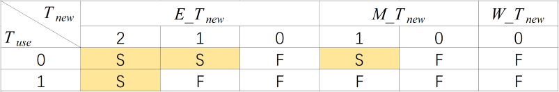
</div>

根据上表，可以看出只有四种情况需要阻塞：

- $E\_T_{new} = 2, T_{use} = 0$；
- $E\_T_{new} = 1, T_{use} = 0$；
- $M\_T_{new} = 1, T_{use} = 0$；
- $E\_T_{new} = 2, T_{use} = 1$。

除了这四种，剩下的情况就是需要转发的了。在转发中，我们需要特别注意转发的优先级问题和rt域有效性问题。

转发优先级问题是当多个数据可以转发，选择哪个数据的问题，如下面这个指令序列：

```mips
lw $1, 0x10
add $1, $2, $3
beq $1, $0
```

<div>
    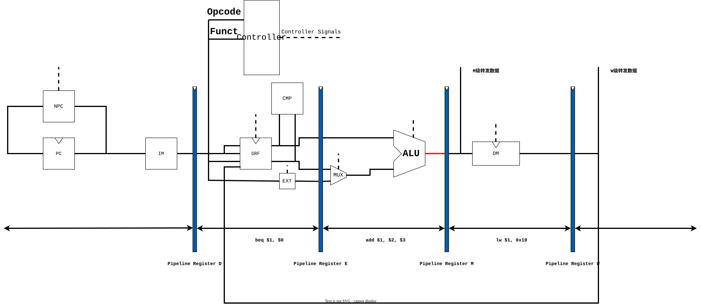
</div>

从上图可以看出，当`beq`在D级时，CMP模块所需的$寄存器的值在`add`指令中产生了一个新值(即上图中红线)，并且这个新值无法通过转发的方式转发到D级，因此，我们此时不得不先暂停一个周期。

<div>
    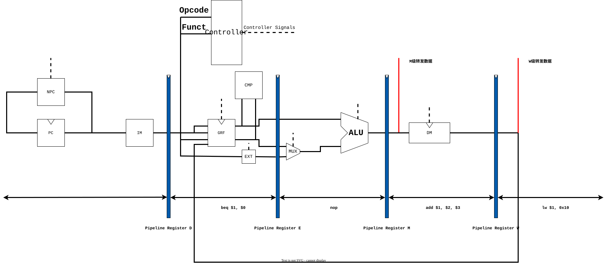
</div>

暂停了一个周期后，我们发现`lw`和`add`两条指令产生了$1寄存器的两个新值(即上图中的两条红线)且两个数据都可以转发到D级。那么此时我们应当选用哪一级的转发数据转发到D级呢？很显然，我们应该用M级，也就是`add`产生的数据，因为它会覆盖掉前面`lw`产生的数据。也就是说，我们要选择流水线中靠前的“新鲜”的数据进行转发。

rt域有效性问题是指有些指令的rt域不是用来表示读寄存器的编号的，比如`j`指令没有rt域，`ori`指令的rt域表示写入寄存器的编号，那么我们是否需要对这些指令进行特判呢？答案是不需要。对于rt域无效的指令，即使我们转发了相应的数据，也不会影响流水线的正确性，因此无需特判。

#### 具体的实现

可能有些同学看了上面的讲述，在设计上仍有些疑惑，这里我们给出一个具体实现的例子，供有需要的同学参考。同学完全可以有不一样的实现方式，满足提交要求即可，我们也鼓励大家给出更优秀的实现方式。

为解决流水线数据冒险，我们可以单独设计一个冒险控制模块，输入用于判断暂停和转发的A和T信号，输出暂停和转发的控制信号，下面让我们一起来分析该模块内部的逻辑。

对于暂停，我们可以根据$T_{use}$和$T_{new}$值的不同组合构造出4种暂停信号。当然除了上述T的条件，暂停时还需要满足A的条件(即读寄存器和写寄存器编号相同且不为0、写寄存器信号有效)。以rs寄存器为例，我们可以写出暂停条件：

```verilog
// 这里的Stall_RS0_E2对应rs_Tuse=0, E_Tnew=2的情况
// Tuse_RS0表示rs_Tuse == 0
// A1表示指令中[25:21]域，A3表示指令中[15:11]域
Stall_RS0_E2 = Tuse_RS0 & (Tnew_E == 2'b10) & (A1_D == A3_E) & (A1_D != 5'd0) & RegWrite_E;
Stall_RS0_E1 = ......
......

Stall_RS = Stall_RS0_E2 | Stall_RS0_E1 | ......
```

rt寄存器同理，最后总的暂停信号把两个寄存器分别的暂停信号或起来即可。

简单起见，我们约定暂停只发生在D级，因此当暂停信号有效时，我们需要保持D级流水寄存器，清空E级流水寄存器。

对于转发，我们首先要在需要转发的点位上放一个多路选择器，可以让0路对应原始数据，剩下的路按照数据优先级从低到高排列，然后利用一个转发控制信号选择正确的值。转发控制信号在冒险控制模块内生成，具体的判断条件是：读寄存器和写寄存器编号相同且不为零、写寄存器信号有效(A条件)以及转发流水级$T_{new} = 0$(T条件，表示此时数据已经准备好了)。以E级ALU中对应GRF[rs]的输入端为例：

```verilog
// AR_M表示M级流水寄存器中存储着的ALU结果，即M级转发数据
// WD_W表示W级流水寄存器中将要写回到寄存器堆的值，即W级转发数据
MF_V1 = (MF_V1_SEL == 2'b10) ? AR_M :
        (MF_V1_SEL == 2'b01) ? WD_W :
        V1_E;

MF_V1_SEL = (A1_E == A3_M && A1_E != 5'd0 && Tnew_M == 2'b00 && RegWrite_M == 1'b1) ? 2'b10 :
            (A1_E == A3_W && A1_E != 5'd0 && Tnew_W == 2'b00 && RegWrite_W == 1'b1) ? 2'b01 : 
            2'b00;
```

<div>
    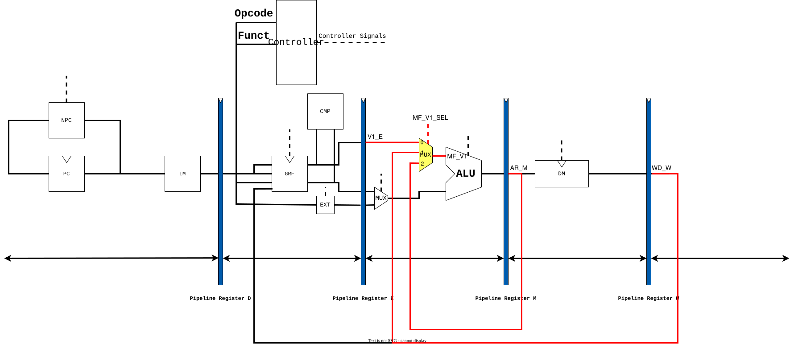
</div>

至此，我们就基本解决了流水线数据冒险的核心问题，剩下的部分就留给聪明的你了，相信你一定能够顺利解决！

<div style="background-color: #e6f7ff; border-left: 4px solid #1890ff; padding: 12px; border-radius: 4px; margin: 16px 0;">
<strong>思考题</strong><br>
我们为什么要使用GPR内部转发？该如何实现？
</div>

<div style="background-color: #e6f7ff; border-left: 4px solid #1890ff; padding: 12px; border-radius: 4px; margin: 16px 0;">
<strong>思考题</strong><br>
我们转发时数据的需求者和供给者可能来源于哪些位置？共有哪些转发数据通路？
</div>

# 流水线测试教程

## 流水线测试

请注意，流水线测试教程为**选作内容**，推荐学有余力、对测试用例的构造有较大兴趣的同学阅读(也可将本教程留到P6阅读)。

流水线处理器相比于单周期处理器有较大的复杂度，原因之一在于指令级并行导致的指令间相互影响，因此仅通过P3、P4中以指令为单位的测试不再能有效地保证处理器功能的正确性，本文将介绍以指令块为单位的，针对流水线功能(转发/暂停)正确性的测试数据的构造思路。

需要说明的是，针对流水线功能正确性的测试数据只需要对暂停和转发有更高的测试强度，并不需要保证对单指令功能的测试强度，也就是将单指令功能正确性测试和流水线功能正确性测试分离，这有利于更高效的构造测试数据。本部分教程主要着眼于流水线功能正确性测试，单指令功能正确性测试相对简单，同学们可以回顾单周期处理器的测试方法。

### 覆盖性测试的数据构造思路

诚然，通过长时间大量的随机测试也可以发现相当多的问题，但我们更加推荐有的放矢进行覆盖性测试，这一部分将介绍覆盖性测试的思想与覆盖方式。

想要构造高覆盖率的测试数据，需要从两大方面入手并不断优化：如何选择指令单位以及如何构造指令序列。

#### 选择指令单位：指令与指令类

**指令类的概念**

指令类即具有实现相似性的若干指令，例如对于MIPS-C3指令集(包含了P5、P6课下要求的指令集)，可以进行如下分类：

- 寄存器立即数计算：`addi, addiu, slti, sltiu, andi, xori, sll, srl, sra`
- 寄存器寄存器计算：`add, addu, sub, subu, slt, sltu, and, or, nor, xor, sllv, srlv, srav`
- 根据寄存器分支：`beq, bne, bgez, bgtz, blez, bltz`
- 写内存：`sw, sh, sb`
- 读内存：`lw, lh, lhu, lb, lbu`
- 读乘除法寄存器：`mfhi, mflo`
- 写乘除法寄存器：`mfhi, mtlo, mult, multu, div, divu`
- 跳转并链接：`jal, jalr`
- 加载高位：`lui`
- 空指令：`nop`

上面的指令中并没有无条件跳转指令`j`，这是因为`j`指令不产生数据也不使用数据，已被移除群聊，而同样不产生数据的`nop`指令由于可以方便地充当无关指令，被保留在测试指令集中。

同学们也可以根据自己处理器的设计特点对指令进行分类，但请注意分类的原则：处理器对同一个指令类中的各个指令的处理是高度相似的。

**选取指令类中的指令**

- 枚举全部指令
  - 优势：测试更加全面，覆盖率高。
  - 不足：存在测试数据规模过于庞大的问题(尤其是枚举四条连续的指令单位时)，此外在进行自测时，人工检查同类型指令在暂停转发上的处理是否一致相比于构造大量测试数据是容易的，因此我们更加推荐使用下面两种枚举方式。
- 枚举特定指令
  - 优势：需要考虑的情况相对有限，可以手工构造测试数据，如果编写测试数据生成程序也可以比较容易的保证测试数据的合法性。
  - 不足：忽略了同意指令类中的其他的指令，需要十分细致的人工检查同类型指令在暂停和转发上的处理是否一致，确保特定的指令可以代表整个指令类。
  - 这种枚举方式比较简单，同学们可以先从这种方式入手进行测试。
- 枚举随机指令
  - 优势：对同一个指令类中的各个指令“雨露均沾”，可以发现只针对指令类中特定指令的错误，且相比于枚举全部指令，测试数据规模可控。
  - 不足：需要考虑的情况大大增加，手工构造测试数据是比较困难的，一般需要编写测试数据生成程序，推荐学有余力的同学使用这种方式进行测试。
  - 对于打算编写测试数据生成程序的同学，我们强烈建议先完成“枚举特定指令”再进一步完成“枚举随机指令”，并在此过程中思考如何更优雅的将测试数据生成程序从“枚举特定指令”扩展到“枚举随机指令”。

#### 构造指令序列

**枚举两条相关的指令单位**

- 核心思想：每一个转发或暂停都对应一个产生数据的指令和一个使用数据的指令，只要枚举这两条指令并在中间插入零到两个无关指令就可以覆盖性的测试流水线功能的正确性。
- 优势：
  - 构造较为简单且有不错的测试强度，如果选择指令类作为指令单位进行枚举的话，手工构造测试数据也是相当可行的。
  - 易于控制寄存器的值，因此对于难以保证合法性的指令(例如`jr`、`jalr`等)，可以使用此种方法构造合法的指令序列，增加覆盖率。
- 不足：
  - 由于仅枚举了两条指令，可能会漏掉一些转发或暂停的错误。而且由于无关指令的存在，数据的有效率更低。

**枚举四条连续的指令单位**

- 核心单位：一个五级流水线处理器，出去IF级最多可以同时存在四条指令，只要枚举连续四条指令就可以覆盖性的测试流水线功能的正确性。
- 优势：拥有更高的测试强度，且数据的有效率更高。
- 不足：枚举的指令块数量庞大，难以手工构造，而编写测试生成数据时，需要更加繁琐的逻辑保证测试数据的合法性和强度。

## 保证数据合法性

显然，不是任何数据都可以直接用来测试我们的处理器，在包括但不限于按字存取时地址未对齐，加减法溢出，跳转指令地址越界的情况下，我们的处理器的行为是未定义的，测试也就无从谈起。

如果我们采取手工构造数据的方式，保证数据合法性是容易的，而编写测试数据生成程序时，虽然我们也可以直接保证数据的合法性，但这需要相当繁琐的逻辑，这一部分将针对此问题，由易到难介绍一些保证数据合法性的方式。

### 调整指令行为

“调整指令行为”部分设计的内容仅为帮助同学们在课下自行测试时，更方便的保证数据合法性，我们保证：**所有官方测试用例中不存在，且我们提供的测试覆盖率分析程序不支持下面提及的指令错误情况**。

实现本部分设计的内容时，同学们可能需要同步修改Mars的行为，其中涉及到的Java语言程序设计的知识并不是计算机组成原理要求的，因此课程组并不在此作过多的展开，但我们建议学有余力的同学对Mars进行探索并在讨论区分享你的成果。

#### 处理除法指令

这一部分涉及的指令主要包括：`div`、`divu`，主要涉及的问题是除零导致异常。一个简单的处理是规定除零时保持乘除法寄存器值不变，这也是Mars处理除零的方式，因此不必修改Mars。

#### 处理存取指令

这一部分涉及的指令主要包括: `sw`、`sh`、`sb`、`lw`、`lh`、`lhu`、`lb`、`lbu`，主要涉及的问题是地址非法导致异常。地址非法主要包括两种情况，地址未对其和地址越界：

- 地址未对齐时，可规定将未对齐的地址强制对齐。
- 地址越界时，可以规定实际访问的地址是原地址对我们规定的地址范围取模的结果。

#### 处理跳转指令

这一部分涉及的指令主要包括：`jr`、`jalr`，主要涉及的问题是地址非法导致异常。地址非法主要包括两种情况，地址未对其和地址越界：

- 地址未对齐时，可规定将未对齐的地址强制对齐。
- 地址越界时，一种可能的处理方式是定义一个规则，将月结的非法地址映射到一个合法地址，这种处理方式将极大程度的扰乱测试程序的控制流，导致测试强度下降，因此我们更简易通过寄存器值域控制、处理器状态追踪等方式进行处理。

### 寄存器值域控制

#### 控制寄存器值域的方式

假设我们关注的寄存器是`$1`、`$2`和`$3`，并希望将这三个寄存器的值限制在0到100的范围内，那么我们可以将这三个寄存器初始化为45到55之间的随机数，对于不同类型的指令，我们可以进行如下处理：

- 寄存器立即数计算

    以`addi`为例，可以选择0到10之间的立即数，如`addi $1, $2, 5`；以`andi`为例，可以选择0到100之间的立即数，如`andi $1, $2, 57`。

- 双寄存器计算

    以`sub`为例，可以选择一个辅助的寄存器`$x`并预先初始化为一个较小的值用于计算，如`sub $1, $2, $7`；以`or`为例，同样选择一个预先初始化好的复制寄存器用于计算，如`or $1, $8, $2`。

- 读内存

    以`lw`为例，预先将地址0到100的字都初始化成0到100范围内的数即可直接读内存，如`lw $1, 0($1)`。如果我们希望的范围变成了100到200，我们仍可以初始化0到100的字，但要在读内存时修改偏移，如`lw $1, -100($1)`。

- 写内存、分支、跳转等

    这些指令不修改我们关注的寄存器，因此无须特别处理。

#### 防止跳转指令地址越界

这种方式的思想在于，跳转指令合法的目标地址可以不是一个而是一些，即跳转到某个地址范围内的任意位置都不影响测试程序的正确执行，实现上我们可以将测试程序分为“公共跳转区”和“测试指令块”两部分：

- “公共跳转区”在程序开始，由若干个`jr`组成。
- “测试指令块”在公共跳转区之后，完成流水线功能测试。

在测试指令块中，我们只需要将用于跳转地址的寄存器的值域限制在公共跳转区即可。此外我们在每个指令块开始时通过`la`指令将指令块结束位置的地址加载到特定寄存器，并将“公共跳转区”中全部`jr`的目标寄存器设为这个寄存器，即可保证控制流不受影响。

### 处理器状态跟踪

处理器状态跟踪是指字构造测试程序的同时解释执行测试程序(即用高级语言实现一个简易单周期CPU)，利用实时获取到的寄存器和内存信息帮助构造测试程序，例如保证数据合法性、提高数据精度、在同等强度下减少数据规模等。

## 生成测试数据

本部分介绍的顺序生成和逆序递归两种策略主要针对实现了处理器状态跟踪的情况，但其他情况也是类似的。

### 顺序指令

顺序指令是指按照PC增加的顺序生成一个指令块中的指令，每生成一条指令就检测这条指令是否非法，如果非法则调整非法的指令，从而“解除”非法。

为保证测试强度，调整非法指令的逻辑需要精心设计，这也是顺序执行策略下的关键所在，对此我们有以下建议：

- 权衡替换指令还是替换寄存器

    为解除非法，最好的方式是调整指令中的立即数，这样既不会减少对某些指令的测试，也不会影响暂停转发的过程。由于调整指令中的立即数并不能处理所有情况，可能需要替换指令或替换寄存器。

    替换指令是指使用同类型的指令替换非法的指令，这种方式不改变操作数因而不影响暂停转发的过程，但可能导致对某些指令的测试减弱。

    替换指令操作数是指更换指令使用的寄存器，这种方式不改变指令因而不会减少对某些指令的测试，但可能导致对暂停转发的覆盖率下降。

- 记录替换的行为

    每一次替换都有导致测试数据强度下降的风险，因此我们建议记录替换的行为(尤其替换指令或替换寄存器的行为)，从而发现测试数据的弱点，针对性的调整生成逻辑或单独构造数据进行弥补。

    我们也提供了用于评估测试数据强度的工具，具体说明可关注**测试设局覆盖率分析**一节。

### 逆序递归

递归逆序同样按照PC增加的顺序生成各个指令块，但对于指令块的处理和顺序生成有所不同，具体而言，逆序递归从指令块的最后一条指令开始，进行以下工作：

- 确定此指令，但暂不确定此指令使用的寄存器与立即数。
- 此指令根据自身特点，确定前一条指令为保证不出现非法行为，需要满足的条件(及要求前一条指令执行结束后，一些寄存器的值处于特定的值域内)。
- 如果这是指令块中的第一条指令，根据下一条指令确定的，需要满足的条件进行初始化，随后确定此指令使用的寄存器与立即数，满足需要满足的条件。
- 如果这不是指令块中的第一条指令，向前递归此过程以生成前一条指令，随后确定此指令使用的寄存器与立即数，满足需要满足的条件。

逆序递归通过“提要求”的方式，在“预防”非法行为的同时，也可以用于实现确保分支跳转或不跳转等功能以提高测试点强度，有较强的灵活性。

为保证测试强度，无论是指令调度和寄存器调度还是满足条件的策略，都需要精心设计，这也是逆序递归策略下的关键所在，其较为繁琐复杂，此处不做过多展开，但我们有以下建议：

- 记录无解的情况

    在“预防”非法的方式下，一些情况是无解的，例如`slt`将结果转发给`jr`，一些情况是理论上有解但因为构造难度大暂未实现的，例如`srav`将结果转发给`jalr`。

    我们可以记录生成工具认为无解的情况并人工甄别，发现测试数据的弱点，针对理论上有解的情况调整生成逻辑或单独构造数据进行弥补。

## 测试数据示例

### 计算类指令

以`addi`、`add`、`sub`三条指令为例，下面测试指令序列的构造思路为优化后的枚举两条相关指令。`add`是核心指令，其既会将计算结果写入寄存器，也会读其他寄存器的值。

```mips
addi $t1, $xx, 0xff # 修改 $t1 的指令
nop                 # 根据产生数据的流水级，插入无关指令或 nop
add $t0, $t1, $xx   # 使用 $t1 并写入 $t0 的指令
nop                 # 根据目标指令使用数据的流水级，插入无关指令或 nop
sub $xx, $t0, $xx   # 使用 $t0 的指令
```

- 上述指令序列根据需要测试的指令使用的寄存器(如上例中是`$t1`)，先执行其他写入该寄存器的指令，并根据想要产生转发的流水级在中间加入无关指令或`nop`；测试执行之后会产生寄存器(上例为`$t0`)的新值，同样根据使用的流水级加入无关指令或`nop`，在执行使用此新值的指令。
- 需要注意的是，在中间插入的指令不能改变目标寄存器的值，否则将干扰对暂停转发的测试，影响测试效果。

以`add`、`sub`、`ori`、`lui`四条指令为例，下面测试指令序列的构造思路为实现了处理器状态追踪的枚举四条连续指令，用于测试暂停转发的寄存器为`$25`和`$26`。

```mips
# ---> block head <---
# ---> block body <---
add $25, $26, $25
sub $25, $25, $26
ori $25, $26, 29
ori $26, $25, 38576
# ---> block tail <---
lui $26, 65535
ori $26, $26, 45351
```

- block head部分用于完成初始化工作，对于这个测试指令块，没有要进行的初始化工作。
- block body用于完成暂停转发测试。
- block tail进行测试的善后工作，将测试过程中值域遭到破坏的寄存器重新初始化。

### 跳转链接类指令

以`jalr`、`and`、`or`三条指令为例，下面测试指令序列的构造思路为优化后的每具两条相关指令。跳转链接类指令产生流水线冒险的原因也是读、写寄存器，但是构造这部分的数据需要清晰的知道指令跳转的位置。

```mips
or $t1, $xx, $xx
nop                 # 根据产生数据的流水级，插入无关指令或nop
jalr $t0, $t1       # 使用 $t1 并写入 $t0，且 $t1 的值等于 address
nop                 # 延迟槽中放置无关指令或 nop
address:
nop                 # 如有需要，继续放置无关指令或 nop
and $xx, $t0, $xx   # 使用 $t0 的指令
```

- 同上，我们可以在写`$t1`的指令和`jalr`之间插入无关指令，以测试不同的流水级。
- 不同的是，跳转指令需要注意延迟槽才是其下一条指令，所以插入无关指令的地方变为了延迟槽和跳转的目标地址，此外需要知道精确的跳转地址才能控制插入测试指令。

以`jal`、`sub`、`nop`、`jr`四条指令为例，下面测试指令序列的构造思路为实现了处理器状态追踪的枚举四条连续指令，用于测试暂停转发的寄存器为`$31`，其他寄存器为辅助寄存器。

```mips

```

### 分支类指令

## 覆盖率分析

## 分析工具使用说明

## 自动化测试

# 课下测试

## 课下作业

### 作业概括

在上次实验的基础上，使用Verilog语言设计一个流水线处理器。

### 设计说明

1. 处理器应支持如下指令集：`{add, sub, ori, lw, sw, beq, lui, jal, jr, nop}`。
2. 处理器为五级流水线设计。

### 设计要求

1. 流水线的设计以追求性能为第一目标，因此必须尽最大可能**支持转发**以解决数据冒险。这一点在本project的最终成绩中所占比重较大，课上测试时会通过测试程序所运行的**总周期数**进行判定，望大家慎重对待。
2. 对于b类和j类指令，流水线设计必须**支持延迟槽**，因此设计需要注意使用$RC@D+8$或$PC@I+4$。
3. 为了结局数据冒险而设计的转发数据来源必须是**某级流水线寄存器**，**不允许**对功能部件的输出直接进行转发。
4. 指令寄存器(IM, instruction memory)和数据存储器(DM, data memory)要求如下：
   - IM: 容量为$16KiB(4096 \times 32bit)$
   - DM: 容量为$12KiB(3072 \times 32bit)$
5. PC的初始地址为$0x00003000$，和Mars中我们要求设置的代码初始地址相同。
6. 最外层的mips模块的文件名必须为mips.v，该文件中的module也必须命名为mips。

### 测试要求

1. 你编写的汇编测试程序必须确保所有指令都应被测试充分。
2. 冲突是你的测试重点，需要覆盖性的测试每一条指令的AT值是否标记正确。

## 在线测试相关信息

### 提交要求

#### 顶层模块

必须在Verilog HDL设计中建立这个**顶层模块**，不允许修改模块名称、端口各信号以及变量的名称或类型。

```verilog
module mips(
    input clk,
    input reset
);
```

#### GRF模块

在**GRF模块**中，每个**时钟上升沿**到来时若要**写入数据**(即写使能信号为1且非reset时)则输出写入的位置及写入的值，格式(请注意空格)为

```verilog
$display("%d@%h: $%d <= %h",$time, WPC, Waddr, WData);
```

其中$time表示当前的时间，`WPC`表示相应指令的存储地址，从0x00003000开始；`Waddr`表示输入的5位写寄存器的地址；`WData`表示输入的32位写入寄存器的值。

例如，地址在0x00003000的指令100时刻向3号寄存器写入数据0，则应该输出`100@00003000: $3 <= 00000000`，其中`00003000`应该是对应操作指令的16位进制地址，不足8位需要补零。

#### DM模块

在DM模块中，每个时钟上升沿到来时若要**写入数据**(即写使能信号为1且非reset时)，则输出写入的位置及写入的值，格式(请注意空格)为

```verilog
$display("%d@%h: *%h <= %h", $time, pc, addr, din);
```

其中$time表示当前的时间，`pc`是该操作对应的指令的地址，和GRF模块要求一致，`addr`表示将要存入数据的32位地址，`din`表示输入的32位写入DM的值。

例如，若地址在0x00003004的指令100时刻要在0x00001004地址写入数据0，则应该输出`100@00003004: *00001004 <= 00000000`。

### 其他

IM容量为$16KiB(32bit \times 4096)$，DM容量为$12KiB(32bit \times 3072)$。

复位后，PC指向0x00003000，此处为第一条指令的地址，GRF和DM中的所有数据清零。注意与**MARS中的设置**保持一致。在复位期间对存储单元进行操作请不要输出任何信息，以免影响评测结果。

除加减法外的指令均以指令集规定的行为为准，可参看MIPS-C指令集(该指令集描述针对单周期，注意单周期和流水线有些许指令行为描述不同，但最终结果是一致的)，加减法按无符号处理(不考虑溢出)。

无需考虑当写通用寄存器和内存同时发生时，指令输出的先后顺序问题。

若是对本次实验有任何疑问请及时在评论区提出。

### 额外说明

由于本次设计是流水线CPU，对各种指令间存在的**数据冲突**和**控制冲突**，应尽量使用**转发**来解决，不能使用转发解决的情况下才选择使用暂停解决。因此，CPU设计时解决冲突的方案不同，跑完测试程序所需要的周期数也不同。越好的设计方案，所需要的周期数相对而言也就越少。

对于我们的实验而言，我们不要求大家设计的都非常完美，但至少常见的能使用转发解决的冲突都要用转发来解决。课上测试时我们会根据测试程序的不同设置不同的**周期范围**，你的CPU要在这个范围内跑完整个测试程序，否则即使结果正确也无法通过评测。课上测试时我们会重点提问你的设计中对于冲突的解决方案，成绩的很大一部分也取决于你的CPU所跑的**周期数**与**问答情况**。

对于指令的行为，Mars和指令集并不是完全相同的，建议大家添加指令前先简单的试试新增指令在Mars中是如何运行的，这个并不麻烦。引用一位同学的话——怠惰会导致惨剧。

## 思考题汇总

<div style="background-color: #e6f7ff; border-left: 4px solid #1890ff; padding: 12px; border-radius: 4px; margin: 16px 0;">
<strong>思考题</strong><br>
1. 我们使用提前分支判断的方法尽早产生结果来减少因不确定而带来的开销，但实际上这种方法并非总能提高效率，请从流水线冒险的角度思考其原因并给出一个指令序列的例子。<br>
2. 因为延迟槽的存在，对于<code>jal</code>等需要将指令地址写入寄存器的指令，要写回<code>PC + 8</code>，请思考为什么这样设计？<br>
3. 我们要求大家所有转发数据都来源于流水寄存器而不能是功能部件（如DM，ALU），请思考为什么？<br>
4. 我们为什么要使用GPR内部转发？该如何实现？<br>
5. 我们转发时数据的需求者和供给者可能来源于哪些位置？共有哪些转发数据通路？<br>
6. 在课上测试时，我们需要你现场实现新的指令，对于这些新的指令，你可能需要在原有的数据通路上做哪些扩展或修改？提示：你可以对指令进行分类，思考每一类指令可能修改或扩展哪些位置。<br>
7. 确定你的译码方式，简要描述你的译码器架构，并思考该架构的优势以及不足。<br>
</div>

<div style="background-color: #e6f7ff; border-left: 4px solid #1890ff; padding: 12px; border-radius: 4px; margin: 16px 0;">
<strong>思考题</strong><br>
1. [P5 选做] 在冒险的解决中，我们引入了AT法，如果你有其他的解决方案，请简述你的思路，并给出一段指令序列，简单说明你是如何做到尽力转发的。<br>
2. [P5 选做] 请详细描述你的测试方案及测试数据构造策略。<br>
3. [P5、P6 选做] 请评估我们给出的覆盖率分析模型的合理性，如有更好的方案，可一并提出。<br>
</div>

## 提交窗口

### p5_L0_document【文件上传】

#### CPU设计文档及思考题提交入口

##### 注意事项

- 设计文档应包含**设计草稿、测试方案与思考题**等内容。
- 推荐使用Markdown撰写设计文档，Markdown教程可参考[菜鸟教程](https://www.runoob.com/markdown/md-tutorial.html)

##### 思考题汇总

1. 我们使用提前分支判断的方法尽早产生结果来减少因不确定而带来的开销，但实际上这种方法并非总能提高效率，请从流水线冒险的角度思考其原因并给出一个指令序列的例子。
2. 因为延迟槽的存在，对于`jal`等需要将指令地址写入寄存器的指令，要写回$PC + 8$，请思考为什么这样设计？
3. 我们要求大家所有转发数据都来源于流水寄存器而不能是功能部件（如DM，ALU），请思考为什么？
4. 我们为什么要使用GPR内部转发？该如何实现？
5. 我们转发时数据的需求者和供给者可能来源于哪些位置？共有哪些转发数据通路？
6. 在课上测试时，我们需要你现场实现新的指令，对于这些新的指令，你可能需要在原有的数据通路上做哪些扩展或修改？提示：你可以对指令进行分类，思考每一类指令可能修改或扩展哪些位置。
7. 确定你的译码方式，简要描述你的译码器架构，并思考该架构的优势以及不足。
8. [P5 选做] 在冒险的解决中，我们引入了AT法，如果你有其他的解决方案，请简述你的思路，并给出一段指令序列，简单说明你是如何做到尽力转发的。
9. [P5 选做] 请详细描述你的测试方案及测试数据构造策略。
10. [P5、P6 选做] 请评估我们给出的覆盖率分析模型的合理性，如有更好的方案，可一并提出。

### P5_L0_weak_2023【文件上传】

#### CPU Verilog源文件提交入口

##### 评测说明

为了鼓励同学们编写自己的测试程序，对于评测机使用的评测程序，我们仅给出机器码来进行本地测试，测试代码机器码见附件。

- 必须严格按照模块的端口定义，顶层文件模块名为mips，不需要考虑延迟槽。
- 在部件中，reset信号的优先级高于其他控制信号，且设计为**同步复位**，保证自动评测在CPU运行前进行复位。
- 在GRF模块中，每个时钟上升沿到来时若写使能信号为1，则输出写入位置及写入的值；在DM模块中，每个时钟上升沿到来时若写使能信号为1，则输出写入的位置及写入的值。
- 用Verilog HDL建立IM时，必须以读取文件的方式将code.txt中的指令加载至IM中。不要在Verilog HDL代码中直接对IM的内容进行赋值。
- Verilog HDL文件打包要求：在**不超过**最大压缩包提交限制的情况下，全部.v文件放在同一文件夹下压缩成.zip格式后提交。
- 自动评测提交的时间间隔为5分钟，其返回的错误信息有一定的参考价值，但仅供参考。
- 其余注意事项请认真参看在线测试相关信息。
- **<span style="color: red;">参加课上测试条件：</span>**
  - <span style="color: red;">通过本窗口的所有测试点。</span>
  - <span style="color: red;">提交 CPU 设计文档。</span>